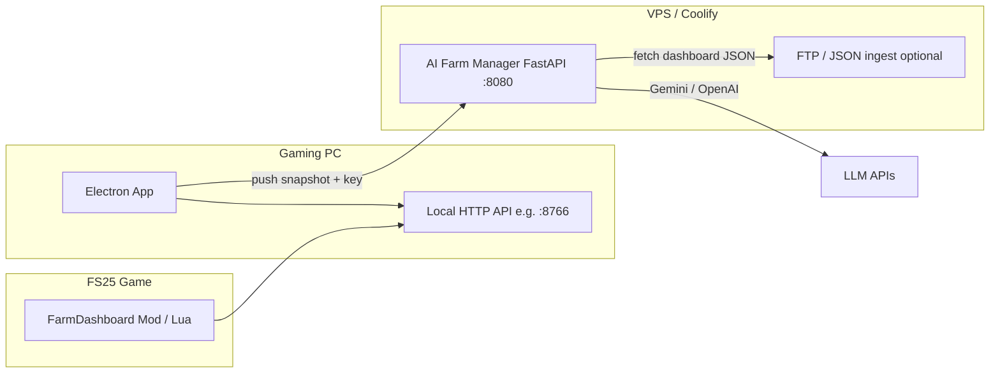

# FarmHub — Developer handover

This document describes the **FarmHub** workspace: the **FS25 Farm Dashboard** (Electron/desktop + embedded web UI) and the **AI Farm Manager** backend (FastAPI on a VPS or local machine). It is intended for onboarding, audits, and maintenance.

---

## 1. High-level architecture

- **Game → mod** exposes farm state over HTTP (fields, vehicles, animals, economy, etc.).
- **Electron** loads the web UI (`web/index.html`), talks to the **local** dashboard API, and optionally **POSTs** merged snapshots to **AI Farm Manager** (`/api/integration/push-snapshot` or similar) so the AI server does not need inbound access to the gaming PC.
- **AI Farm Manager** stores the latest JSON in RAM (per `serverId`), runs **consultant insights**, **chat** (`!bot`), and admin tools.

---

## 2. Repository layout (`FarmHub/`)

| Path | Role |
|------|------|
| `FS25_FarmDashboard_App/FS25_FarmDashboard_App/` | Electron shell, `main.js`, `package.json`, preload, **web UI** under `web/` |
| `FS25_FarmDashboard_App/.../web/assests/js/` | Dashboard JS (note historic typo **assests**) |
| `FS25_FarmDashboard_App/.../web/index.html` | Main SPA shell: landing, navbar, **Smart suggestions** row, section containers |
| `AI_Farm_Manager/backend/` | FastAPI app (`app/main.py`, `app/routers/`, `app/services/`) |
| `AI_Farm_Manager/docker-compose.yml` | Typical VPS deploy for the AI server |

Supporting / integration:

- `dataMerger.js` — merges streams for the dashboard (referenced from Electron flows as applicable).
- `branding.example.json` — white-label defaults for the Electron app.

---

## 3. FS25 Farm Dashboard (frontend)

### 3.1 Entry and modules

- **`web/assests/js/app.js`** (ES module) imports feature modules and attaches behaviour to `LivestockDashboard` / `window.dashboard`.
- **`navigation.js`** — section routing (`showLanding`, `showSection`), hash sync, **Smart suggestions row visibility** (`updateSmartSuggestionsRowVisibility`).
- **`realtime-connector.js`** — polls local dashboard API on an interval (default **5s** for `/api/data`-style updates) and updates `window.dashboard` state.
- **`apiStorage.js`** — farm folder / legacy file flows; also toggles visibility of landing vs dashboard sections.

### 3.2 AI / consultant (browser)

| File | Purpose |
|------|---------|
| `ai-farm-consultant-insights.js` | **Smart suggestions** panel: `GET {AI}/api/v1/consultant/insights` with `serverId`, `farmId`, `view=…`. Handles **stale response** discard when the user changes section mid-flight, **Fields tab** special case (no second LLM call — uses per-field map), **in-flight guard** to avoid overlapping GETs, **Refresh** forces a new run. |
| `field-consultant-bridge.js` | ES module: **field map** consultant (`context=fields`), throttling (`MIN_INTERVAL_MS` 8 min), farm cache, `window.__fieldConsultantByRef`, events `field-consultant-updated` / `field-consultant-loading`. |
| `ai-farm-bot-panel.js` | Robot panel: AI server URL, integration key, BYOK, instance enablement. |
| `dash-ai-debug.js` | Debug logging hooks. |
| `modules/fields.js` | Fields section UI; **5s** refresh for `/api/fields`; renders per-field AI lines via bridge. |

**Script load order (see `index.html`):** pipeline helpers → realtime → **ai-farm-bot-panel** → **`app.js` (module)** → **deferred** `ai-farm-consultant-insights.js` so `window.pickDoThisFirstFromFieldInsights` exists after the bridge module loads.

### 3.3 Smart suggestions `view` mapping

- Home / dashboard → `view=home` (top 3 farm priorities).
- Fields, vehicles, pastures, livestock, productions, economy → matching `view`.
- Fields tab panel uses **client-side ranking** from `__fieldConsultantByRef` (no duplicate `GET` for that tab).

### 3.4 Performance characteristics (UI)

| Area | Default | Tuning / notes |
|------|---------|----------------|
| Realtime poll | 5s | `realtime-connector.js` — increasing interval reduces CPU/network feel on weak machines. |
| Fields section poll | 5s | `fields.js` — same trade-off. |
| **Payload dedupe** | On | HTTP poll skips `handleRealtimeData` when `JSON.stringify` of `/api/data` (minus `timestamp`) + farm + server id matches the previous poll — avoids DOM churn when nothing changed. **`RealtimeConnector.refreshHttpDataNow()`** or **`clearPayloadDedupeCache()`** forces the next fetch to apply (manual refresh / farm switch). |
| Smart suggestions interval | 5 min | `REFRESH_MS` in `ai-farm-consultant-insights.js` (background polls omit the skeleton). |
| Field consultant throttle | 8 min | `MIN_INTERVAL_MS` in `field-consultant-bridge.js`. |
| Insight row MutationObserver | ~950ms debounce | Reduces duplicate refreshes when the row is shown/hidden quickly. |
| Overlapping insight GETs | Blocked | `insightsFetchInFlight` unless **Refresh** (`forceRefresh=true`). Navigation calls **`refreshFarmDashConsultantInsights(true)`** so the panel shows loading immediately. |

**Sluggishness** is often (a) **LLM latency** on the server, (b) **many parallel** insight triggers before guards, (c) **large** dashboard JSON over slow links — the in-flight guard, debounce, and payload dedupe address (b) and idle DOM work.

---

## 4. AI Farm Manager (backend)

### 4.1 Entry

- **`app/main.py`** — FastAPI app, **lifespan**: encryption/bootstrap, optional **FTP poll**, **startup LLM probe**, **shutdown** closes shared Gemini HTTP client.
- **CORS** from `CORS_ORIGINS` in settings.
- **GZip** middleware compresses responses **≥800 bytes** (helps large JSON from admin/integration).

### 4.2 Routers (high level)

| Router | Prefix | Notes |
|--------|--------|------|
| `chat` | `/api/...` | Game / bot chat, `!bot` trigger |
| `admin_routes` | `/admin` | HTML admin, env, LLM test |
| `integration` | `/api/integration` | Push snapshot, instances, keys |
| `consultant` | `/api/v1/consultant` | **GET /insights** — farm insights |
| `mod_config_download` | — | Mod XML delivery if configured |

### 4.3 Consultant pipeline

1. **Load snapshot** — from in-memory push buffer (preferred) or FTP/`DASHBOARD_JSON_URL` (`consultant.py` + `dashboard_service.py`).
2. **Resolve farm** — `prune_snapshot_to_active_farm`, `farmId` query vs `activeFarmId`.
3. **Prune by `view`** — `snapshot_pruner.prune_snapshot_for_dashboard_view`:
   - `home` → `prune_snapshot_home_overview` (multi-domain compact JSON for “top 3”).
   - `fields`, `vehicles`, etc. → section-specific slices.
4. **`generate_farm_insights`** (`consultant.py`) — optional **production-fill heuristics** (scoped/skipped per view), then **Gemini** JSON response, merge/dedupe, cap **3** for `VIEW MODE — home`. **LLM result cache:** `cachetools.TTLCache` (~10 min, bounded size) keys on SHA-256 of pruned snapshot + `serverId` / `farmId` / `view` / `context` / `fieldRef` + system-prompt hash — avoids repeat Gemini calls when the farm JSON is unchanged (see `_consultant_llm_cache_key`).
5. **LLM** — `llm_service.gemini_consultant_post_with_quota_fallback` (and similar for generic chat).

### 4.4 LLM / Gemini (`app/services/llm_service.py`)

- **Multi-key pool** — `GEMINI_API_KEY`, `GEMINI_API_KEY_2`, … merged in `config.py`; deduped order.
- **Sticky last-success key** — `GEMINI_STICKY_LAST_SUCCESS` (default on): next request tries last working key first (`_gemini_last_success_key`).
- **Model rollover** — `GEMINI_MODEL_ROLLOVER`: comma-separated model IDs. Set to `0`/`off` to use **only** `GEMINI_MODEL` (**no** model cycling — fixed model for BYOK users who pin one id). If unset, a **default multi-model chain** (3.x previews + 2.5 stable) is used — override if your API version/region does not support previews.
- **BYOK / single-key:** When only **one** API key is in use (typical Farm Dashboard BYOK), the service tries the **full** rollover list on **429/503** before giving up on that key — so free-tier rate limits can fall through to the next model on the same key. Multi-key server pools still use **one** model slot per key index (avoids multiplying calls).
- **HTTP** — **Single shared `httpx.AsyncClient`** (`gemini_http_client.py`) for **connection reuse** to `generativelanguage.googleapis.com` (reduces TLS/handshake overhead vs creating a new client per request).
- **429/503** — rotate to next key; optional sleep retry on last key for 429 (`_gemini_retry_same_key_once_after_429`).
- **Budget** — `gemini_budget.py` enforces per-key RPM/RPD-style caps (env-driven).

### 4.5 Important environment variables (AI server)

| Variable | Purpose |
|----------|---------|
| `LLM_PROVIDER` | `gemini` or `openai` |
| `GEMINI_API_KEY`, `GEMINI_API_KEY_2`, … | Key pool |
| `GEMINI_MODEL` | Default model when rollover **disabled** |
| `GEMINI_MODEL_ROLLOVER` | `0` = off; unset = default list; or comma IDs |
| `GEMINI_STICKY_LAST_SUCCESS` | `0` restores time-slot key rotation only |
| `GEMINI_REST_API_VERSION` | `v1` / `v1beta` |
| `DASHBOARD_JSON_URL` / FTP | Ingest dashboard JSON if not using push |
| `FARMDASH_INTEGRATION_KEY` / `X-FarmDash-Key` | Farm Dashboard → AI auth |
| `CORS_ORIGINS` | Browser origins if not `*` |

See `app/config.py` for the full merged settings dict.

---

## 5. Cross-system data flow (consultant)

1. Electron stores **AI base URL** + **integration key** (localStorage / IPC).
2. `GET /api/v1/consultant/insights?serverId=…&farmId=…&view=…` with header `X-FarmDash-Key`.
3. Backend resolves **that PC’s** pushed JSON (or FTP) and runs one LLM call (after pruning).

**Performance:** LLM time dominates (often **2–30+ seconds** on free tiers). Server-side **insight cache** and client **payload dedupe** reduce repeat work; client guards prevent overlapping insight GETs.

### V3 agronomy / consultant prompts

The **Smart suggestions** and field-map consultant behaviour come from **`app/services/consultant.py`**: FS25 mentor voices, mechanics block, `VIEW MODE` section prompts, and field-map / single-field system strings. Treat this as the current **V3** agronomy prompt set for maintenance and audits.

---

## 6. Deployment notes

- **AI Farm Manager:** Docker/Coolify using `AI_Farm_Manager/docker-compose.yml`; set env vars there; expose HTTPS; health checks if configured.
- **Farm Dashboard app:** `npm` scripts in `FS25_FarmDashboard_App/FS25_FarmDashboard_App/package.json` (build Electron as per your pipeline).
- **Secrets:** Never commit real API keys; use host env or encrypted bot storage (`encryption.py`, `bot_servers.json` patterns).

---

## 7. Performance changes (audit)

| Layer | Change |
|-------|--------|
| **Backend** | Shared **`httpx.AsyncClient`** for all Gemini `generateContent` calls (keep-alive). |
| **Backend** | **GZip** middleware for compressible responses. |
| **Backend** | **Pre-create** HTTP client at startup (`get_gemini_async_client()` in lifespan). |
| **Backend** | **Consultant LLM cache** — `cachetools.TTLCache` (~10 min, max ~512 entries); keys hash pruned snapshot + scope; evicts by TTL and cap (**no** unbounded growth). |
| **Backend** | **BYOK model cycling** — on **429/503**, single-key requests iterate **`GEMINI_MODEL_ROLLOVER`** before the next API key or 429 sleep (disabled when `GEMINI_MODEL_ROLLOVER=off`). |
| **Frontend** | **`/api/data` dedupe** — skip `handleRealtimeData` when merged JSON (no `timestamp`) + farm/server unchanged; **`refreshHttpDataNow()`** bypasses dedupe for a forced refresh. |
| **Frontend** | **In-flight guard** + **`.then(done, done)`** cleanup for consultant GET. |
| **Frontend** | **Refresh** / **navigation** use **`forceRefresh`** on insights so loading state shows; background 5 min poll does not flash skeleton. |
| **Frontend** | **Observer debounce** ~**950ms** when showing the insights row. |

### 7.1 Further ideas (optional)

- Raise realtime/fields poll intervals on low-power PCs (trade freshness for CPU).
- CDN/cache for static assets in Electron (often already local).
- **v1beta** + JSON MIME for Gemini if stable for your models (consultant already has MIME retry logic).

End-user BYOK setup: **`AI_Farm_Manager/docs/BYOK_GUIDE.md`**.

---

## 8. Debugging checklist

| Symptom | Where to look |
|---------|----------------|
| 429 / rate limits | Server logs (`Gemini HTTP 429`), `gemini_budget.py`, key pool size, `GEMINI_MODEL_ROLLOVER` (fewer preview models). |
| Wrong farm data | `serverId` / `farmId` query mismatch vs push buffer (`push_resolve` logs). |
| Fields AI empty | `field-consultant-bridge` — `category` must be Field + `field_ref`; consultant `context=fields` filter. |
| Smart panel stale | `ai-farm-consultant-insights.js` stale-check vs `getCurrentDashboardSection()`. |
| Slow first LLM after restart | Cold start + Google latency — expected; HTTP reuse helps **subsequent** calls. |

---

## 9. Key files quick reference

| File | Responsibility |
|------|----------------|
| `AI_Farm_Manager/backend/app/main.py` | App factory, lifespan, gzip, routers |
| `AI_Farm_Manager/backend/app/services/llm_service.py` | Gemini POST, keys, models, chat |
| `AI_Farm_Manager/backend/app/services/gemini_http_client.py` | Shared async HTTP client |
| `AI_Farm_Manager/backend/app/services/consultant.py` | Prompts, `generate_farm_insights`, heuristics |
| `AI_Farm_Manager/backend/app/services/snapshot_pruner.py` | JSON size / view pruning |
| `AI_Farm_Manager/backend/app/routers/consultant.py` | `GET /insights` |
| `FS25_FarmDashboard_App/.../ai-farm-consultant-insights.js` | Smart panel client |
| `FS25_FarmDashboard_App/.../field-consultant-bridge.js` | Per-field consultant map |
| `FS25_FarmDashboard_App/.../modules/navigation.js` | Section + insights row visibility |

---

## 10. Ownership / conventions

- **Python:** FastAPI, Pydantic schemas under `app/schemas/`.
- **JS:** Mix of ES modules (`app.js`, `field-consultant-bridge.js`) and IIFE scripts (`ai-farm-consultant-insights.js`) loaded from `index.html`.
- **Naming:** Dashboard asset path typo **assests** is entrenched; changing it would require updating every reference.

---

*Generated for FarmHub maintenance. Update this file when you add major routes, env vars, or deployment steps.*
