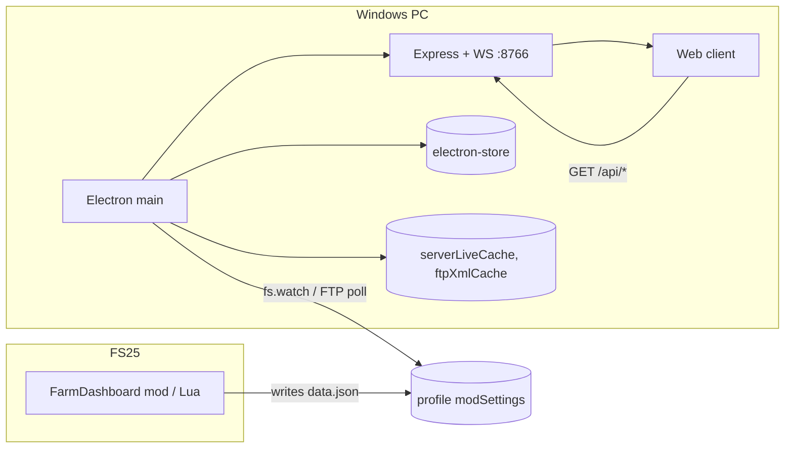

# FarmHub — Developer handover (v3.9)

This is the maintainer reference for **FarmHub**: the **FS25 Farm Dashboard** Electron + web app and the **FS25 Farm Dashboard** Lua mod. It targets a new contributor shipping fixes or features on the **3.9.x** line without breaking LAN, merge, or mod export contracts.

| Artifact | Where | Current value |
| -------- | ----- | ------------- |
| Desktop app | `FS25_FarmDashboard_App/FS25_FarmDashboard_App/package.json` | **`3.9.0`** |
| Lua mod | `FS25_FarmDashboard_Mod/FS25_FarmDashboard_Mod/modDesc.xml` | **`2.3.0.0`** |
| HTTP / WebSocket port | `main.js` `PORT` | **`8766`** |
| Companion docs | [`USER_MANUAL.md`](./USER_MANUAL.md) · [`AUDIT_v3.9_PREFINAL.md`](./AUDIT_v3.9_PREFINAL.md) · [`AUDIT_v3.0.md`](./AUDIT_v3.0.md) (historical) · [`SECURITY.md`](./SECURITY.md) · [`CHANGELOG.md`](./CHANGELOG.md) · [`I18N.md`](./I18N.md) | — |

## Table of contents

1. [Architecture](#1-architecture)
2. [Repository layout](#2-repository-layout)
3. [Lua mod](#3-lua-mod)
4. [Electron host (`main.js`)](#4-electron-host-mainjs)
5. [Renderer bridge (`preload.js`)](#5-renderer-bridge-preloadjs)
6. [Merge layer (`dataMerger.js`)](#6-merge-layer-datamergerjs)
7. [Rules engine (`rules-engine.js`)](#7-rules-engine-rules-enginejs)
8. [Web client](#8-web-client)
9. [i18n pipeline](#9-i18n-pipeline)
10. [Build, packaging, installer](#10-build-packaging-installer)
11. [Runtime artifacts and paths](#11-runtime-artifacts-and-paths)
12. [Debugging checklist](#12-debugging-checklist)
13. [Known gaps from the audit](#13-known-gaps-from-the-audit)
14. [Conventions](#14-conventions)

---

## 1. Architecture



- The mod runs only on **authority** (single-player or MP host / dedicated server) and writes `data.json` once per cycle.
- Electron watches `data.json` locally and/or polls FTP, runs `dataMerger.mergeData(luaJson, xmlJson, opts)`, and serves the merged payload through Express on `127.0.0.1:8766` (or `0.0.0.0:8766` when LAN is enabled).
- The browser (embedded `BrowserWindow` or external) loads `web/index.html`, polls `/api/*`, and renders sections via vanilla-JS modules under `web/assests/js/`.
- Renderer hardening: `nodeIntegration: false`, `contextIsolation: true`; `preload.js` exposes a fixed `window.farmDashAPI` surface.

---

## 2. Repository layout

```
FarmHub/
  docs/                                  # this folder; user + dev docs
  FS25_FarmDashboard_App/
    FS25_FarmDashboard_App/
      main.js                            # Electron main + Express + FTP coordinator
      preload.js                         # IPC surface
      dataMerger.js, xmlCollector.js, serverDataCache.js
      detailAnimalsHydrate.js, livestockDetail.js, fileReadRetry.js, fs25Paths.js
      lanCredentialPolicy.js, app-updater.js
      package.json                       # 3.9.0
      setup.html                         # first-run setup page (sibling of web/)
      build/installer.nsh                # NSIS hooks
      web/
        index.html                       # main dashboard shell
        simhub.html                      # SimHub overlay page (separate)
        assests/                         # historic spelling
          css/styles.css
          js/
            app.js                         # `LivestockDashboard` + `window.dashboard`; composes modules below
            realtime-connector.js         # WebSocket / live merge fan-out (ES module)
            lan-http-auth.js, pipeline-log.js, modExportProgress.js
            splash-screen.js, screen-wake-lock.js
            pastures-warnings.js, realtime-fanout.js, realtime-dedupe.js
            rules-engine.js                 # offline field heuristics (imported by fields / tools / cache)
            field-rules-cache.js, field-suggestion-tools.js, field-clusters.js
            base-game-tool-catalog.js
            i18n/i18n.js, setup-i18n.js
            utils/escape.js
            modules/
              apiStorage.js, navigation.js, notifications.js, parsers.js, changes.js
              theming.js, dashboard-settings.js, viewer-mode.js
              livestock.js, livestock.penDetail.js, vehicles.js, fields.js
              economy.js, pastures.js, productions.js, environment.js
            simhub-page.js
        locales/
          messages/<code>.json           # en.json = source of truth; other locales = overrides / copies from en
          translations.json              # built bundle served at /locales/translations.json
          build-translations.mjs         # npm run i18n:build
          sync-keys-from-en.mjs          # npm run i18n:sync (copy new keys from en into every locale)
          mt-fill.mjs, audit-keys.mjs,
          find-hardcoded-strings.mjs, verify-i18n.mjs
  FS25_FarmDashboard_Mod/
    FS25_FarmDashboard_Mod/
      modDesc.xml                        # 2.3.0.0
      icon.png                           # mod icon (also in release zip)
      src/
        FarmDashboard.lua                # mission hook + authority
        Diagnostics.lua                  # optional diagnostics (modDesc `sourceFile`)
        FarmDashboardDataCollector.lua   # staggered orchestration + writer
        collectors/
          AnimalDataCollector.lua
          VehicleDataCollector.lua
          FieldDataCollector.lua
          WeatherDataCollector.lua
          FinanceDataCollector.lua
          EconomyDataCollector.lua
          ProductionDataCollector.lua
  tools/                                 # all scripts: app/ (Electron npm helpers), *.ps1 zips + mod export
```

**Release mod zip:** run **`.\tools\Zip-FarmDashboardMod.ps1`** from the repo root → **`FS25_FarmDashboard_Mod\FS25_FarmDashboard.zip`**. The archive contains **only** **`modDesc.xml`**, **`icon.png`** (if present), and **`src/`** at the **zip root** — matching **`modDesc.xml`** `sourceFile` paths. Ship/rename as **`FS25_FarmDashboard.zip`** for players; they drop it in **`mods\`** or extract into **`mods\FS25_FarmDashboard\`**. That is **not** the **`FS25_FarmDashboard_Mod\`** dev tree name.

---

## 3. Lua mod

### 3.1 Mission hook and authority

`FarmDashboard.lua` registers itself with `addModEventListener(FarmDashboard)`. On `loadMap` / `onStartMission` it adds itself to the updateables **only when `isAuthority()`** returns true: single-player, or `g_server:getIsServer()` and not `g_connectionManager:getIsClient()`. Multiplayer **clients are intentionally silent** — only the server writes `data.json`.

`FarmDashboard:bootstrapDataJson` fires once so the file exists before the first cycle completes.

### 3.2 Staggered orchestration

`FarmDashboardDataCollector:update(dt)` divides each `collectionCycleMs` into one slot per **enabled** module, runs `runOneStaggeredSlice` for the current slot, refreshes that module's slice in `moduleCache`, then `assembleDataFromModuleCache` + `writeDataToFile` rewrites the whole `data.json`. Slot width = `cycleMs / nEnabled`. With seven modules enabled and the default 60 s cycle, each module re-samples every ~8.5 s.

`ProductionDataCollector` has its own internal **1 s** floor (`collectInterval`) so heavy placeable scans never run more than once per second even if the slot fires faster.

### 3.3 Collectors

| File | What it produces |
| ---- | ---------------- |
| `AnimalDataCollector.lua` | Per-husbandry rows: animals, fill levels, position, type names |
| `VehicleDataCollector.lua` | Live vehicles: position, speed, engine state, type/cleaned name, ownership |
| `FieldDataCollector.lua` | Per-field crop, growth stage, PF nitrogen / pH, windrows, bales, `suggestions[]`, `needsWork`, roller flags. Uses `NUTRIENT_CLOSE_FRAC = 0.05` for "close enough" |
| `WeatherDataCollector.lua` | Current temperature / weather snapshot from `environment.weather` |
| `FinanceDataCollector.lua` | Farm 1 money, loan, asset breakdown counts and values |
| `EconomyDataCollector.lua` | `marketPrices`, `sellingStations`, optional debug block |
| `ProductionDataCollector.lua` | Production `chains`; aggregate `husbandryTotals` is folded in by the orchestrator |

### 3.4 `data.json` shape (top level)

| Key | Source | Notes |
| --- | ------ | ----- |
| `timestamp` | `_G.g_time` | Mission time at write |
| `status` | constant `"active"` | Sentinel |
| `gameTime` | `getGameTime()` | day, hour, period, timeScale |
| `farmInfo` | `g_farmManager` | Array: farms, money, players |
| `animals` | Animal collector | — |
| `vehicles` | Vehicle collector | — |
| `fields` | Field collector | — |
| `production` | Production collector + aggregator | Includes `husbandryTotals` |
| `finance` | Finance collector | — |
| `weather` | Weather collector | — |
| `economy` | Economy collector | Optional `debug` block |
| `money` | mirror of `finance.money` | When present |
| `serverInfo` | writer | `{ mapName, saveSlot }` |

There is **no `meta` / `version` block** in `data.json`; the mod build is identified via `modDesc.xml` and `FarmDashboard.VERSION` only. Be careful adding new top-level keys: bump `dataMerger.js` to handle them deterministically.

### 3.5 `config.xml`

Created on first run by `FarmDashboardDataCollector:loadConfig` at:

```
%USERPROFILE%\Documents\My Games\FarmingSimulator2025\modSettings\FS25_FarmDashboard\config.xml
```

| XML path | Type | Effect |
| -------- | ---- | ------ |
| `farmDashboard.settings#updateInterval` | int (ms) | Legacy interval; mapped to `max(60000, interval*7)` if `collectionCycleMs` missing |
| `farmDashboard.settings#collectionCycleMs` | int (ms) | Cycle length, clamped 5 000 – 1 800 000 |
| `farmDashboard.settings#debugBaleScan` | bool | Throttled bale-scan logging to `log.txt` (Lua reads, **Electron writer ignores** — see audit gap #2) |
| `farmDashboard.modules#animals` … `#production` | bool | Per-collector enable; disabling reduces stagger denominator |

### 3.6 Output path

```
%USERPROFILE%\Documents\My Games\FarmingSimulator2025\modSettings\FS25_FarmDashboard\<savegameDirName>\data.json
```

`getSavegameDirName()` reads `missionInfo.savegameDirectoryName` or falls back to `savegame<index>`. The writer uses `io.open` first and falls back to `_G.saveFile("modSettings/FS25_FarmDashboard/<save>/data.json", json)`.

The mod has **no `addConsoleCommand` integration and no in-game settings menu entry**. The Settings → FS25 mod tab is the only UI for the config file; everything else needs a text editor.

---

## 4. Electron host (`main.js`)

### 4.1 HTTP and WebSocket

- `const PORT = 8766` for both HTTP and WebSocket.
- `getLanBindAddress()` returns `"127.0.0.1"` unless `store.lanAccessEnabled`, in which case it binds `"0.0.0.0"` and applies `requireLanAuth` (HTTP Basic + optional IP allowlist) on every non-loopback request.
- IPv4-mapped IPv6 (`::ffff:1.2.3.4`) is normalised before allowlist checks.
- The local Electron window and any `127.0.0.1` browser bypass auth.
- `POST /api/export-mod-store-images` is **localhost-only** unless `process.env.FARMDASH_ALLOW_LAN_EXPORT === "1"`.

### 4.2 Setup write token

`setup.html` can be loaded over LAN. For non-loopback callers, `POST /api/setup-config` must include header `X-Setup-Token: <token>` matching the value in `electron-store` `farmdashSetupWriteToken`. `ensureSetupWriteToken()` generates one on first run.

### 4.3 FTP polling

`getFtpPollingOptions()` validates and clamps user input:

| Option | Range | Default |
| ------ | ----- | ------- |
| `intervalMinutes` | 1 – 25 | 5 |
| `initialDelaySeconds` | 0 – 600 | 0 |
| `scheduleMode` | `"sync"` \| `"staggered"` | `"sync"` |

`startFtpPollingCoordinator()` schedules every FTP server using these values. `sync` fires all servers at the same boundary; `staggered` offsets each server by `intervalMinutes / nServers` minutes.

### 4.4 Local watching

`startLocalWatching()` arms `fs.watch` on each local server's `data.json`. If the file is missing or watch errors, it re-arms after **5 000 ms**. Savegame XML is independently re-read every **60 000 ms** via `setInterval` in the same module.

### 4.5 `electron-store` keys

| Key | Purpose |
| --- | ------- |
| `config` | Servers, paths, FTP settings, polling options |
| `uiPreferences` | Section toggles, field exclusions, field clusters, SimHub view |
| `locale` | Persisted `farmdash_locale` (mirrored to `localStorage`) |
| `lanAccessEnabled`, `lanUsername`, `lanPassword`, `lanAllowedIPs`, `lanAuthOptional` | LAN settings (v3.9: weak/default credentials rejected when enabling LAN access) |
| `farmdashSetupWriteToken` | LAN setup writer token |
| `lanWsSecret` | WebSocket auth secret for LAN |
| `simHubLiveContext` | Last-known SimHub context for the overlay page |

### 4.6 Debounce, timeouts, env

| Knob | Value | Purpose |
| ---- | ----- | ------- |
| `MOD_EXPORT_POWERSHELL_MAX_MS` | `90 * 60 * 1000` | Hard stop for the mod-image PowerShell helper |
| `schedulePersistServerCache` | 600 ms | Debounces `serverLiveCache/<id>.json` writes |
| `process.env.USERPROFILE` | — | Adds extra root paths for `modSettings\FS25_FarmDashboard` to handle OneDrive / drive remap |
| `process.env.FARMDASH_ALLOW_LAN_EXPORT` | `"1"` to enable | Opens LAN POST `/api/export-mod-store-images` |

There is no global `DEBUG=1` flag; logging is `console.log` / `console.warn`.

### 4.7 IPC handlers

Every channel handled in `main.js` corresponds to a function in `preload.js` (next section). The map is intentionally one-to-one — do not introduce new channels without adding the matching `farmDashAPI` method.

**`ipcMain.handle` channels (invoke):** `save-settings`, `get-current-config`, `read-local-farmdash-data-json`, `read-server-live-cache`, `get-lan-access-settings`, `save-lan-access-settings`, `get-desktop-app-version`, `check-desktop-app-updates`, `get-stored-locale`, `get-translations-json`, `get-ui-preferences`, `save-ui-preferences`, `set-simhub-live-context`, `get-field-exclusion-options`, `get-mod-config`, `save-mod-config`, `scan-local-saves`, `export-mod-store-images`.

**`ipcMain.on` channels (send):** `set-stored-locale`, `reset-settings`, `open-setup`.

**Main → renderer `webContents.send`:** `app-update-status`, `export-mod-store-images-progress` (subscribed in `preload.js`; not on `farmDashAPI` as invoke).

## 5. Renderer bridge (`preload.js`)

`preload.js` exposes exactly these methods on `window.farmDashAPI` via `contextBridge.exposeInMainWorld`:

| Method | Purpose |
| ------ | ------- |
| `getCurrentConfig()` | Read `electron-store` config |
| `saveSettings(cfg)` | Persist config + restart watchers |
| `scanLocalSaves()` | Auto-detect saves under `Documents\My Games\FarmingSimulator2025\modSettings\FS25_FarmDashboard\` |
| `openSetup()` | Open `setup.html` |
| `resetSettings()` | Wipe `electron-store` config |
| `getStoredLocale()` / `setStoredLocale(code)` | Persist `farmdash_locale` |
| `getTranslationsJson()` | Return parsed `translations.json` |
| `getUiPreferences()` / `saveUiPreferences(prefs)` | Section toggles, field clusters, SimHub view |
| `getLanAccessSettings()` / `saveLanAccessSettings(s)` | LAN tab values |
| `getDesktopAppVersion()` | App version for Settings → Dashboard |
| `checkDesktopAppUpdates()` | Trigger `electron-updater` check |
| `exportModStoreImages()` | Run mod-image PowerShell pipeline |
| `getFieldExclusionOptions(payload)` | List farmlands per server for the exclusions UI |
| `getModConfig()` / `saveModConfig(cfg)` | Read/write the mod `config.xml` (parser ignores `debugBaleScan` — audit gap #2) |
| `readLocalFarmdashDataJson()` | Fallback when `/api` is down — scans `modSettings/FS25_FarmDashboard/*/data.json`, returns `{ ok, path, data }` |
| `setSimHubLiveContext(ctx)` | Push live context to `simhub.html` |
| `onAppUpdateStatus(cb)` | Subscribe to channel `app-update-status` |
| `subscribeExportModStoreImagesProgress(cb)` | Subscribe to `export-mod-store-images-progress` |

Adding a method? Wire it in `main.js`, expose it in `preload.js`, and document it here. Never add `nodeIntegration` to bypass.

---

## 6. Merge layer (`dataMerger.js`)

### 6.1 Precedence

| Domain | Lua wins | XML wins | Merged |
| ------ | -------- | -------- | ------ |
| Animals | live counts, fill levels, position | — | farm metadata |
| Weather | live temperature, current condition | forecast | — |
| Fields | live agronomy (PF nitrogen, pH, fertilization), windrow, bales, growth, suggestions | base field rows from savegame | per-field merge keyed by stable id |
| Vehicles | live state, fuel, damage, engine | base list and ownership | merged: liveSet + xmlSet → unique by id |
| Economy | live `marketPrices`, sellingStations | history | merged |
| Production | live chains, slots, fill | placeables list | merged |
| Money | `finance.money` (Lua) | — | — |
| Game time | `gameTime` from Lua | — | — |
| Missions / placeables | — | XML | — |
| Farms | — | XML base | enriched with live counts |

`mergeFields` deliberately does **not** mix XML and Lua suggestion lists for the same field: when a Lua row is present, only Lua suggestions are emitted.

### 6.2 Anti-regress

`buildFieldLiveFingerprints(fields)` snapshots the per-field live signals (windrow type / liters, bale count, growth stage, PF N, pH). `applyFieldLiveCacheAntiRegress(prevFingerprints, mergedFields)` reapplies the cached signal when XML is newer than Lua but the live tick is the freshest source of truth — prevents the "windrow disappears for one second" flicker.

### 6.3 Timestamps

`attachDataTimestamps(merged)` adds:

```json
{
  "dataTimestamps": {
    "lastLuaReceivedAt": <epoch_ms>,
    "lastXmlReceivedAt": <epoch_ms>,
    "mergeComputedAt": <epoch_ms>,
    "liveNewerThanXml": <bool>
  }
}
```

The web client uses these to drive the "XML + Live + API" navbar badge.

---

## 7. Rules engine (`rules-engine.js`)

Located at `web/assests/js/rules-engine.js`. Layer 1, runs in the browser, no network calls.

### 7.1 Game-context booleans

`rulesGameContext()` reads `gameSettings` from the merged payload and exposes:

- `stonesEnabled`, `weedsEnabled`, `plowingRequired`, `limeRequired` — used to gate suggestions.

### 7.2 Thresholds

| Constant | Value | Purpose |
| -------- | ----- | ------- |
| `MIN_WINDROW_LITERS` | 120 | Below this, ignore windrow signal |
| `MIN_WINDROW_AREA` | 0.0005 | Min area fraction to count windrow |
| `MIN_WINDROW_SAMPLE` | 15 | Min sample count |
| `MIN_LOOSE_CH` | 25 | Legacy litres fallback for loose forage |
| PF growing N band | nitrogen/target < **0.6** | Triggers "needs nitrogen" |
| PF fallow N band | nitrogen < target × **0.95** | Triggers "needs prep" |
| `RULES_ENGINE_FALLBACK_ACTION` | constant | Used when no specific rule fires |

### 7.3 Helpers

`getLocalFieldSuggestion(field, opts)` is the entry point. Internals worth knowing:

- `nitrogenTargetForDisplay(field)` caps the displayed N target depending on grass / mulch / empty state and respects `nitrogenTargetDisplay` if Lua set it.
- `aggregateWindrowDetected`, `classifyWindrowMaterial` — sort the per-sample windrow data into `Straw` / `Grass` / `Hay`.
- `getBaleCountStrict`, `aggregateBaleableLoose` — ground-truth bale counts.
- `pickGrowingCropMaintenanceSuggestion` — when a crop is growing and multiple maintenance actions apply, the tie-break order is **lime (1) → nitrogen (2) → weeds (3) → roll (4)**.
- `pickDoThisFirstFieldRulesOnly` — collapses the per-action urgency scores into the single line shown on the field card.

The mod also exports its own `suggestions[]` per field. `fields.js` prefers the mod's per-field suggestion when present; the rules engine fills in the gap when the mod has nothing to say.

---

## 8. Web client

### 8.1 Module map

Entry **`app.js`** defines `LivestockDashboard`, mixes in **`apiStorage`**, **`navigation`**, section modules, etc., and assigns **`window.dashboard`**. **`realtime-connector.js`** (ES module) attaches WebSocket live updates. **`index.html`** also loads shared helpers (`escape.js`, fan-out/dedupe, pastures warnings) before **`app.js`**.

| File | Role |
| ---- | ---- |
| `app.js` | Top-level controller; server / farm switching, `showSection(name)`, polling cadence (`window.dashboard`) |
| `navigation.js` | Sidebar, landing badges (`fmtLandingBadge`, `card.badge*One/Many`), alerts, splash |
| `apiStorage.js` | Server tabs (`renderServerTabs`), farm dropdown (`renderFarmDropdown`), `localStorage` keys `dashboard_active_server` / `dashboard_active_farm_<server>`, `/api/*` glue |
| `i18n/i18n.js` | `t(key, params)`, `applyDom(root)`, `setLocale(code, reload)`, persists to `farmdash_locale` |
| `setup-i18n.js` | Same surface for `setup.html` (`data-setup-i18n` attributes) |
| `theming.js` | 4-color theme editor; persists `dashboard_themes` in `localStorage` |
| `notifications.js` | Bell, modal, `farmdashboard_notifications` (max 10 items) |
| `splash-screen.js` | First-load splash overlay |
| `viewer-mode.js` | Marks the body when running as `?viewer=1` (read-only LAN tablet); hides Settings gear |
| `dashboard-settings.js` | Unified Settings modal (servers, LAN, dashboard, mod export, etc.) |
| `parsers.js` | Shared parse helpers for merged payloads |
| `changes.js` | Data-change / diff style UI |
| `field-rules-cache.js` | In-memory cache of rule output keyed by field id; invalidation on data refresh |
| `field-suggestion-tools.js` | Mapping of action → tool labels for the **Tools & shop** block on field cards |
| `rules-engine.js` | Offline field heuristics (imported by `fields.js` and helpers) |
| `realtime-connector.js` | WebSocket client, coordinates with `realtime-fanout.js` / `realtime-dedupe.js` |
| `modules/livestock.js` | Livestock section, filters, table, animal-details modal |
| `modules/livestock.penDetail.js` | Pen / detail drilldown helpers |
| `modules/vehicles.js` | Vehicles section, filters, image modal |
| `modules/fields.js` | Fields section, badges, rules badge, windrow badge, soil mini-bars, error / waiting states |
| `modules/economy.js` | Economy section, Purchases / Market tabs |
| `modules/pastures.js` | Pastures section + livestock modal |
| `modules/productions.js` | Production chains |
| `modules/environment.js` | Game time, weather, navbar status strip |
| `simhub-page.js` | Backs `web/simhub.html` (separate page) |

### 8.2 `localStorage` keys

| Key | Owner | Purpose |
| --- | ----- | ------- |
| `farmdash_locale` | `i18n/i18n.js` | Selected language; mirrored into `electron-store` `locale` |
| `dashboard_active_server` | `apiStorage.js` | Currently selected server tab |
| `dashboard_active_farm_<serverId>` | `apiStorage.js` | Active farm per server |
| `dashboard_themes` | `theming.js` | Per-tab colour set |
| `farmdashboard_notifications` | `notifications.js` | History (capped at 10) |
| `livestockFolderData` | `apiStorage.js` | Legacy folder picker fallback (cleared by "Clear saved data" button) |

### 8.3 Section show flow

1. User clicks a landing card or sidebar entry.
2. `dashboard.showSection(name)` calls `modules/<name>.js` `show*Section()`.
3. The module fetches `/api/data` (already merged), renders into `#dashboard-content`, registers its filter handlers.
4. Polling continues at the **`dashboard` instance** (`app.js` + mixed-in modules) cadence; modules expose a `refresh*()` so polling does not rebuild the DOM unnecessarily.

---

## 9. i18n pipeline

All user-visible strings ship through **`web/locales/messages/<code>.json`** → **`build-translations.mjs`** → **`translations.json`**. There is **no** second “segment / line-pack” pipeline in this tree anymore (that experiment was removed; everything lives in `messages/*.json`).

Full workflow (sync, MT fill, verify, placeholders): **[I18N.md](./I18N.md)**.

`audit-keys.mjs` and `find-hardcoded-strings.mjs` scan the codebase; `verify-i18n.mjs` checks 100% locale coverage vs `en.json`. NPM aliases in `package.json`:

```
npm run i18n:audit     # key audit
npm run i18n:scan      # hardcoded strings
npm run i18n:build     # build translations.json
npm run i18n:sync      # copy missing keys from en.json into every locale
npm run i18n:fill      # mt fill (non-destructive)
npm run i18n:fill:force
npm run i18n:verify
```

### 9.1 Adding a new key

1. Add the key to `messages/en.json` (source of truth).
2. Run `npm run i18n:audit` to confirm no orphan or duplicate.
3. Run **`npm run i18n:sync`** so every `messages/<lang>.json` receives the new key (English placeholder until translated).
4. Hand-edit non-English files as needed, then **`npm run i18n:build`** and **`npm run i18n:verify`** before merge.

---

## 10. Build, packaging, installer

### 10.1 NPM scripts

| Script | What it does |
| ------ | ------------ |
| `npm start` | `electron .` — dev launch |
| `npm run pack` | `node ../../tools/app/run-electron-builder.mjs pack` — `--dir` build into `%LOCALAPPDATA%\fs25-farm-dashboard-electron-out` |
| `npm run pack:in-repo` | `electron-builder --dir` — output under `../electron-pack-out` |
| `npm run pack:fresh` | Fresh tmp folder, used when normal output is locked |
| `npm run pack:alt` | `../electron-pack-out-alt` |
| `npm run dist` | `node ../../tools/app/run-electron-builder.mjs dist` — full NSIS installer at `%LOCALAPPDATA%` |
| `npm run dist:in-repo` / `:fresh` / `:alt` | NSIS variants matching `pack:*` |
| `npm run clean:build-out[:search]` | `../../tools/app/remove-build-output-folders.ps1`; `:search` also stops Windows Search |
| `npm run unlock-install[:delete]` | `../../tools/app/stop-farmdash-install-lock.ps1` to release locked installer files |
| `npm run i18n:*` | See §9 |
| `npm run verify:electron-pack` | `../../tools/app/verify-electron-pack-files.mjs` — CI gate: main `require('./…')` closure vs **`build.files`** |
| `npm run export-fields-csv` | `../../tools/app/export-fields-to-csv.mjs` (engineer-only diagnostic) |

**CI:** [`.github/workflows/ci.yml`](../.github/workflows/ci.yml) — on push/PR to **`main`**, **`master`**, or **`develop`**, runs **`npm ci`**, **`npm test`**, **`npm run verify:electron-pack`**, **`npm run i18n:verify`**, **`npm audit --omit=dev`** (Windows, Node 20) in the app folder.

### 10.2 NSIS (`build/installer.nsh`)

| Macro | Purpose |
| ----- | ------- |
| `customCheckAppRunning` | `taskkill /F /T` on running Farm Dashboard processes during upgrade |
| `customWelcomePage` | Language-first welcome (writes `$TEMP\farmdash-install-locale.txt`) |
| `customInstall` | Optional `install-imagemagick.ps1` for the mod-image pipeline |
| `customUnInit` | Yes/No/Cancel prompt — sets `FarmDashWipeUserData` |
| `customUnInstall` | When wipe is requested: deletes `%APPDATA%\fs25-farm-dashboard`, `%LOCALAPPDATA%\fs25-farm-dashboard`, registry key `HKCU\Software\fs25-farm-dashboard` |

The `--delete-app-data` CLI on the uninstaller forces wipe without prompting.

### 10.3 Auto-update

`build.publish` in `package.json` is set to `provider: github`, `owner: WizardlyPayload`, `repo: FarmHub`. `electron-updater` polls GitHub Releases. Settings → Dashboard → Check for updates triggers `checkDesktopAppUpdates` which fans out to `app-update-status` events for the renderer.

### 10.4 Extra resources shipped with the installer

| Resource | Purpose |
| -------- | ------- |
| `tools/Export-ModStoreImages.ps1` | Mod shop image extraction pipeline |
| `build/install-imagemagick.ps1` | Best-effort ImageMagick install / detection |
| `resources/imagemagick/` | Bundled ImageMagick binary (Windows) |
| `resources/texconv/` | Bundled `texconv.exe` for DDS conversion |

---

## 11. Runtime artifacts and paths

| Path | Owner | Notes |
| ---- | ----- | ----- |
| `%USERPROFILE%\Documents\My Games\FarmingSimulator2025\modSettings\FS25_FarmDashboard\` | Mod | `config.xml` and per-save `data.json` |
| `%USERPROFILE%\Documents\My Games\FarmingSimulator2025\mods\` | Game | Mod folder location |
| `%APPDATA%\fs25-farm-dashboard\` | Electron `userData` | `electron-store` JSON, install-locale, caches |
| `%APPDATA%\fs25-farm-dashboard\serverLiveCache\<id>.json` | `serverDataCache.js` | Last seen merged payload per server (debounced 600 ms) |
| `%APPDATA%\fs25-farm-dashboard\ftpXmlCache\<server>\<slot>\` | FTP coordinator | Cached XML downloads |
| `%APPDATA%\fs25-farm-dashboard\<temp>` | FTP coordinator | `data_<id>.json` and `.tmp` while downloading |
| `%LOCALAPPDATA%\fs25-farm-dashboard-electron-out\` | `tools/app/run-electron-builder.mjs` | Build output (default) |
| `%TEMP%\farmdash-mod-export-summary.json` | Mod-image pipeline | Last run result |
| `$TEMP\farmdash-install-locale.txt` | NSIS | Captured installer language |

There is **no rotating log file**. Console output goes to stdout / DevTools. If you need a persistent log, redirect `npm start > app.log 2>&1`.

---

## 12. Debugging checklist

| Symptom | Where to look |
| ------- | ------------- |
| Empty dashboard | Mod enabled + save loaded; `data.json` exists; Settings → Servers & saves path matches; FTP credentials and slot |
| Fields stuck on "waiting for field data" | `dataTimestamps.lastLuaReceivedAt` should advance; if not, the mod is not authority (MP client) or the watcher has not fired (re-arms every 5 s) |
| Wrong farm | `activeFarmId`, `ownerFarmId`, `filterFieldsForFarmView` (`fields.js`, `apiStorage.js`); confirm farm dropdown |
| Merge oddities | `dataMerger.js` precedence table (§6); `dataTimestamps.liveNewerThanXml` should be `true` when the live tick is fresh |
| LAN 401 / 403 | `lanUsername`, `lanPassword`, `lanAllowedIPs`; check IPv4-mapped IPv6 (`::ffff:` prefix is normalised) |
| FTP not ticking | `getFtpPollingOptions` clamps; check `intervalMinutes` is between 1 and 25 |
| Notifications empty after upgrade | `localStorage` `farmdashboard_notifications`; cap is 10; `notif.none` is overridden by hard-coded English (audit gap #4) |
| `app.asar` locked during install | `npm run unlock-install`, then `npm run dist` |
| **Cannot find module './…'** in installed Electron app | Root **`*.js`** missing from **`package.json` → `build` → `files`** — add it, run **`npm run verify:electron-pack`**, rebuild |
| `debugBaleScan` flag flipped in UI but no extra logs | Audit gap #2: hand-edit `config.xml`, the Electron writer ignores the flag |

---

## 13. Known gaps from the audits

**Current release posture:** [`AUDIT_v3.9_PREFINAL.md`](./AUDIT_v3.9_PREFINAL.md) (v3.9.0 pre-final — updater QA gate, residual risks).

**Historical v3.0 gap analysis:** [`AUDIT_v3.0.md`](./AUDIT_v3.0.md) listed code-vs-docs items; several UX/engineering follow-ups below were captured there and may still apply until closed in code:

1. Livestock Statistics / Genetics tab buttons not wired (`index.html`, `livestock.js`).
2. Electron `parseModConfigXml` ignores `debugBaleScan` (`main.js`).
3. Fields error strip has no retry button (`modules/fields.js` `showFieldsApiError`).
4. Notification empty state hard-codes English (`notifications.js` `displayNotificationHistory`).

---

## 14. Conventions

- Match existing **naming**, **IPC channel lists**, and **merge** semantics when extending the payload. Prefer **additive** JSON fields and **aggregate-first** Lua tables.
- Do not reintroduce **per-vertex coordinate dumps** in `data.json`; keep the file rewrite-friendly from the game thread.
- New translations go through `messages/<code>.json` for full keys; never hand-edit `translations.json`.
- New IPC channels: add in `main.js`, expose in `preload.js`, document in §**4.7** and §**5**.
- Store keys: prefer `electron-store` keys over ad-hoc `localStorage` for anything the desktop should be authoritative on (e.g. server config, LAN, mod config).
- Tests: run **`npm test`** under `FS25_FarmDashboard_App/FS25_FarmDashboard_App/` for JS changes; Lua/game behaviour still needs **manual** verification on a real save when collectors or merge semantics change (markdown-only PRs: tests optional).

**Credits:** [`AUTHORS.md`](./AUTHORS.md).
