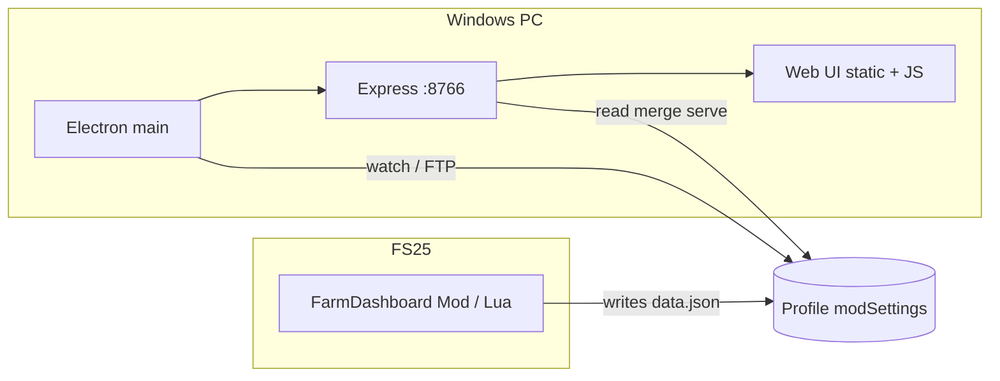

# FarmHub — Developer handover

This document describes the **FarmHub** workspace: the **FS25 Farm Dashboard** (Electron + embedded web UI + Express) and the **FS25 Farm Dashboard** Lua mod. It is for onboarding, audits, and maintenance.

**Current shipping app line:** **3.0.0** (`FS25_FarmDashboard_App/.../package.json`). **Mod:** **2.0.0.0** (`modDesc.xml`, `FarmDashboard.VERSION` in Lua).

**User-facing detail:** [USER_MANUAL.md](./USER_MANUAL.md) · **Security:** [SECURITY.md](./SECURITY.md) · **History:** [CHANGELOG.md](./CHANGELOG.md)

| § | Topic |
| - | ----- |
| [1](#1-high-level-architecture) | Architecture |
| [2](#2-repository-layout) | Repository layout |
| [3](#3-data-flow) | End-to-end data flow |
| [4](#4-electron-and-web-ui) | Electron main + web client |
| [5](#5-merge-and-rules) | Merge layer and field rules |
| [6](#6-lua-mod) | Lua mod collectors |
| [7](#7-build-and-packaging) | Build, installer, output folders |
| [8](#8-debugging-checklist) | Debugging |
| [9](#9-key-files) | Key files |

---

## 1. High-level architecture



- **Game + mod** write **`data.json`** under `Documents/My Games/FarmingSimulator2025/modSettings/FS25_FarmDashboard/<save>/`.
- **Electron** starts **Express** (and optional **WebSocket** paths used by the SPA), watches files, runs **FTP polling**, merges streams, serves **`/api/*`** and static **`web/`** assets.
- **Browser** (embedded or external) loads **`web/index.html`** and polls APIs for JSON used by section modules.

**Renderer security:** `nodeIntegration: false`, `contextIsolation: true`; **`preload.js`** exposes **`window.farmDashAPI`** with a fixed IPC surface only.

---

## 2. Repository layout

| Path | Role |
| ---- | ---- |
| `FS25_FarmDashboard_Mod/FS25_FarmDashboard_Mod/` | In-game Lua; writes `data.json` |
| `FS25_FarmDashboard_App/FS25_FarmDashboard_App/` | `main.js`, `preload.js`, `package.json`, `dataMerger.js`, `web/` |
| `FS25_FarmDashboard_App/FS25_FarmDashboard_App/web/assests/` | Dashboard JS/CSS (historic folder spelling **assests**) |
| `tools/` | PowerShell helpers (mod shop images, build cleanup) |

---

## 3. Data flow

1. FS25 runs with the mod enabled on **authority** (SP or MP host/dedicated).
2. Staggered collectors assemble a payload; **`FarmDashboardDataCollector`** writes **`data.json`** on a **`collectionCycleMs`** cadence.
3. Electron watches **`data.json`** (and may fetch **savegame XML** locally or via **FTP** cache).
4. **`dataMerger.js`** merges Lua + XML for fields, vehicles, economy, etc. (see CHANGELOG §2.0.0 for merge precedence rules).
5. Express exposes merged JSON on **`/api/...`** routes; the web client stores and renders (e.g. **`apiStorage.js`**, **`realtime-connector.js`**).

---

## 4. Electron and web UI

- **`main.js`** — Express listen address (**127.0.0.1** vs **0.0.0.0** when LAN enabled), LAN middleware (Basic + IP allowlist, loopback bypass), FTP coordinator, merge pipeline, static hosting, IPC handlers for setup/mod export/locale/store.
- **`preload.js`** — Whitelisted `ipcRenderer.invoke` channels for the renderer.
- **`web/index.html`** + **`web/assests/js/`** — Vanilla JS modules per dashboard section (`fields.js`, `vehicles.js`, …), **`rules-engine.js`**, i18n under **`web/locales/`**.

---

## 5. Merge and rules

- **`dataMerger.js`** — Stable field IDs, `ownerFarmId`, windrow normalization (`normalizeWindrowTypeFromLua`, etc.), Lua-vs-XML precedence for `needsWork` and suggestions.
- **`rules-engine.js`** — Offline suggestions consumed by **`fields.js`** and field-card helpers (fleet/shop tool lists, PF vs conventional branches).
- **`field-suggestion-tools.js`** (if present in tree) — Labels and tool metadata for the rules UI.

---

## 6. Lua mod

- **`FarmDashboard.lua`** — Mission hook; authority gate.
- **`FarmDashboardDataCollector.lua`** — Staggered slice runner; **`toJSON`** serialization.
- **`FieldDataCollector.lua`** — Per-field probes (growth, bales, windrows via density helpers), **`pcall`** around fragile engine calls.

**Config:** `modSettings/FS25_FarmDashboard/config.xml` — `collectionCycleMs`, per-module toggles, intervals.

---

## 7. Build and packaging

```bash
cd FS25_FarmDashboard_App/FS25_FarmDashboard_App
npm install
npm run dist
```

- Default **`npm run dist`** uses **`tools/run-electron-builder.mjs`** → **`%LOCALAPPDATA%\fs25-farm-dashboard-electron-out`** (reduces IDE locks on `app.asar`).
- **`npm run clean:build-out`**, **`unlock-install`** — helpers when Windows Search or stale processes hold files.
- **NSIS** — `build/installer.nsh` macros; optional user-data wipe on uninstall.

**Auto-update:** Packaged builds may use `electron-updater` against GitHub Releases — verify `build.publish` in `package.json` matches your publishing repo.

---

## 8. Debugging checklist

| Symptom | Where to look |
| ------- | ------------- |
| Empty dashboard | Mod enabled + save loaded; path to `data.json`; FTP credentials/slot |
| Wrong farm | `activeFarmId`, `ownerFarmId`, `filterFieldsForFarmView` in `fields.js` / `apiStorage.js` |
| Merge oddities | `dataMerger.js` logs / temporary `DASH_DEBUG` style flags if present in your branch |
| LAN 403 | Allowlist + Basic auth; confirm client IP family (IPv4 vs IPv6 mapped) |

---

## 9. Key files

| File | Why it matters |
| ---- | -------------- |
| `FS25_FarmDashboard_App/.../main.js` | Express, FTP, merge, LAN, IPC |
| `FS25_FarmDashboard_App/.../preload.js` | Renderer bridge |
| `FS25_FarmDashboard_App/.../dataMerger.js` | Lua + XML merge |
| `FS25_FarmDashboard_App/.../web/assests/js/modules/fields.js` | Field cards, windrow badge, rules hooks |
| `FS25_FarmDashboard_App/.../web/assests/js/rules-engine.js` | Offline field suggestions |
| `FS25_FarmDashboard_Mod/.../FieldDataCollector.lua` | Windrow + bale export |
| `FS25_FarmDashboard_Mod/.../FarmDashboardDataCollector.lua` | JSON write path |

---

## 10. Ownership and conventions

- Match existing **naming**, **IPC channel lists**, and **merge** semantics when extending payloads — prefer **additive** JSON fields and **aggregate-first** Lua tables.
- Do not reintroduce **large coordinate dumps** in `data.json`; keep files suitable for frequent rewrite from the game thread.

**Credits:** [AUTHORS.md](./AUTHORS.md).
