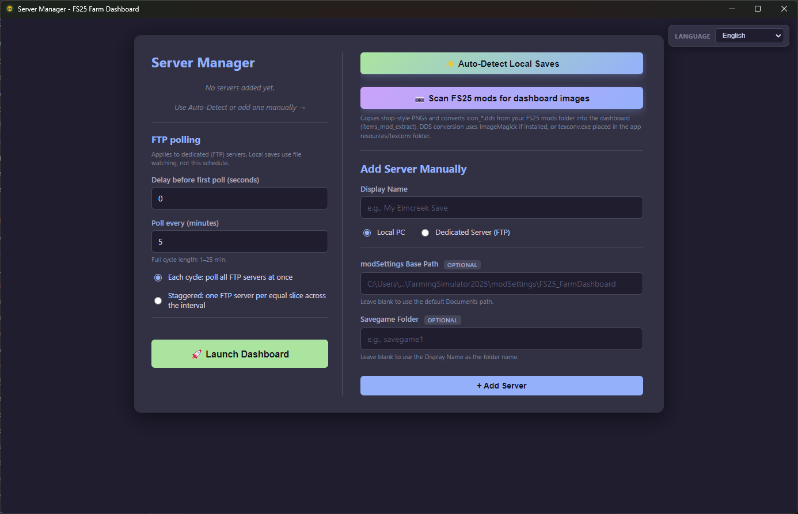
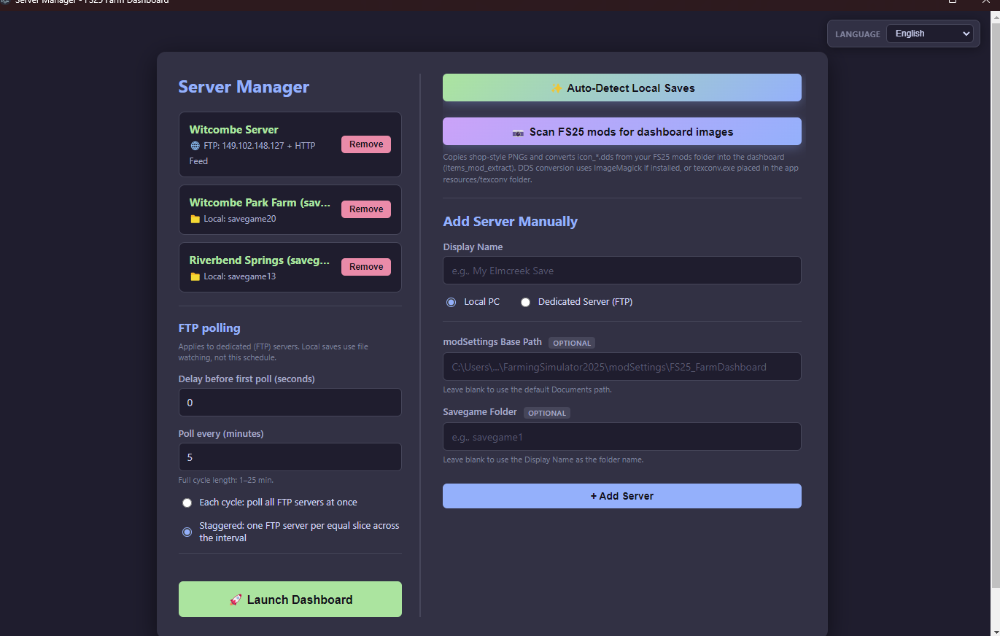

# FS25 Farm Dashboard — Installation guide

**Read this guide in order.** The mod must write `data.json` before the Windows app can show your farm.

| | |
| --- | --- |
| **App** | **4.2.0** (installer from [Releases](https://github.com/WizardlyPayload/FarmHub/releases)) |
| **Mod** | **3.4.0.6** (`FS25_FarmDashboard.zip`) |
| **Dashboard URL** | [http://localhost:8766](http://localhost:8766) after setup |

**After install:** day-to-day use is in [`USER_MANUAL.md`](./USER_MANUAL.md). **Upgrading from 2.0.0?** See [`UPGRADE_FROM_FS25-Farm-Dashboard.md`](./UPGRADE_FROM_FS25-Farm-Dashboard.md).

---

## Why mod before app

The **Windows app does not run inside FS25**. It only reads **`data.json`**, which the **in-game mod** creates while you play (or while a dedicated server runs with the mod).

Until you **load a save with the mod enabled** at least once:

- `modSettings/FS25_FarmDashboard/<savegame>/` may not exist.
- `data.json` is missing or stale.
- The dashboard shows **“waiting for data”** even if the app is installed.

On a **dedicated / rented server**, the mod must be active on that server. You can get `data.json` onto the PC that runs the desktop app either by **joining as a client** (recommended when someone can stay connected — **no FTP**) or by **FTP** (Advanced — headless-only admins). See [Dedicated server](#dedicated-server-join-as-client-or-ftp) below.

---

## Stage A — Install the mod

1. Download **`FS25_FarmDashboard.zip`** from [Releases](https://github.com/WizardlyPayload/FarmHub/releases).
2. Copy it into your FS25 **mods** folder (do not rename the zip unless you know the game still loads it):

   `Documents\My Games\FarmingSimulator2025\mods\`

   **Alternative:** extract so you have `mods\FS25_FarmDashboard\` with `modDesc.xml` at that folder root (same layout as the release zip).

3. Start **Farming Simulator 25** once so the game registers the mod.


*Figure: File Explorer showing **`FS25_FarmDashboard`** (`.zip` or folder) under **`mods\`**.*

---

## Stage B — Enable the mod on every save

Repeat for **each savegame** (and each dedicated-server save) that should use the dashboard:

1. Open the save’s **Mods** list in FS25.
2. Enable **Farm Dashboard** / **FS25 Farm Dashboard**.
3. **Load the save and enter the world** (main menu alone is not enough).


*Figure: Mod ticked in the save’s mod list.*

---

## Stage C — Confirm `data.json` is updating

After about one minute in-game, check:

```
%USERPROFILE%\Documents\My Games\FarmingSimulator2025\modSettings\FS25_FarmDashboard\<savegame>\data.json
```

The file should exist and its **Modified** time should advance while you play.


*Figure: File Explorer on that folder with a recent `data.json` timestamp.*

**Dedicated server:**

- **Join as client (no FTP):** after you opt in on a joined client PC, confirm `data.json` appears under that PC’s local `modSettings\FS25_FarmDashboard\<slot>\` path (same layout as above) and that **Modified** advances while the client stays connected.
- **FTP (Advanced):** confirm the same path exists on the **server** profile you will point the app at, not only on your gaming PC.

---

## Stage D — Install the Windows app

1. Download **`FS25-Farm-Dashboard-Setup-4.2.0.exe`** from [Releases](https://github.com/WizardlyPayload/FarmHub/releases).
2. Run the installer. Choose language on the welcome page.
3. Finish setup and launch **Farm Dashboard** from the Start menu.


*Figure: NSIS welcome / language page.*


*Figure: Installer **Finished** page.*

---

## Stage E — First launch and Setup

On first launch the app opens **Server Manager** (`setup.html`) if no servers are configured.



*Figure: App window before you complete Setup (or empty server list).*

### Setup walk-through

| Step | Action | Screenshot |
| ---- | ------ | ---------- |
| Language | Top-right dropdown on Setup | `fd-setup-010-language-corner.png` **[manual]** |
| Empty list | First open, no servers yet | `fd-setup-020-empty-server-list.png` **[manual]** |
| Auto-detect | Click **Auto-detect saves** | `fd-setup-030-auto-detect.png` **[manual]** |
| Add local | Fill **Local PC** form, **+ Add Server** | `fd-setup-040-add-local.png` **[manual]** |
| Add local (incl. DS join-as-client) | Fill **Local PC** — path to the client’s `modSettings\…\<slot>\` folder | `fd-setup-040-add-local.png` **[manual]** |
| Add FTP | Fill **Dedicated Server (FTP)** — Advanced / headless (blur passwords) | `fd-setup-050-add-ftp.png` **[manual]** |
| FTP polling | Set delay / interval / stagger vs sync (FTP rows only) | `fd-setup-060-ftp-polling.png` **[manual]** |
| Mod images | Optional **Scan FS25 mods for dashboard images** | `fd-setup-070-mod-images.png` **[manual]** |
| Launch | At least one server in the list → **Launch Dashboard** | `fd-setup-080-launch-button.png` **[manual]** |



*Figure: fd-setup-080-launch-button.png.**Figure: Server Manager with **Launch Dashboard**. **[manual]** capture.*

After launch, open **[http://localhost:8766](http://localhost:8766)** in the app window or your browser.

---

## Post-install checks

| Check | Expected |
| ----- | -------- |
| Landing page | Six section cards with counts (or zeros until data arrives) |
| Data-source badge | **XML + Live + API** (or subset if XML/API unavailable) |
| Settings → Servers | Correct **Local** path (SP, or DS join-as-client) or FTP host + save slot |
| Wrong save empty | Repeat **Stage B** for that save |

---

## Dedicated server (join as client or FTP)

Dedicated / rented hosts write `data.json` on the **authority** (the dedicated process). The desktop app still needs that file on the PC where Farm Dashboard runs. You have two supported paths:

| Path | When to use | App mode |
| ---- | ----------- | -------- |
| **Join as client (recommended)** | Someone can join the server with the same mod (spare/alt account or admin playing) | **Local** — file watch — **no FTP** |
| **FTP (Advanced)** | Headless-only: zero players, or you prefer remote poll | **FTP** — scheduled poll |

Works the same for the legacy desktop app (**4.2.1** line) and **v5** (NEW APP): both watch a local `data.json` folder in Local mode. FTP remains available as Advanced.

**Not a substitute:** Giants dedicated HTTP on port **:8080** is an optional XML feed for richer merge fields — it does **not** replace `data.json`. Do not remove or skip FTP if you need headless-only access; join-as-client does not replace FTP for empty servers.

Day-to-day detail: [`USER_MANUAL.md` §3.4a](./USER_MANUAL.md#34a-dedicated-server--join-as-client-no-ftp) · [§3.5 FTP](./USER_MANUAL.md#35-add-server-ftp).

### Option A — Join as client (no FTP)

Requires an **updated Farm Dashboard mod** with the **export mirror** feature (ships with the **4.2.1** / **v5** release line — update the mod zip on the dedicated server **and** on the client PC).

1. Install **`FS25_FarmDashboard.zip`** on the **dedicated server** (Stages A–B on the server save).
2. On the PC that runs the desktop app, install the **same mod**, then **join the dedicated server as a multiplayer client** (spare/alt account or admin playing is fine).
3. **Opt in** so this client receives the mirrored export. Look for a Farm Dashboard / mod setting along the lines of **mirror export to this client** (exact Setup / in-game labels may say *Mirror export*, *Receive server export*, or similar until UI copy is final).
4. The dedicated **authority** streams the export over MP events; the **joined client** writes:

   ```
   %USERPROFILE%\Documents\My Games\FarmingSimulator2025\modSettings\FS25_FarmDashboard\mirror_<slot>\data.json
   ```

   The `mirror_` prefix keeps dedicated data separate from this PC’s single-player `savegameN` exports (same slot numbers never overwrite each other). Confirm the file’s **Modified** time advances while the client stays connected.
5. In Farm Dashboard Setup or **Settings → Servers & saves**, add a **Local** server pointing at that folder (or use **Auto-detect saves**). Launch — **no FTP required**.

**Honest limits**

- Needs **at least one** connected client with the mod and mirror opt-in. An empty dedicated server with **zero players** does **not** mirror until someone joins.
- Large exports may lag a few seconds behind the authority write.
- Requires the updated mod with export mirror on **both** server and client.

### Option B — FTP (Advanced) + optional HTTP feed

Use when nobody can stay joined, or your host already exposes FTP.

1. Complete Stages **A–C** on the server (mod enabled, save loaded, `data.json` present on the server profile).
2. In Setup or **Settings → Servers & saves**, add a **Dedicated Server (FTP)** row:
   - FTP host, port, username, password
   - **Base profile path** (often `profile`)
   - **Savegame slot folder** (e.g. `savegame1`)
3. Optional **HTTP feed** (Giants dedicated XML): server IP, port **8080**, access code — improves vehicle age, prices, and market history when available. This is **not** a replacement for `data.json`.
4. Set **Poll every** (1–25 minutes). **Local** (including join-as-client) uses file watching; FTP uses this schedule.


*Figure: fd-settings-020-servers-list.png.**Figure: Settings → Servers — polling and configured servers. **[auto]** capture.*

---

## Troubleshooting install

| Symptom | Fix |
| ------- | --- |
| **Waiting for data** | Stage B + C; correct path in Settings |
| **Port 8766 in use** | Close other apps on 8766; restart Farm Dashboard |
| **Join-as-client: no local `data.json`** | Client still connected? Same updated mod on server + client? Mirror opt-in enabled? Empty server = no mirror until someone joins |
| **FTP never updates** | Check credentials, slot name, firewall; interval ≥ 1 min |
| **Blank after upgrade** | Update **both** app and mod from the same release line (mirror needs the updated mod) |

More detail: [`USER_MANUAL.md` §10](./USER_MANUAL.md#10-troubleshooting) · [`SECURITY.md`](./SECURITY.md) (LAN).

---

## Screenshots for this guide

Place published PNGs in [`docs/doc-screenshots/`](./doc-screenshots/) using the exact names above (drop WIP captures in [`docs/screenshots/`](./screenshots/) first). Full manifest and capture checklist: [`SCREENSHOTS.md`](./SCREENSHOTS.md).

**Authors:** [`AUTHORS.md`](./AUTHORS.md)
