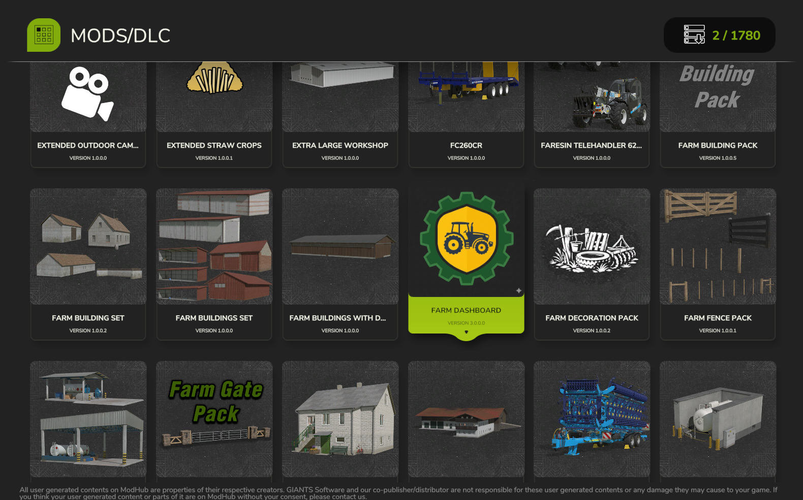
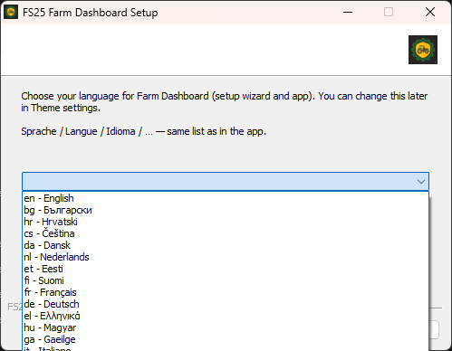
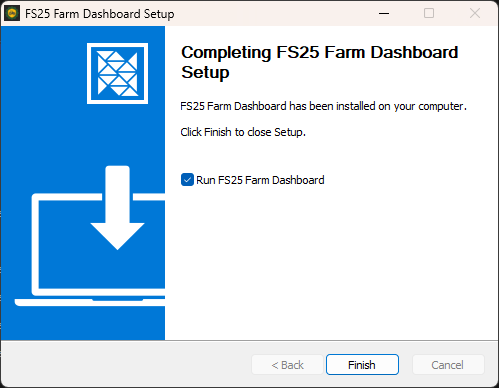
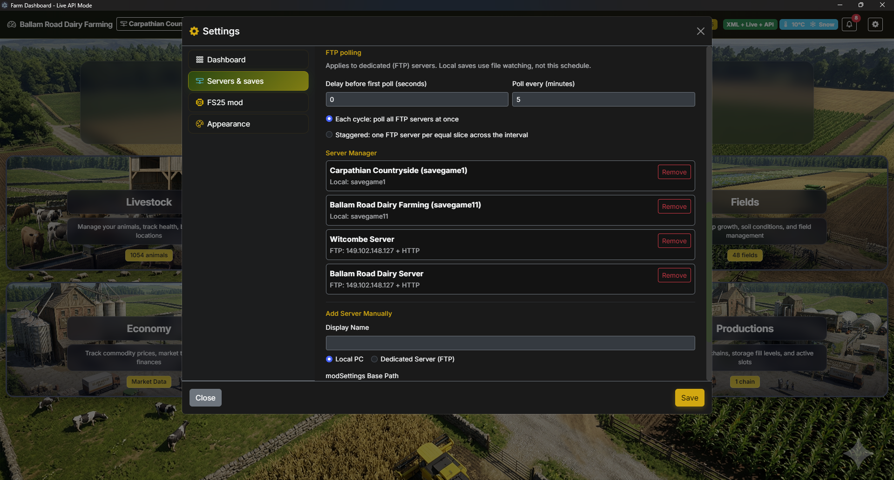

# FS25 Farm Dashboard — Installation guide

**Read this guide in order.** The mod must write `data.json` before the Windows app can show your farm.

| | |
| --- | --- |
| **App** | **4.1.0** (installer from [Releases](https://github.com/WizardlyPayload/FarmHub/releases)) |
| **Mod** | **3.1.0.0** (`FS25_FarmDashboard.zip`) |
| **Dashboard URL** | [http://localhost:8766](http://localhost:8766) after setup |

**After install:** day-to-day use is in [`USER_MANUAL.md`](./USER_MANUAL.md). **Upgrading from 2.0.0?** See [`UPGRADE_FROM_FS25-Farm-Dashboard.md`](./UPGRADE_FROM_FS25-Farm-Dashboard.md).

---

## Why mod before app

The **Windows app does not run inside FS25**. It only reads **`data.json`**, which the **in-game mod** creates while you play (or while a dedicated server runs with the mod).

Until you **load a save with the mod enabled** at least once:

- `modSettings/FS25_FarmDashboard/<savegame>/` may not exist.
- `data.json` is missing or stale.
- The dashboard shows **“waiting for data”** even if the app is installed.

On a **hosted / FTP server**, the mod must be active on that server and the save must have run so `data.json` exists where your FTP path points.

---

## Stage A — Install the mod

1. Download **`FS25_FarmDashboard.zip`** from [Releases](https://github.com/WizardlyPayload/FarmHub/releases).
2. Copy it into your FS25 **mods** folder (do not rename the zip unless you know the game still loads it):

   `Documents\My Games\FarmingSimulator2025\mods\`

   **Alternative:** extract so you have `mods\FS25_FarmDashboard\` with `modDesc.xml` at that folder root (same layout as the release zip).

3. Start **Farming Simulator 25** once so the game registers the mod.


*Figure: File Explorer showing **`FS25_FarmDashboard`** (`.zip` or folder) under **`mods\`**.*

---

## Stage B — Enable the mod on every save

Repeat for **each savegame** (and each dedicated-server save) that should use the dashboard:

1. Open the save’s **Mods** list in FS25.
2. Enable **Farm Dashboard** / **FS25 Farm Dashboard**.
3. **Load the save and enter the world** (main menu alone is not enough).



*Figure: Mod ticked in the save’s mod list.*

---

## Stage C — Confirm `data.json` is updating

After about one minute in-game, check:

```
%USERPROFILE%\Documents\My Games\FarmingSimulator2025\modSettings\FS25_FarmDashboard\<savegame>\data.json
```

The file should exist and its **Modified** time should advance while you play.


*Figure: File Explorer on that folder with a recent `data.json` timestamp.*

**Dedicated / FTP server:** confirm the same path exists on the server profile you will point the app at (via FTP), not only on your gaming PC.

---

## Stage D — Install the Windows app

1. Download **`FS25 Farm Dashboard Setup 4.1.0.exe`** from [Releases](https://github.com/WizardlyPayload/FarmHub/releases).
2. Run the installer. Choose language on the welcome page.
3. Finish setup and launch **Farm Dashboard** from the Start menu.



*Figure: NSIS welcome / language page.*



*Figure: Installer **Finished** page.*

---

## Stage E — First launch and Setup

On first launch the app opens **Server Manager** (`setup.html`) if no servers are configured.


*Figure: App window before you complete Setup (or empty server list).*

### Setup walk-through

| Step | Action | Screenshot |
| ---- | ------ | ---------- |
| Language | Top-right dropdown on Setup | `fd-setup-010-language-corner.png` **[manual]** |
| Empty list | First open, no servers yet | `fd-setup-020-empty-server-list.png` **[manual]** |
| Auto-detect | Click **Auto-detect saves** | `fd-setup-030-auto-detect.png` **[manual]** |
| Add local | Fill **Local PC** form, **+ Add Server** | `fd-setup-040-add-local.png` **[manual]** |
| Add FTP | Fill **Dedicated Server (FTP)** (blur passwords in captures) | `fd-setup-050-add-ftp.png` **[manual]** |
| FTP polling | Set delay / interval / stagger vs sync | `fd-setup-060-ftp-polling.png` **[manual]** |
| Mod images | Optional **Scan FS25 mods for dashboard images** | `fd-setup-070-mod-images.png` **[manual]** |
| Launch | At least one server in the list → **Launch Dashboard** | `fd-setup-080-launch-button.png` **[manual]** |


*Figure: fd-setup-080-launch-button.png.**Figure: Server Manager with **Launch Dashboard**. **[manual]** capture.*

After launch, open **[http://localhost:8766](http://localhost:8766)** in the app window or your browser.

---

## Post-install checks

| Check | Expected |
| ----- | -------- |
| Landing page | Six section cards with counts (or zeros until data arrives) |
| Data-source badge | **XML + Live + API** (or subset if XML/API unavailable) |
| Settings → Servers | Correct local path or FTP host + save slot |
| Wrong save empty | Repeat **Stage B** for that save |

---

## Dedicated server (FTP + optional HTTP feed)

1. Complete Stages **A–C** on the server (mod enabled, save loaded, `data.json` present on the server profile).
2. In Setup or **Settings → Servers & saves**, add a **Dedicated Server (FTP)** row:
   - FTP host, port, username, password
   - **Base profile path** (often `profile`)
   - **Savegame slot folder** (e.g. `savegame1`)
3. Optional **HTTP feed** (Giants dedicated XML): server IP, port **8080**, access code — improves vehicle age, prices, and market history when available.
4. Set **Poll every** (1–25 minutes). **Local saves** use file watching; FTP uses this schedule.



*Figure: fd-settings-020-servers-list.png.**Figure: Settings → Servers — polling and configured servers. **[auto]** capture.*

---

## Troubleshooting install

| Symptom | Fix |
| ------- | --- |
| **Waiting for data** | Stage B + C; correct path in Settings |
| **Port 8766 in use** | Close other apps on 8766; restart Farm Dashboard |
| **FTP never updates** | Check credentials, slot name, firewall; interval ≥ 1 min |
| **Blank after upgrade** | Update **both** app and mod from the same release line |

More detail: [`USER_MANUAL.md` §10](./USER_MANUAL.md#10-troubleshooting) · [`SECURITY.md`](./SECURITY.md) (LAN).

---

## Screenshots for this guide

Place PNGs in [`docs/screenshots/`](./screenshots/) using the exact names above. Full manifest and capture checklist: [`SCREENSHOTS.md`](./SCREENSHOTS.md).

**Authors:** [`AUTHORS.md`](./AUTHORS.md)
