# FS25 Farm Dashboard — User manual (v4.1)

**Farm Dashboard** is the Windows desktop app that reads live farm data from **Farming Simulator 25** (via the in-game **FS25 Farm Dashboard** mod) and renders it in your browser at **[http://localhost:8766](http://localhost:8766)**. **App version 4.1.0**, **mod version 3.1.0.0**.

This manual walks every setting, every section, and every modal, with **inline screenshots** (below each section). Where we already have a similar capture, one image is reused instead of asking twice. Screenshot filenames, capture recipes, and the “still to capture” checklist are in [`SCREENSHOTS.md`](./SCREENSHOTS.md).

**Companion docs:** [`INSTALL.md`](./INSTALL.md) · [`SECURITY.md`](./SECURITY.md) · [`CHANGELOG.md`](./CHANGELOG.md) · [`SCREENSHOTS.md`](./SCREENSHOTS.md)

> **Screenshots not visible?** Open **Markdown Preview** (`Ctrl+Shift+V`) while this file is focused — the editor tab alone shows text, not pictures. Images are in [`screenshots/`](./screenshots/) beside this file. On GitHub they appear only after PNGs are **committed and pushed**.

---

## Table of contents

1. [What you need](#1-what-you-need)
2. [Install order (Stages A–E)](#2-install-order-stages-ae)
3. [First-run Setup](#3-first-run-setup)
4. [Main screen map](#4-main-screen-map)
5. [Settings modal — every tab and control](#5-settings-modal--every-tab-and-control)
6. [Dashboard sections](#6-dashboard-sections)
7. [Modals](#7-modals)
8. [LAN access and tablets](#8-lan-access-and-tablets)
9. [In-game mod settings (`config.xml`)](#9-in-game-mod-settings-configxml)
10. [Troubleshooting](#10-troubleshooting)
11. [Screenshot index](#11-screenshot-index)

> Screenshot tags: **[auto]** = captured against the running web UI; **[manual]** = you supply (Windows installer, in-game screens, file-explorer / editor views, tablet photo).

---

## 1. What you need

| Item | Purpose |
| ---- | ------- |
| **Farming Simulator 25** | Game must run with the mod for live data to exist |
| **FS25 Farm Dashboard mod** | **`FS25_FarmDashboard.zip`** or folder **`FS25_FarmDashboard`** in your FS25 `mods` folder |
| **FS25 Farm Dashboard app (Windows)** | Installer `FS25 Farm Dashboard Setup 4.1.0.exe` |
| **Browser** | Edge, Chrome, Firefox — opens [http://localhost:8766](http://localhost:8766) |
| **(Optional) FTP credentials** | If FS25 runs on a dedicated / rented server you do not own locally |
| **(Optional) LAN network** | If you want the dashboard on a tablet or second screen |

---

## 2. Install order (Stages A–E)

Do these **in order**. Skipping a stage is the most common reason the dashboard shows "waiting for field data".

### Stage A — Install the mod

1. Copy **`FS25_FarmDashboard.zip`** into **`Documents\My Games\FarmingSimulator2025\mods\`** (recommended), **or** copy/extract so you have **`mods\FS25_FarmDashboard\`** with **`modDesc.xml`** at that folder root (same layout as the release zip from **`tools\Zip-FarmDashboardMod.ps1`**).
2. Start FS25 once so it sees the mod.


*Figure: **`FS25_FarmDashboard`** visible under FS25 **`mods\`** (folder **or** `.zip`).*

### Stage B — Enable per save

For **every** savegame where you want the dashboard:

1. Enable **FS25 Farm Dashboard** in the save's mod list.
2. Load the save and enter the world (the main menu alone does not start collectors).


*Figure: Mod ticked in the save's mod list.*

### Stage C — Confirm the mod is writing data

After a minute, look in:

```
%USERPROFILE%\Documents\My Games\FarmingSimulator2025\modSettings\FS25_FarmDashboard\<savegame>\data.json
```

`data.json` should be present and have a recent **modified** timestamp.


*Figure: `data.json` shown in File Explorer with a fresh timestamp.*

### Stage D — Install the Windows app

1. Run **`FS25 Farm Dashboard Setup 4.1.0.exe`**.
2. Pick installer language on the welcome page; complete the installer.
3. Launch **Farm Dashboard** from the Start menu.


*Figure: NSIS welcome page (language pick).*


*Figure: Installer "Finished" page.*

### Stage E — First launch

The app starts the Express server on `127.0.0.1:8766`, opens its window, and walks you through Setup if no servers are configured (see §3). After Setup completes you land on the **dashboard home** (§4).


*Figure: App window on first launch, before Setup.*

---

## 3. First-run Setup

The Setup page (`setup.html`) is a **left/right split**:

- **Left** — server list, FTP polling, the **Launch** button.
- **Right** — Auto-detect saves, mod images scan, Add server form.

### 3.1 Language corner

Top-right of the Setup page. Picking a language switches the page (and persists `farmdash_locale` for the main app too).


*Figure: Language dropdown highlighted.*

### 3.2 Server list

Each row shows the server name, source type, and a **Remove** button. The list is empty on first run.


*Figure: Empty list, ready for first add.*

### 3.3 Auto-detect saves

Right-side button. Scans `Documents\My Games\FarmingSimulator2025\modSettings\FS25_FarmDashboard\` and proposes one **Local** server per save it finds. Accept to add them to the list.

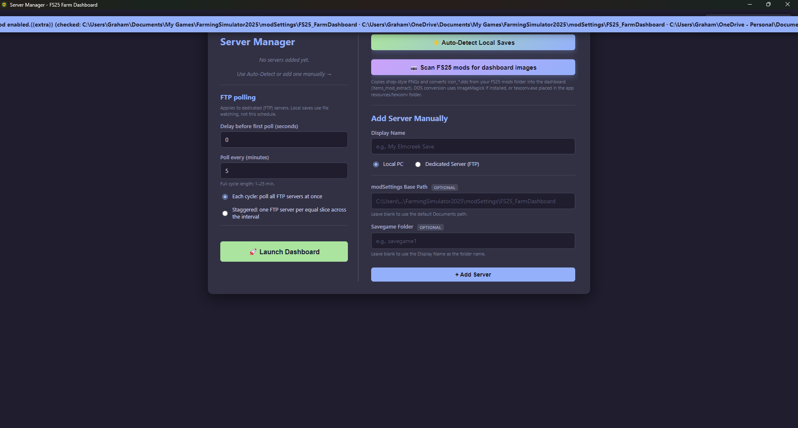

*Figure: Auto-detect result with two saves found.*

### 3.4 Add server (Local)

| Field | What to enter |
| ----- | ------------- |
| Display name | Friendly label, e.g. "PC main save" |
| Mode | **Local** |
| Local path | Full path to the folder containing `data.json`, e.g. `…\modSettings\FS25_FarmDashboard\savegame1` |
| (Optional) HTTP feed | Only when your host documents an extra XML/HTTP source |

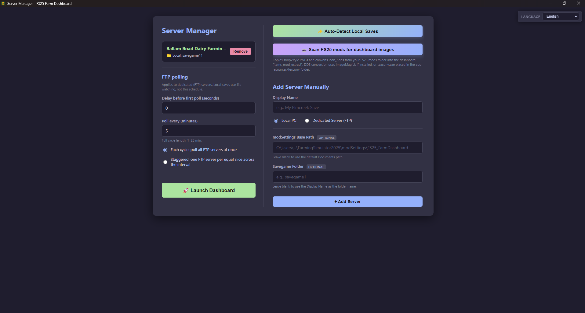

*Figure: Add-server form filled in for Local.*

### 3.5 Add server (FTP)

For a dedicated / rented FS25 server you do **not** play on locally.

| Field | Notes |
| ----- | ----- |
| Display name | e.g. "Rented dedi" |
| Mode | **FTP** |
| Host, port | Your provider's values |
| User, password | FTP credentials |
| Remote dir | The folder containing the savegame's `data.json` (often `modSettings/FS25_FarmDashboard/<savegame>/`) |
| Save slot | Slot number / folder name when needed |
| (Optional) HTTP feed | Only when your host documents one |

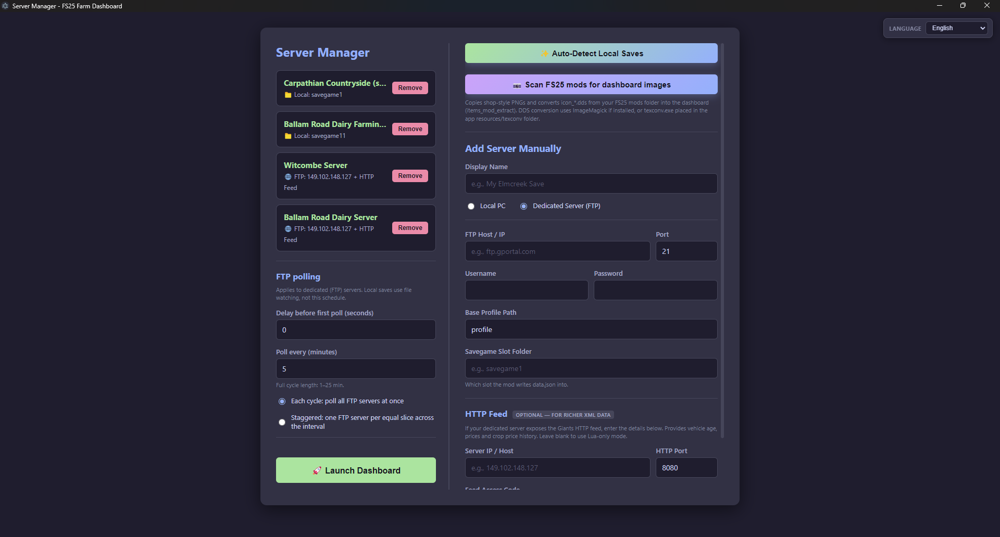

*Figure: Add-server form filled in for FTP (blur secrets).*

### 3.6 FTP polling

Polling settings apply to **all FTP servers** at once.

| Control | Range | Default | Effect |
| ------- | ----- | ------- | ------ |
| Initial delay (seconds) | 0 – 600 | 0 | Wait before the first poll fires |
| Interval (minutes) | 1 – 25 | 5 | Time between polls per server |
| Schedule | **Sync** / **Staggered** | Sync | Sync = all servers fire on the boundary; Staggered = offset each server by `interval / number of servers` |

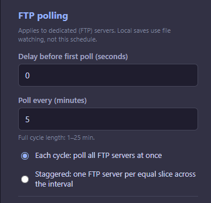

*Figure: FTP polling block.*

### 3.7 Mod images scan

Right-side button. Runs a background PowerShell helper to extract vehicle thumbnails from your installed mods. Has a progress overlay and can take a long time (capped at 90 minutes).

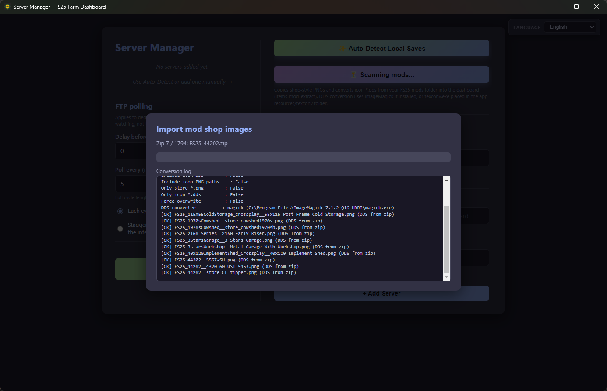

*Figure: Mod images progress overlay.*

### 3.8 Launch

Saves the config and reloads to the dashboard home.


*Figure: Setup ready to launch with one server.*

---

## 4. Main screen map

After Setup, the dashboard shell loads at [http://localhost:8766](http://localhost:8766). The top bar from left to right:

| Area | What it is |
| ---- | ---------- |
| **Server tabs** | One per configured server. Click to switch source. |
| **Farm dropdown** | Visible when the active server has more than one farm. |
| **Game time** | Live game day / hour from the mod. |
| **Data-source badge** | Combined "XML + Live + API" health pill. |
| **Weather pill** | Click to open the **Weather forecast** modal. |
| **Mod version badge** | Appears when the in-game mod is **older than 3.1.0.0** or missing a version export (legacy builds). |
| **Notification bell** | Count of recent notifications; click for history modal. |
| **Settings (gear)** | Opens the unified Settings modal (§5). Hidden in viewer mode. |
| **Home** | Returns to the landing page. |

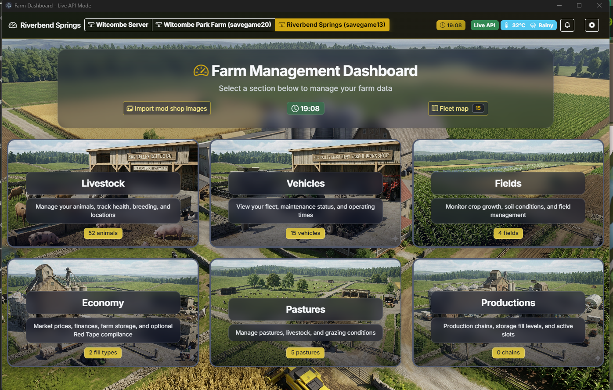

*Figure: **Home (landing page)** — server tabs, farm dropdown, game time, data-source and weather pills, notification bell, and settings. The six cards (Livestock, Vehicles, Fields, Economy, Pastures, Productions) show live counts. This one capture also covers `fd-shell-010-navbar`, `fd-shell-040-landing-badges`, and `fd-section-000-landing` in the manifest.*

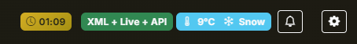

*Figure: Close-up crop of only the game time and weather pills.*

The **landing page** shows up to six section cards: Livestock, Vehicles, Fields, Economy, Pastures, Productions. Each card has a count badge using the localised pluralised string (`{{count}} animal/animals`, etc.).

Above the cards, the hero toolbar also exposes:

| Control | What it does |
| ------- | ------------ |
| **Import mod shop images** | Local-only scan of your FS25 `mods` folder for vehicle thumbnails (same flow as Setup §3.7). Hidden on read-only LAN viewer sessions. |
| **Game time badge** | Live day / hour from the mod. |
| **Fleet map** | Opens the live **Fleet map** section (§6.8) with a vehicle count badge. |

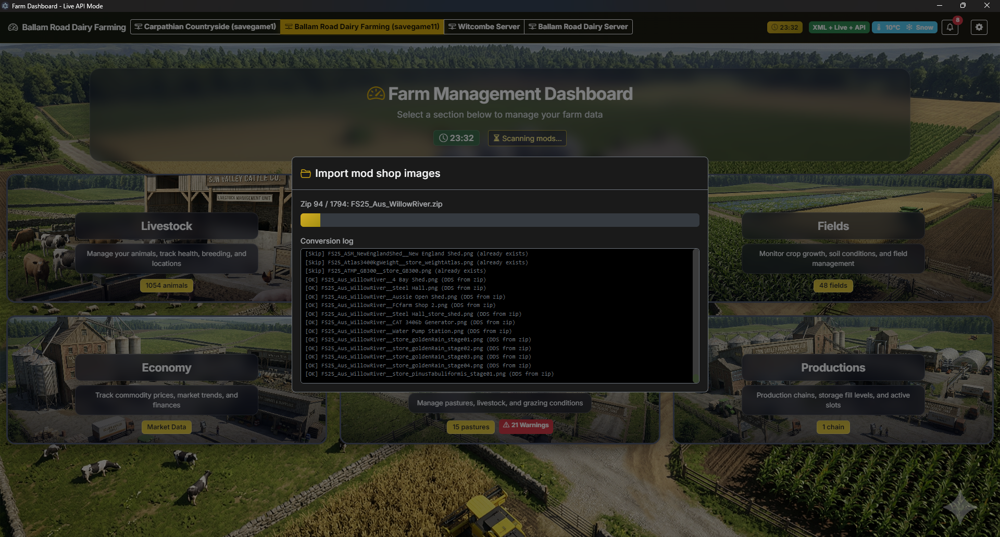

*Figure: Import button on landing.*

---

## 5. Settings modal — every tab and control

Open with the gear icon. The modal has a left-hand sidebar with four tabs, plus footer buttons:

- **Save** — saves the current tab's controls.
- **Save theme** — only on Appearance; saves theme colours.

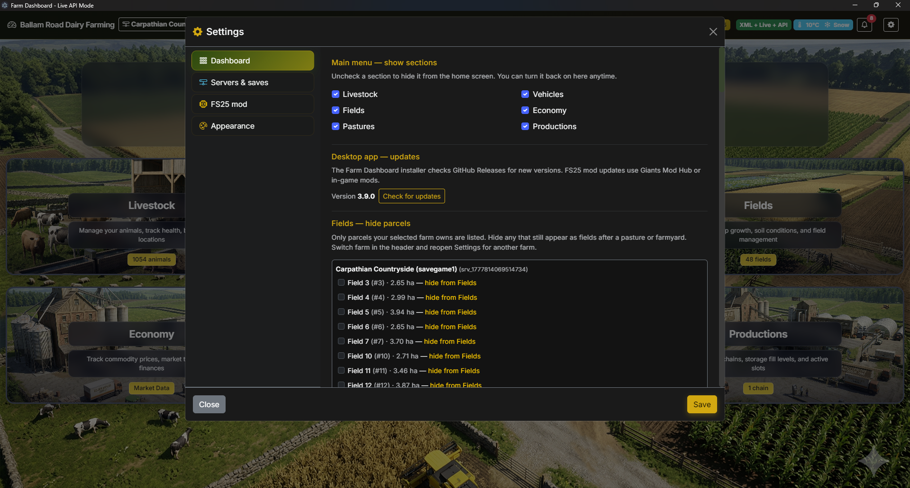

*Figure: Settings modal open on the first tab.*

*(Same UI as `fd-settings-000-modal-overview.png` — shown using `fd-settings-010-dashboard-toggles.png`.)*

### 5.1 Tab — Dashboard

| Control | What it does | Persisted as |
| ------- | ------------ | ------------ |
| **Section toggles (6)** | Show / hide Livestock, Vehicles, Fields, Economy, Pastures, Productions cards on the landing page | `uiPreferences.sections` |
| **Desktop version** | Read-only build version (e.g. `4.1.0`) | — |
| **Check for updates** | Triggers `electron-updater` against GitHub Releases | — |
| **Update status** | Live status line during checks | — |
| **Field exclusions** | Per-server, per-farmland checkboxes; un-tick to hide that parcel from the Fields page | `uiPreferences.excludedFarmlandIdsByServer` |
| **Field clusters** | Group several parcels into one **field card** — Auto (heuristic) or Manual (paste comma-separated ids) | `uiPreferences.fieldClusterPrefsByServer` |
| **SimHub view** | Cluster ids, pasture ids, production keys, plus a help text — feeds the optional `simhub.html` overlay page | `uiPreferences.simHubView` |


*Figure: Section toggles + version.*


*Figure: Field exclusions list.*

*(Same UI as `fd-settings-015-dashboard-exclusions.png` — shown using `fd-settings-010-dashboard-toggles.png`.)*

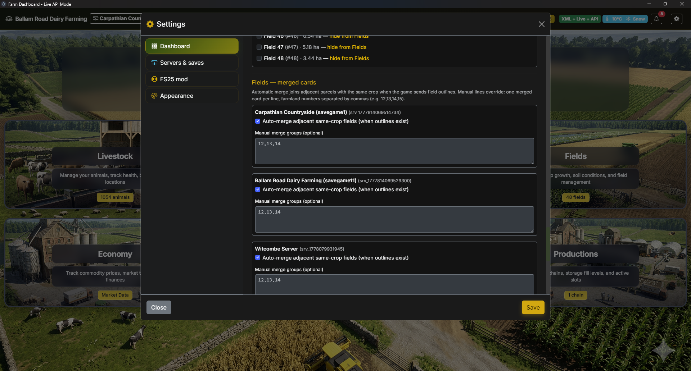

*Figure: Field clusters block.*

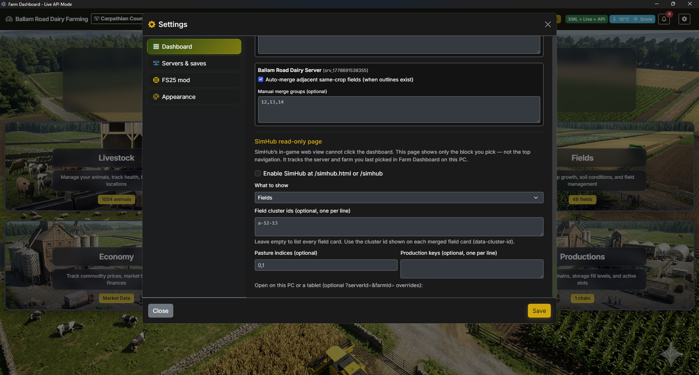

*Figure: SimHub view block.*

### 5.2 Tab — Servers & saves

| Control | What it does | Persisted as |
| ------- | ------------ | ------------ |
| **Enable LAN access** | Switches the HTTP/WS bind from `127.0.0.1` to `0.0.0.0` so other devices can connect | `lanAccessEnabled` |
| **LAN user** / **LAN password** | HTTP Basic credentials applied to non-loopback requests. v3.9: weak/default passwords are rejected when LAN access is enabled. | `lanUsername`, `lanPassword` |
| **IP allowlist** | Comma-separated CIDRs / IPs that may connect; empty = any LAN IP | `lanAllowlist` |
| **Require auth even from loopback** | Optional, for shared desktops | `lanRequireAuthForLoopback` |
| **Open full setup** | Opens `setup.html` in a separate window for power users | — |
| **Auto-detect saves** | Same as Setup §3.3 | — |
| **Mod images scan** | Same as Setup §3.7 | — |
| **FTP polling** | Initial delay, interval (minutes), schedule (Sync / Staggered) | `config.ftpPolling` |
| **Server list** | Current servers; **Remove** per row | `config.servers` |
| **Add server form** | Same fields as Setup §3.4 / §3.5 | `config.servers` |


*Figure: Servers tab top-half (LAN + servers list).*

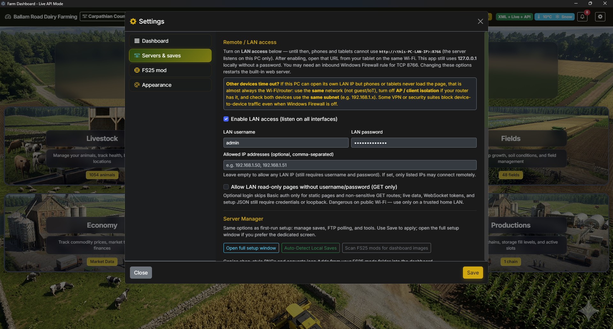

*Figure: LAN block close-up.*

*(Same UI as `fd-settings-021-servers-lan.png` — shown using `fd-lan-010-toggle-on.png`.)*


*Figure: FTP polling block.*

*(Same UI as `fd-settings-022-servers-ftp-polling.png` — shown using `fd-settings-020-servers-list.png`.)*

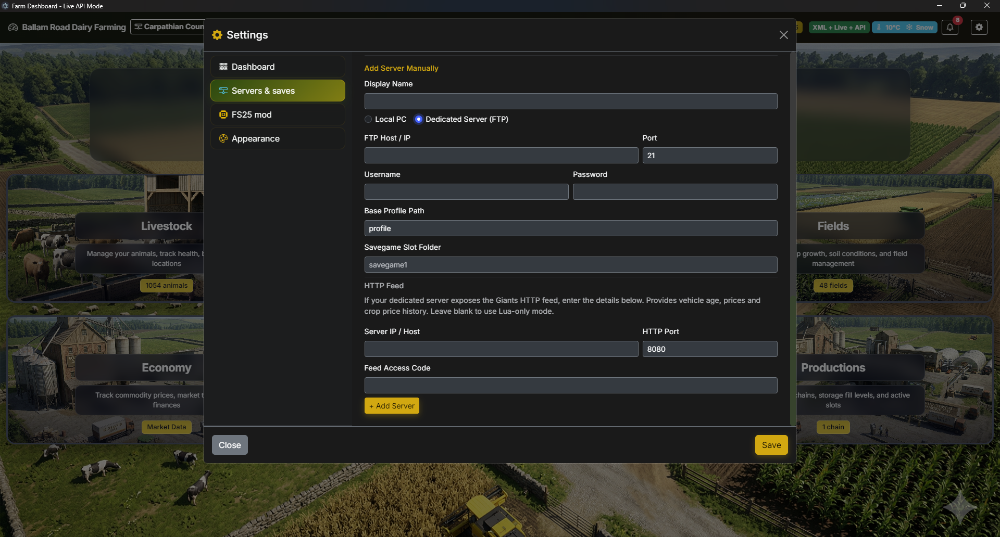

*Figure: Add-server form expanded.*

### 5.3 Tab — FS25 mod

Settings written here become `config.xml` on disk (see §9 for the file path).

| Control | What it does | Persisted as |
| ------- | ------------ | ------------ |
| **Config path** | Read-only label showing the actual `config.xml` path | — |
| **Update interval (ms)** | Legacy key; only used if `collectionCycleMs` missing | XML attr `updateInterval` |
| **Collection cycle (ms)** | Master cycle. Clamped 5 000 – 1 800 000 by the mod | XML attr `collectionCycleMs` |
| **Module checkboxes (7 in UI)** | Animals, Vehicles, Fields, Weather, Finance, Economy, Production | XML attrs `farmDashboard.modules#…` |

Additional collectors (**stock**, **baleInventory**, **redTape**) are toggled in `config.xml` (§9) — they are not yet exposed as checkboxes in this tab.

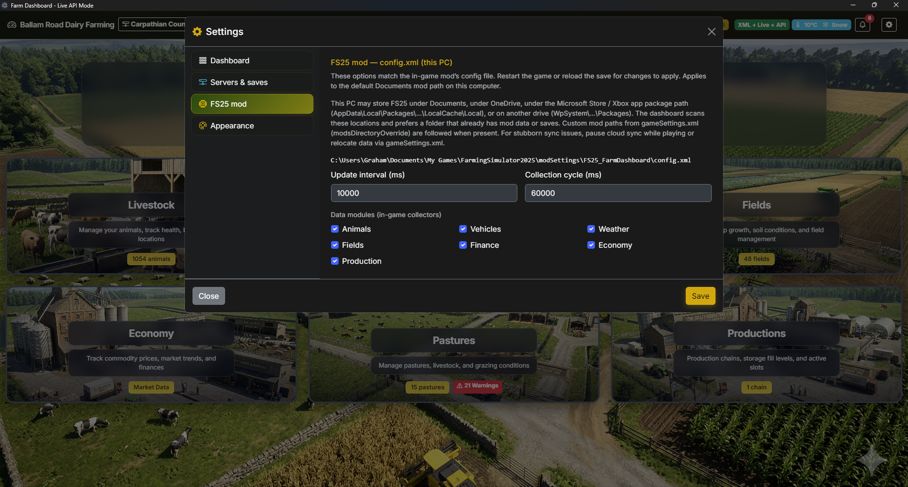

*Figure: FS25 mod tab with all controls.*

> **Note (audit gap #2):** the `debugBaleScan` flag in `config.xml` is **not** writable from this tab; if you need it, hand-edit `config.xml` (§9).

### 5.4 Tab — Appearance

| Control | What it does | Persisted as |
| ------- | ------------ | ------------ |
| **Language** | Picks the UI language; reloads the page on change | `localStorage` `farmdash_locale` + `electron-store` `locale` |
| **Tab selector** | Pick which themed area you are editing (Global / Dashboard / Sections / etc.) | — |
| **Background colour** | Page background | `localStorage` `dashboard_themes` |
| **Surface colour** | Cards, panels | same |
| **Text colour** | Primary text | same |
| **Accent colour** | Buttons, badges, highlights | same |
| **Copy to all** | Copy the current 4 colours to every tab | same |
| **Reset** | Reset the current tab to defaults | same |
| **Save theme** (footer) | Persists colour set | same |

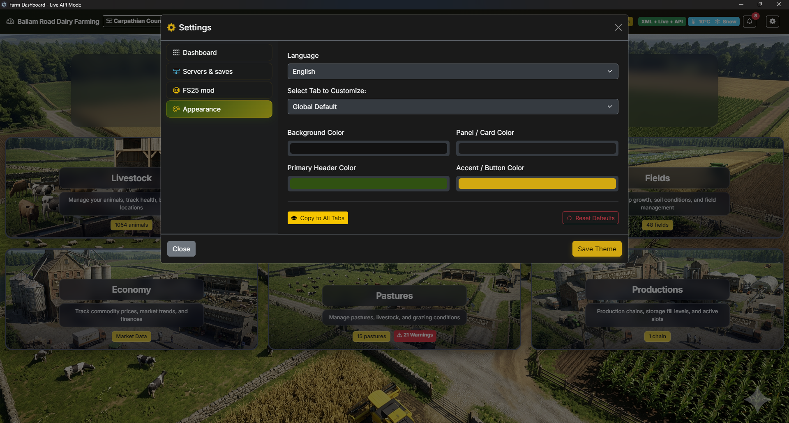

*Figure: Language picker.*

*(Same UI as `fd-settings-040-appearance-language.png` — shown using `fd-settings-041-appearance-theme.png`.)*


*Figure: Theme editor with colour pickers.*

The language picker triggers a full page reload so the freshly-loaded `translations.json` is applied everywhere (toasts, modals, splash, setup wizard).

---

## 6. Dashboard sections

Every section section header has a back-to-home button. Sections live under `web/assests/js/modules/`.

### 6.1 Landing (home)

Already covered in §4. The six cards are populated by `navigation.js` `updateLandingPageCounts()`. Card visibility follows the toggles in Settings → Dashboard.


*Figure: Full landing with all six cards.*

*(Same UI as `fd-section-000-landing.png` — shown using `fd-shell-020-landing.png`.)*

### 6.2 Livestock

| Control | What it does |
| ------- | ------------ |
| **Total animals** card | Click for an unfiltered list |
| **Lactating** card | Filter to lactating animals |
| **Pregnant** card | Filter to pregnant animals |
| **Average health** card | Read-only summary |
| **Show / hide filters** | Toggle the filter panel |
| **Reset filters** | Clear all filter controls |
| **Age / weight** numeric ranges | Numeric inputs |
| **Health, metabolism, fertility, quality, productivity** | Dual-handle sliders for min/max |
| **Animal type** | Filter to one type at a time |
| **Apply filters** | Apply the panel values |
| **Active filters** | Summary chips when something is active |
| **Animals table** | Sortable / paginated DataTable |
| **Export** | Opens the export modal (§7.2) |
| **Row "View" button** | Opens **Animal details** modal (§7.6) |

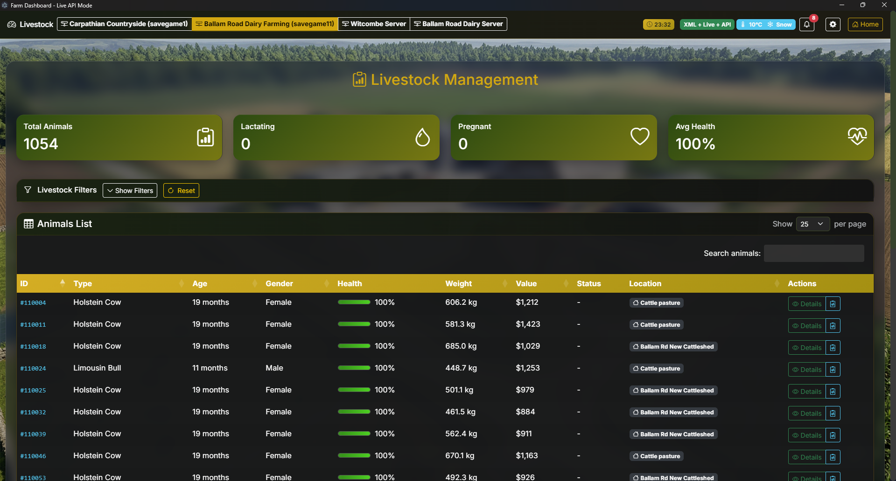

*Figure: Summary cards row.*

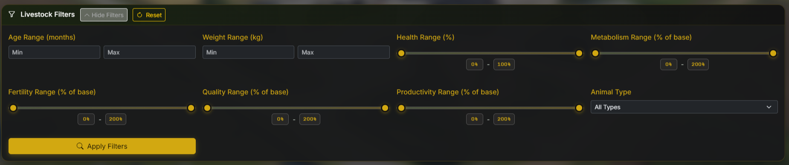

*Figure: Filter panel expanded.*

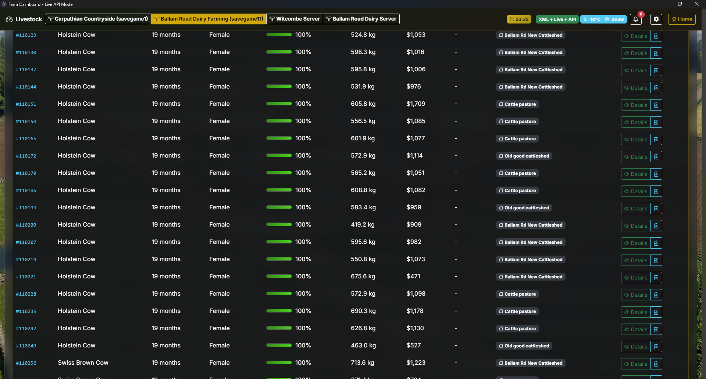

*Figure: Animals table.*

> **Note (audit gap #1):** the **Statistics** and **Genetics** panes exist in the markup (`#statistics-tab`, `#genetics-tab`) but no tab buttons switch to them in the current build. They are not exposed yet.

### 6.3 Vehicles

| Control | What it does |
| ------- | ------------ |
| **In workshop** card | Count of vehicles flagged by **Advanced Damage System (ADS)** as currently under service. Only shown when ADS exports data. |
| **In need of repair** card | Vehicles with ADS breakdowns, overdue service, or inspection warnings. Click to filter. |
| **Overdue service** card | ADS vehicles past their maintenance interval. |
| **Total vehicles** card | Click to clear filter and show all |
| **Low fuel** card | Click to filter `< 25%` fuel |
| **High damage** card | Click to filter `> 20%` damage |
| **Show / hide filters** | Toggle filter panel |
| **Vehicle type** select | All / Tractors / All motorized / Trailers / Implements / Cultivators / Pallets & others |
| **Fuel level** select | All / Empty (0%) / Low (<25%) / Medium (25–75%) / Full (>75%) |
| **Status** select | All / Engine running / Engine off / Damaged |
| **Apply filters** | Apply the panel values |
| **Vehicle grid** | Card per vehicle with image, name, fuel, damage, location |
| **Vehicle image click** | Opens **Vehicle image** modal (§7.8) |
| **ADS panel on a card** | When **FS25 Advanced Damage System** is installed, motorized cards can show workshop status, pre-shift inspection, damaged parts, and weakest subsystems. |
| **Vehicle years badge** | Model year and decade label when the mod exports `vehicleYears` metadata. |

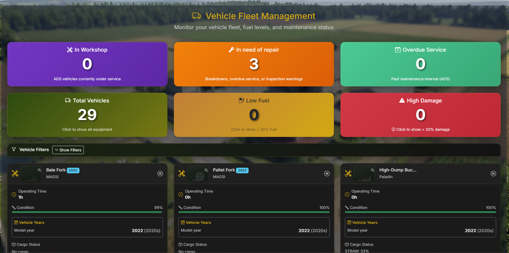

*Figure: Summary cards including ADS workshop / repair counts.*

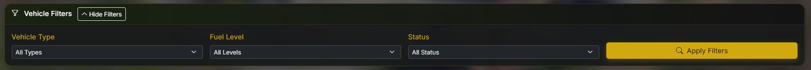

*Figure: Filters panel.*

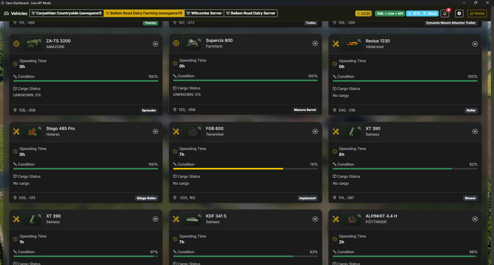

*Figure: Vehicle grid.*

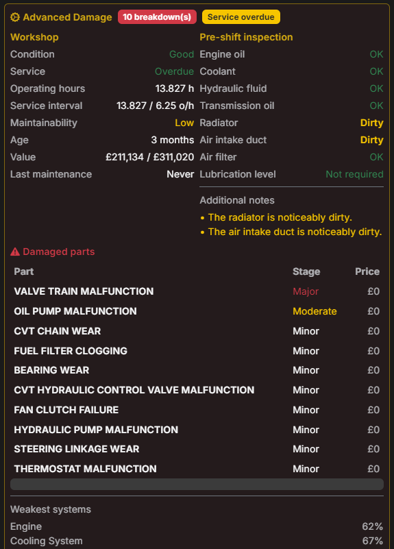

*Figure: Advanced Damage breakdown panel on a vehicle card.*

*(Summary row without ADS mods active may match `fd-section-vehicles-010-summary.png`.)*

### 6.4 Fields

The most feature-rich section.

| Control | What it does |
| ------- | ------------ |
| **Total fields** card | Read-only count |
| **Total area** card | Sum across non-excluded fields |
| **Needs work** card | Fields where the rules engine wants action |
| **Harvest ready** card | Fields the rules engine flags ready |
| **Refresh field rules** | Re-runs `rules-engine.js` against the current data |
| **All / Harvest ready / Needs work / Growing / Empty** | Filter buttons |
| **Search field** | Filter by name or id |
| **Field card** | Per parcel; see badges below |
| **Status badges** on a card | Withered / Harvested / Mulched / Ready / Needs work / Growing / Empty |
| **PF Soil badge** | Shown when Precision Farming is mapping nitrogen and pH |
| **Growth bar** | Animated bar showing current stage |
| **Forage / bale / windrow volume badge** | Loose straw / grass / hay, bale count, or windrow litres when present |
| **Moisture badge** | Shown when **[FS25 Moisture System](https://github.com/Ozz-Modding/FS25_MoistureSystem)** (or compatible export) reports crop moisture for the field |
| **Weeds row** | Percent cover with alert threshold; rules engine may suggest mechanical weeding before herbicide on early growth stages |
| **N mini-bar** | Current vs target nitrogen |
| **pH mini-bar** | Current pH vs target |
| **Suggested next step** | One-line recommendation; **Rules** badge if the rules engine produced it |
| **Tools & shop** | "From your fleet" / "Not in your fleet" / shop hints |
| **Waiting state** | Rendered when no merge data has arrived yet |
| **API error strip** | Rendered when the fetch fails. Background polling auto-retries every 5 seconds (no explicit retry button) |

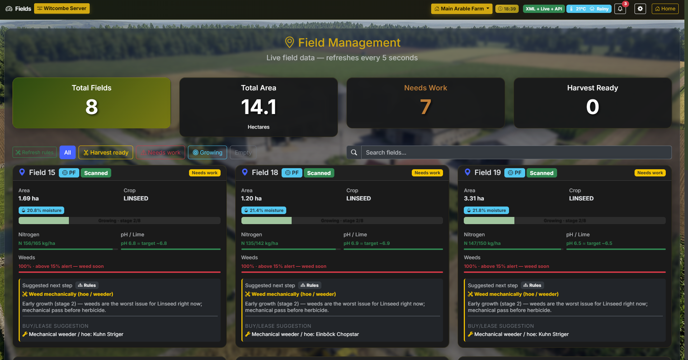

*Figure: Summary row.*


*Figure: Filter buttons + search.*

*(Same UI as `fd-section-fields-020-filter-bar.png` — shown using `fd-section-fields-010-summary.png`.)*

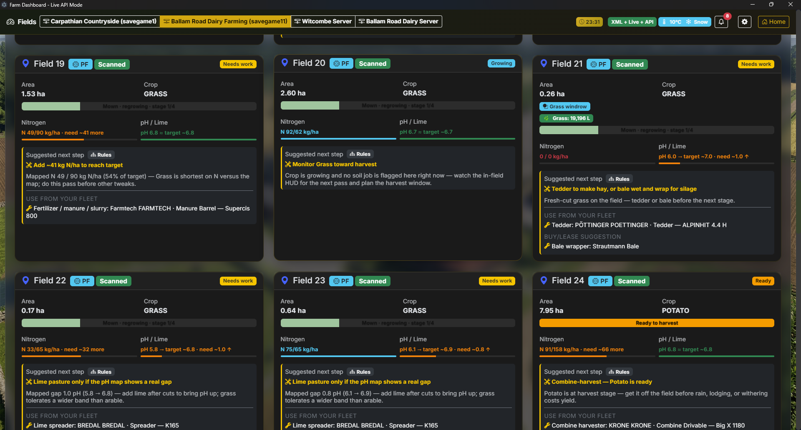

*Figure: One field card with the rules suggestion.*

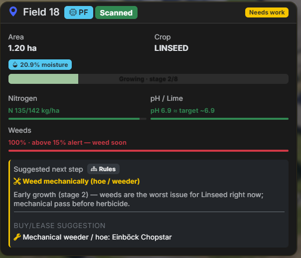

*Figure: Field card with moisture, weeds, and rules suggestion.*

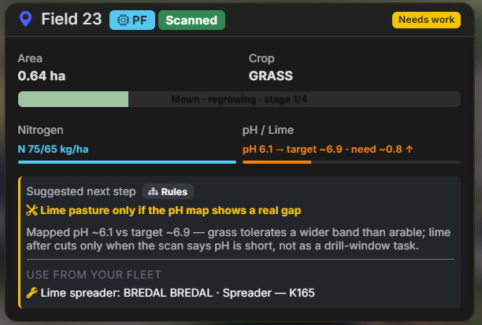

*Figure: Field card with N + pH mini-bars.*

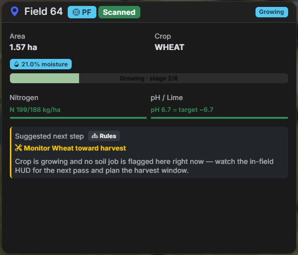

*Figure: Field card — monitor toward harvest (no soil job flagged).*

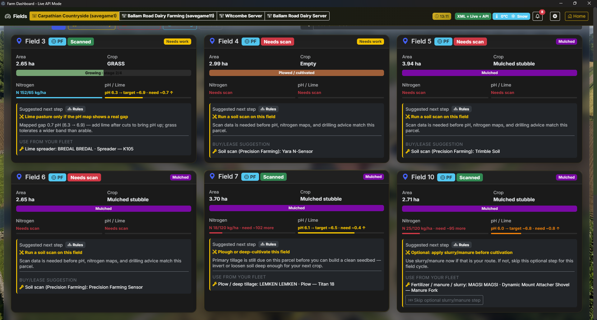

*Figure: Tools & shop block.*

When install and server setup are correct (§2–§3), Fields loads with live cards as in the figures above. A **waiting** message or **API error** strip only appears if `data.json` is missing, stale, or unreadable — that means something still needs fixing (mod, save load, or server path), not normal operation. See [INSTALL.md](./INSTALL.md) if you hit it.

### 6.5 Economy

The Economy section has up to four tabs: **Market prices**, **Equipment purchases**, **Storage**, and (when the **Red Tape** mod is active on the save) **Compliance**.

| Control | What it does |
| ------- | ------------ |
| **Current money** card | Live cash on hand |
| **Total purchases** card | Equipment value |
| **Outstanding loan** card | Current debt |
| **Net worth** card | Assets minus debt |
| **Market prices** tab | Crop / commodity prices with search |
| **Equipment purchases** tab | Purchased vehicles and implements with filters and sort |
| **Storage** tab | Silo & bunker stock table, **Bale stock** summary, and **Pallets & big bags** grid (see below) |
| **Compliance** tab | Red Tape policies, schemes, tax, grants, and recent events (only when exported) |
| **Filter — All equipment** | Show everything (Purchases tab) |
| **Filter — Vehicles** | Limit to vehicles |
| **Filter — Implements** | Limit to implements |
| **Sort — Price / Age / Name** | Sort buttons |
| **Market search** | Filter by crop or location |

#### Storage tab

| Block | What it shows |
| ----- | ------------- |
| **Silo & bunker stock** | Expandable table of fill types with litres, best sell point, value, and optional moisture / grade column when exported |
| **Bale stock** | Two cards: **Loose on cropland** (inside registered field polygons) vs **Storage** (yards, sheds, AUTO BALE STORAGE buildings, and other off-field farmland). Breakdown by straw / grass / hay / silage / other. |
| **Pallets & big bags** | Pallets, IBCs, and big bags grouped by product |

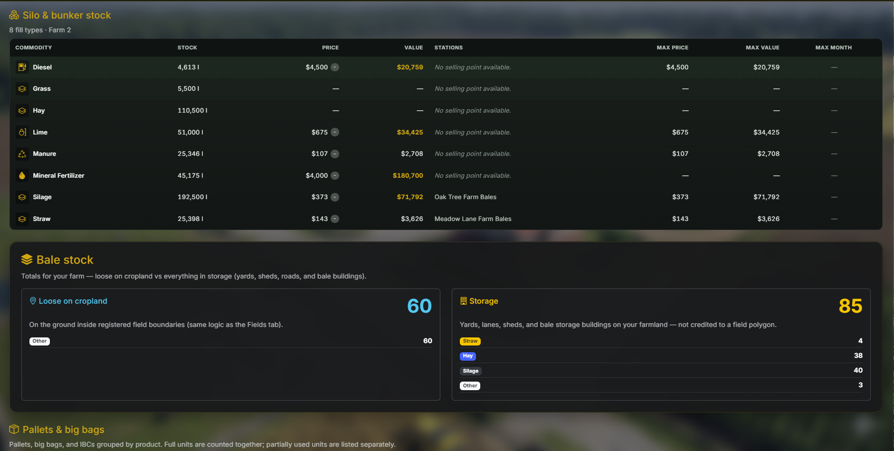

*Figure: Storage tab — silo stock and bale inventory.*

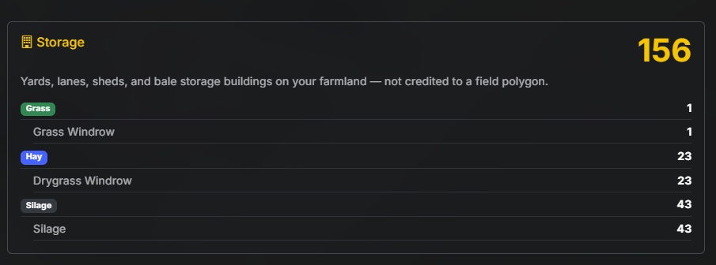

*Figure: Bale storage breakdown by fill type.*

#### Compliance tab (Red Tape mod)

When the save runs **Red Tape** and the mod collector is enabled, Economy gains a **Compliance** tab for the active farm:

| Block | What it shows |
| ----- | ------------- |
| **Tier / points / policies** | Compliance tier letter, score, and policy count |
| **Policies table** | Each policy with warnings, watched flag, and next evaluation day |
| **Active / available schemes** | Environmental or subsidy schemes |
| **Tax** | Monthly income / expense summary and statement rows |
| **Grants** | Open grant applications |
| **Recent events** | Point awards and evaluation log |

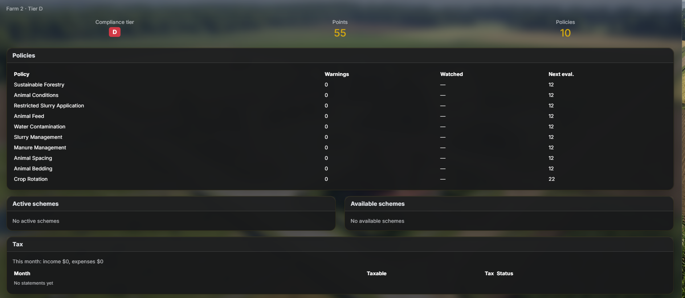

*Figure: Compliance overview — policies and tier.*

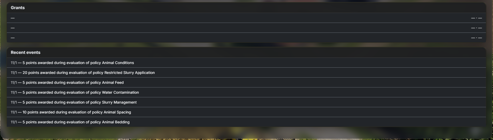

*Figure: Recent compliance events log.*

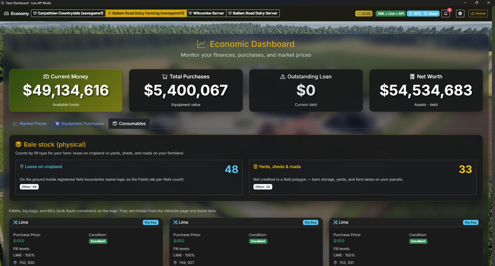

*Figure: Summary row.*

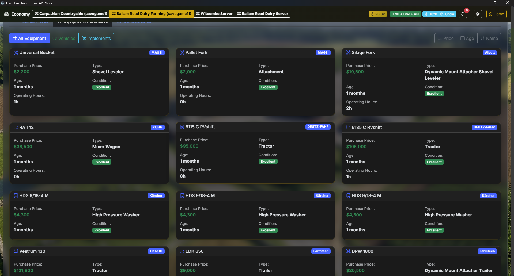

*Figure: Purchases tab with filters and sort.*

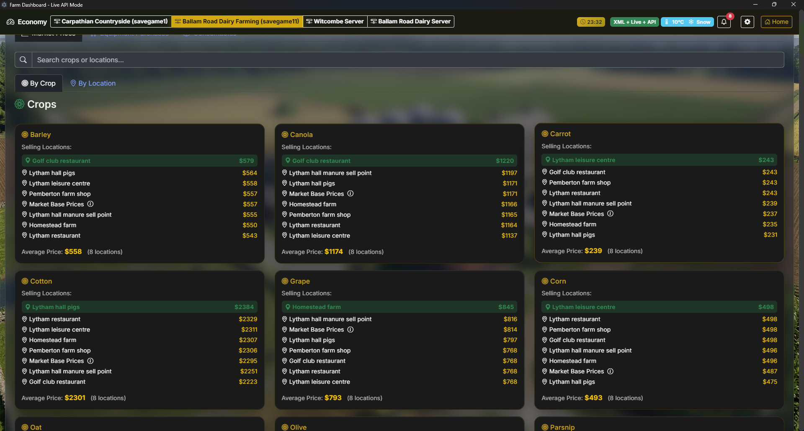

*Figure: Market tab (or placeholder).*

### 6.6 Pastures

| Control | What it does |
| ------- | ------------ |
| **Total pastures** card | Count |
| **Active livestock** card | Sum of animals across pastures |
| **Birth warnings** card | Count of pending birth events |
| **Avg health** card | Pasture-weighted health |
| **View all livestock** button | Opens combined livestock modal across pastures |
| **Pasture cards** | Click to open per-pasture details modal (§7.7) |
| **Warning badges** | Click to open warning details modal (§7.5) |

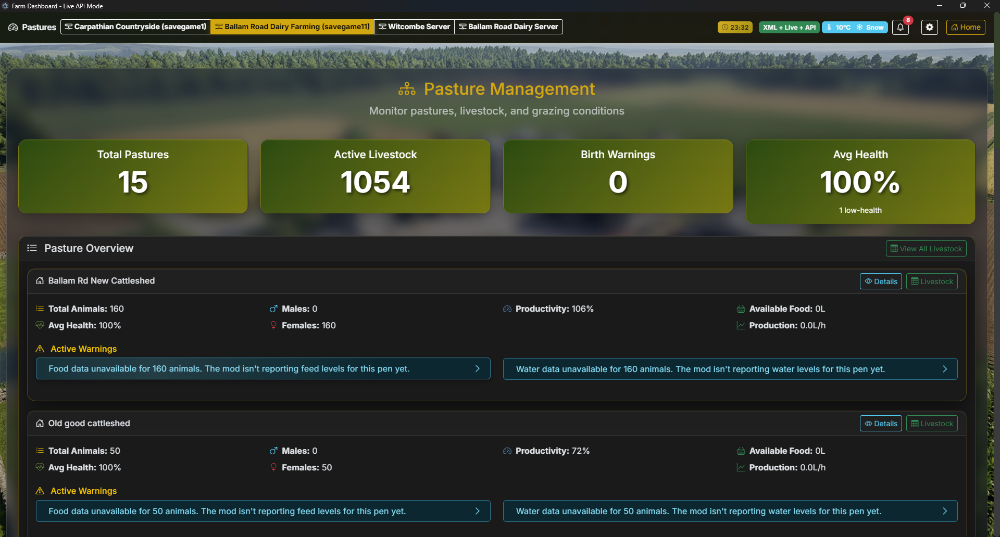

*Figure: Summary row.*

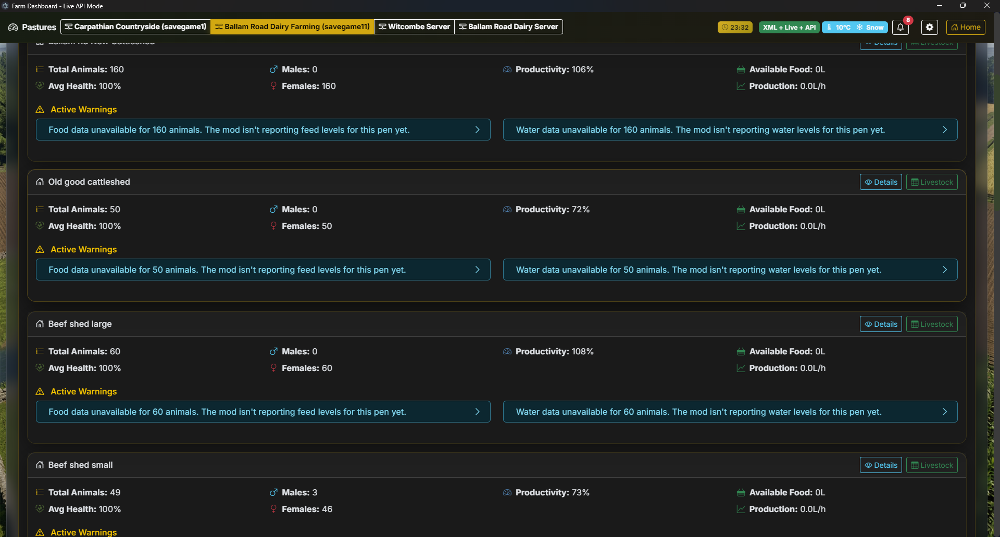

*Figure: Pasture cards grid.*

### 6.7 Productions

| Control | What it does |
| ------- | ------------ |
| **Empty state** | Shown when no chains are reported |
| **Chain card** | Per chain — running / stopped, input storage, output storage, fill levels, recipe, slots |
| **Slot row** | One per production slot in the chain |

Productions has no user filters; it is read-only.

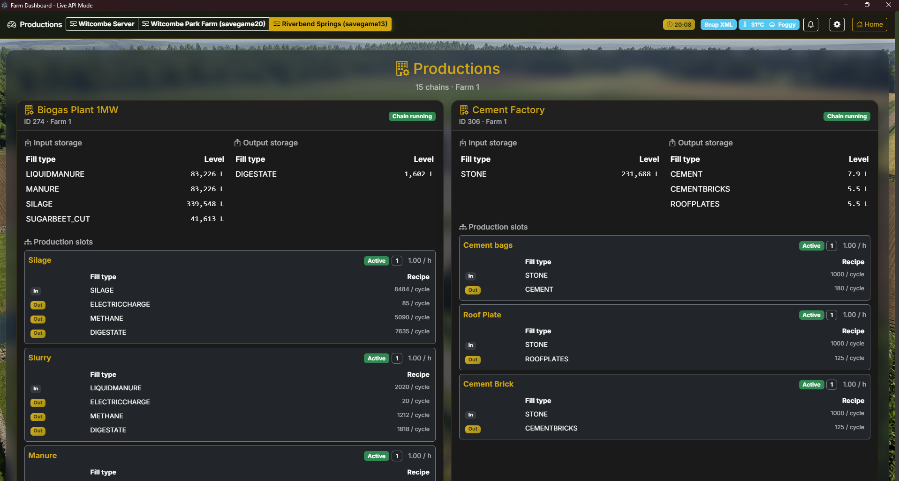

*Figure: Chains list.*

### 6.8 Fleet map

Open from the landing **Fleet map** button or `#map` in the URL. The map plots live vehicle positions on your save's PDA **overview** texture (resolved from installed map mods on the PC running the app).

| Control | What it does |
| ------- | ------------ |
| **Show all farms** | When ticked, plots every farm's vehicles; when off, only the navbar farm selection |
| **Plotted count** | Live count of vehicles with valid world coordinates |
| **Zoom − / +** | Step zoom in and out |
| **Reset view** | Fit the clipped playable map area |
| **Fit items** | Zoom to include all visible pins |
| **Drag / scroll** | Pan and wheel-zoom inside the map stage |
| **Pin click** | Tooltip with vehicle name, farm, type, and rounded X/Z |
| **Legend** | Farm colour swatches when the save reports multiple farms |

The app clips decorative borders from desk-style overview images (common on mod maps) so pins align with the in-game PDA playable rectangle. On first open after a map change, the app may rebuild `%APPDATA%\fs25-farm-dashboard\map_overviews\` cache — allow a few seconds.

> **Known limitation:** on **4 km** maps the engine still uses ±1024 m PDA coordinates; vehicles beyond that range may appear shifted. See [README](../FS25_FarmDashboard_App/README.md) fleet-map notes.

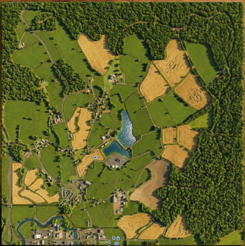

*Figure: Fleet map with vehicle pins on the playable map area.*

For comparison, the in-game PDA uses the same overview asset:

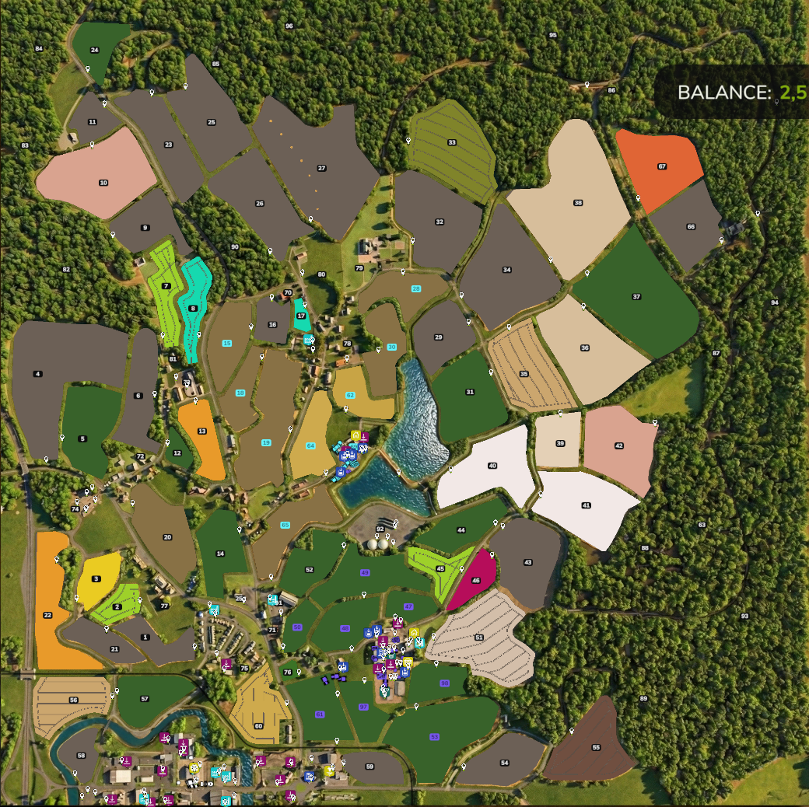

*Figure: In-game PDA map (reference — not the dashboard UI).*

---

## 7. Modals

### 7.1 Notification history

Bell → opens the modal. Lists up to 10 most recent notifications with a **Clear all** button.

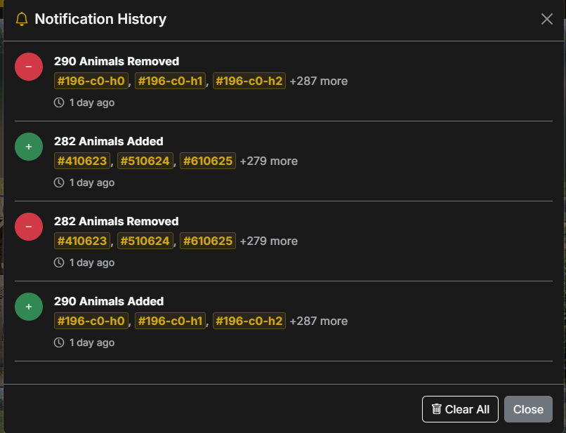

*Figure: Notification history modal.*

### 7.2 Export livestock

Livestock section → **Export**. Format options + download.


*Figure: Export modal.*

*(Same UI as `fd-modal-020-export-livestock.png` — shown using `fd-section-livestock-020-filters.png`.)*

### 7.3 Refresh data

Optional confirmation when you force a refresh from the navbar. You only see this if you trigger refresh yourself — not shown here.

### 7.4 Data changes

Lists recent merge deltas in three sub-tabs (added / removed / updated). Opens from the navbar when the app detects changes since the last load.

### 7.5 Warning details

Opened from a warning badge (e.g. on a pasture). Resolve the underlying issue in-game; the badge clears on the next data update.

### 7.6 Animal details

Opened from a row on the Livestock table.

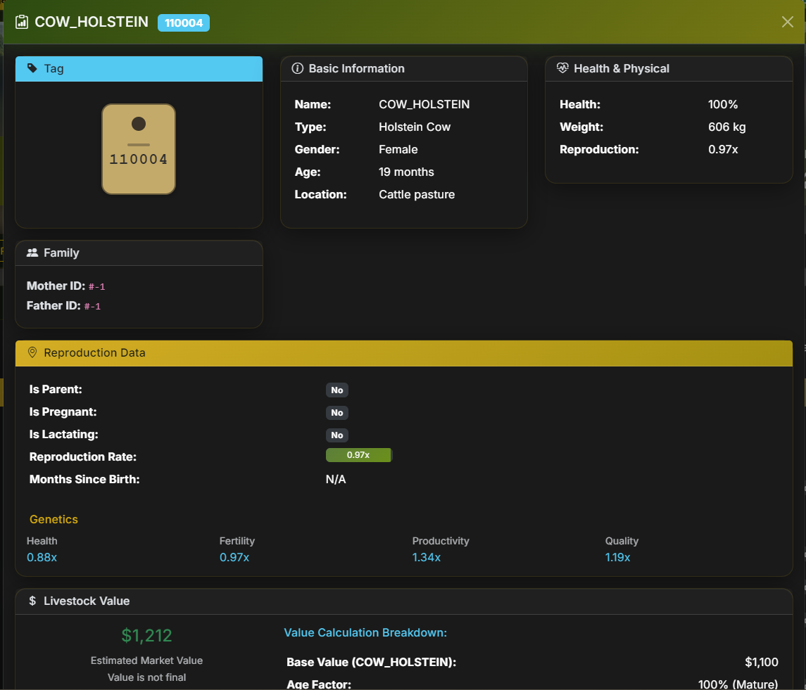

*Figure: Animal details modal.*

### 7.7 Pasture livestock / details

Opened from pasture cards or **View all livestock**.

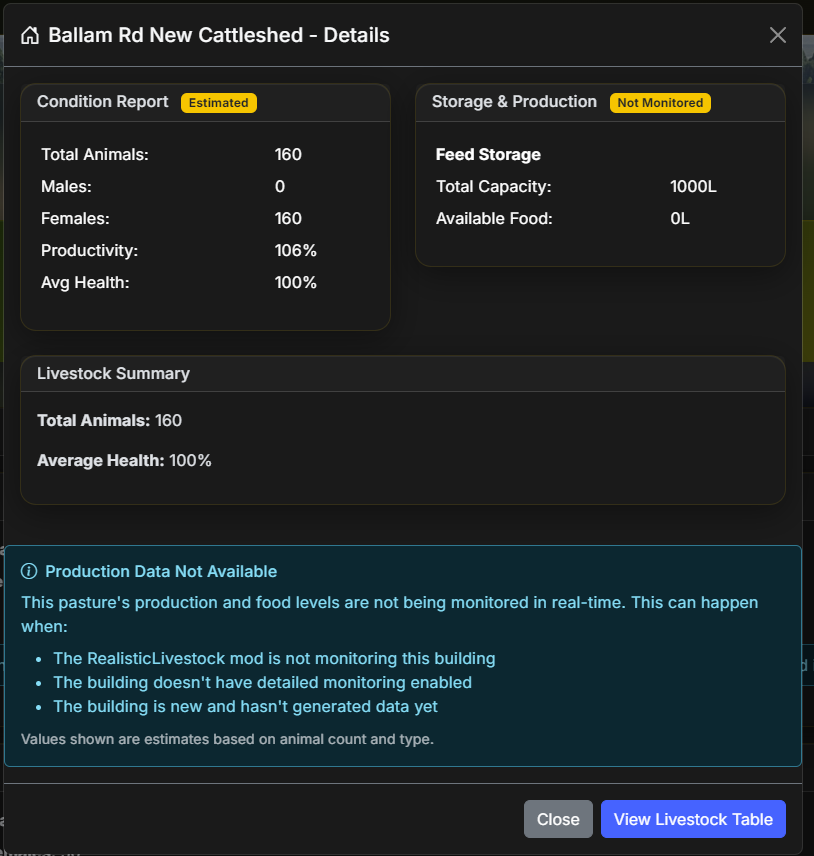

*Figure: Pasture livestock modal.*

### 7.8 Vehicle image

Opened by clicking a vehicle image.

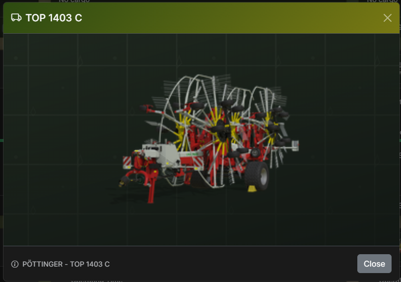

*Figure: Vehicle image modal.*

### 7.9 Weather forecast

Opened by clicking the navbar weather pill.

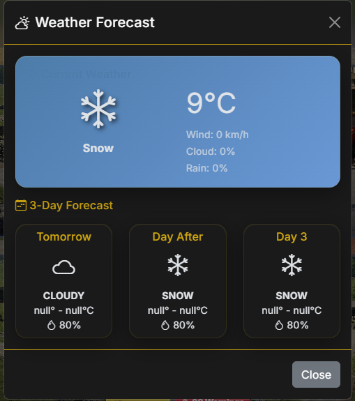

*Figure: Weather forecast modal.*

### 7.10 Mod export progress

Shown while the mod-image scan is running.

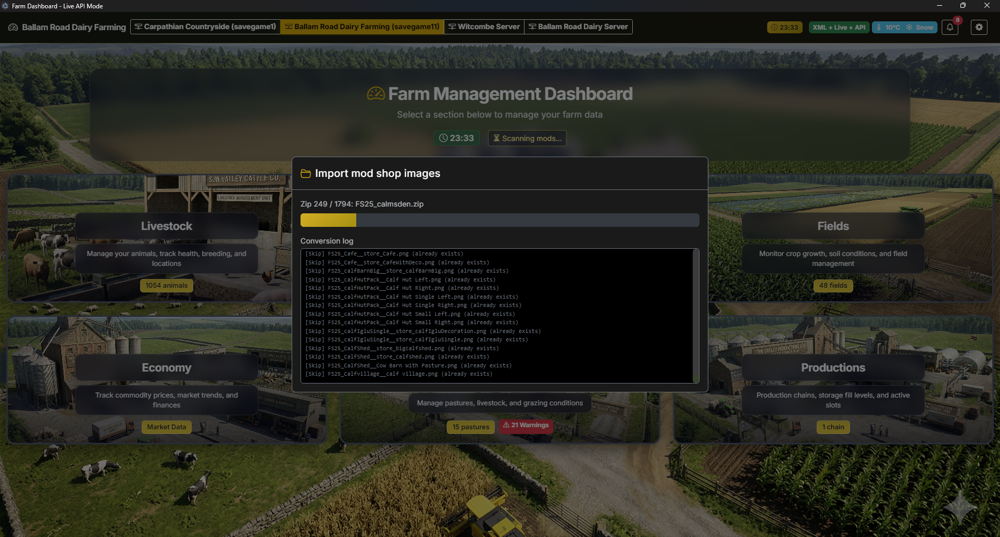

*Figure: Mod export progress modal.*

### 7.11 Farm selection

Shown when the save reports more than one farm and the dashboard needs you to pick which one to view. Use the farm dropdown in the navbar day-to-day; this modal appears only when an explicit choice is required.

---

## 8. LAN access and tablets

The dashboard can serve a tablet on your LAN. Always set both **a username and a password** before enabling LAN.

1. Open Settings → **Servers & saves**.
2. Enable **LAN access** and fill **LAN user** + **LAN password**.
3. (Optional) **IP allowlist** — comma-separated IPs / CIDRs allowed to connect.
4. (Optional) tick **Require auth even from loopback** if other people use this PC.
5. Save. The HTTP server now binds `0.0.0.0:8766`.
6. On the tablet, open `http://<PC-LAN-IP>:8766`. The browser prompts for the credentials you set.
7. (Optional) append `?viewer=1` for read-only viewer mode on the tablet (hides the gear and any destructive buttons).


*Figure: LAN access toggle on with credentials.*

**Tablet walkthrough (auth prompt, home screen, viewer mode):** see [`SECURITY.md`](./SECURITY.md) for trust assumptions and firewall notes. A dedicated **LAN & tablet** guide with screenshots is planned separately — not part of this manual.

See [`SECURITY.md`](./SECURITY.md) for what LAN exposure does and does not protect.

---

## 9. In-game mod settings (`config.xml`)

The mod uses one config file at:

```
%USERPROFILE%\Documents\My Games\FarmingSimulator2025\modSettings\FS25_FarmDashboard\config.xml
```

Settings → **FS25 mod** edits this file directly (see §5.3). The file looks like:

```xml
<farmDashboard>
  <settings updateInterval="60000" collectionCycleMs="60000" debugBaleScan="false" />
  <modules animals="true" vehicles="true" fields="true" weather="true"
           finance="true" economy="true" production="true"
           stock="true" baleInventory="true" redTape="true" />
</farmDashboard>
```

| Attribute | Range | Effect |
| --------- | ----- | ------ |
| `updateInterval` | int (ms) | Legacy fallback; only used when `collectionCycleMs` is missing |
| `collectionCycleMs` | 5 000 – 1 800 000 | Master cycle; the mod splits this into one slot per enabled module |
| `debugBaleScan` | `true` / `false` | Throttled bale-scan logging into FS25's `log.txt`. **Hand-edit only** — see audit gap #2 |
| `modules.animals` … `modules.production` | bool | Core collectors (also toggled from Settings → FS25 mod) |
| `modules.stock` | bool | Silo / bunker / placeable storage scan |
| `modules.baleInventory` | bool | World bale scan + AUTO BALE STORAGE / object-storage sheds (separate from `stock`) |
| `modules.redTape` | bool | Compliance export when Red Tape mod is present |


*Figure: `config.xml` in File Explorer.*


*Figure: `config.xml` open in a text editor.*

The mod has **no in-game console command** and **no Giants settings menu entry**; the file above is the only configuration surface.

---

## 10. Troubleshooting

| Symptom | What to check |
| ------- | ------------- |
| **Blank dashboard / "waiting for field data"** | Stage B — mod enabled and save **loaded into the world**, not just the main menu. Stage C — `data.json` exists and the **modified** time is moving. Settings → Servers & saves — path or FTP credentials match the file you confirmed. |
| **API error strip** ("retrying every 5 s") | Background polling re-arms automatically. If it persists, confirm the path is correct or the FTP credentials are valid. There is no manual retry button (audit gap #3). |
| **Wrong farm shown** | Top-bar farm dropdown picks the active farm. Settings → Dashboard exclusions might also be hiding fields you expected. |
| **FTP not ticking** | Settings → Servers & saves: interval must be 1 – 25 minutes. Sync vs Staggered does **not** disable polling. |
| **Notifications empty after upgrade** | History is capped at 10 and stored in browser `localStorage`; reinstalling the desktop app does not clear the bell, but clearing browser data will. |
| **Language picker did not change everything** | The page reloads on language change — wait for the reload. If a string still falls back to English, the key is missing for that language; see [`I18N.md`](./I18N.md). |
| **Build / install said `app.asar` is locked** | Run `npm run unlock-install` then re-install. The default `npm run dist` writes the build to `%LOCALAPPDATA%\fs25-farm-dashboard-electron-out\` to avoid IDE locks. |
| **Uninstall asked to wipe user data** | Yes deletes settings, caches, and the registry entry. No keeps your config so a reinstall picks up where you left off. Cancel aborts the uninstall. |
| **Tablet says 401 / 403** | LAN credentials wrong, or your tablet is outside the IP allowlist. Loopback always bypasses auth unless you ticked "Require auth even from loopback". |
| **Mod version badge in navbar** | Install **`FS25_FarmDashboard.zip` 3.1.0.0+** on the server / local mods folder, load the save once, and confirm `data.json` shows `serverInfo.modVersion`. |
| **Fleet map pins offset or on desk border** | Restart the app after upgrading to **4.1.0** (overview cache v6). Delete `%APPDATA%\fs25-farm-dashboard\map_overviews\` and reopen Fleet map. Confirm the PC running the app has the same map mod installed. |
| **Bale counts look doubled on dedicated** | Requires mod **3.1.0.0+** (deduplicated shed vs world scan). Restart app so merge layer picks up fresh JSON. |
| **Storage tab empty** | Enable `modules.stock="true"` in `config.xml` (§9) and confirm you own silos / bunkers on the active farm. |
| **Compliance tab missing** | Red Tape mod must be on the save **and** `modules.redTape="true"`. |
| **`debugBaleScan` in Settings → FS25 mod has no effect** | Audit gap #2 — hand-edit `config.xml` (§9). |

---

## 11. Screenshot index

The full list of filenames, captions, and capture recipes (auto vs manual) lives in [`SCREENSHOTS.md`](./SCREENSHOTS.md). All images sit under [`docs/screenshots/`](./screenshots/).

**Document version:** aligned with app **4.1.0** and mod **3.1.0.0**. **Authors:** [`AUTHORS.md`](./AUTHORS.md).
