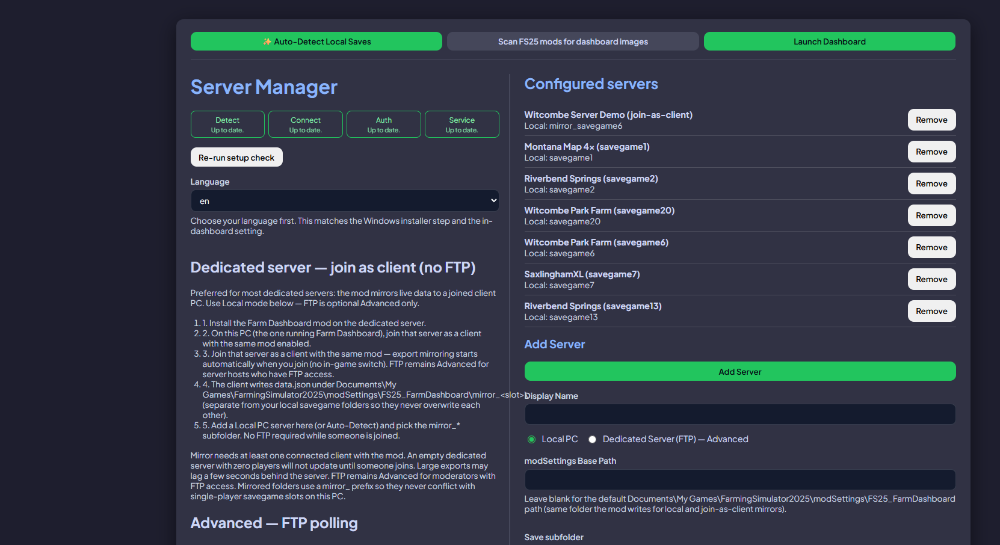
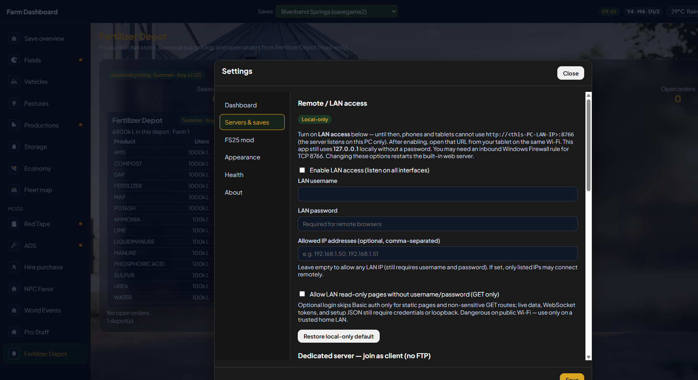

# Farm Dashboard V5 — Installation guide

**Read this guide in order.** The mod must write `data.json` before the Windows app can show your farm.

| | |
| --- | --- |
| **App** | **5.0.3** — installer `FS25-Farm-Dashboard-V5-Setup-5.0.3.exe` (Start Menu: **Farm Dashboard V5**) |
| **Mod** | **5.0.0.3** (`FS25_FarmDashboard.zip` — **same zip** as classic V4) |
| **Dashboard URL** | Installed V5: [http://localhost:8768](http://localhost:8768) after setup |
| **Update feed** | `latest-rf.yml` only — **never** V4 `latest.yml` |

**After install:** day-to-day use is in [`USER_MANUAL.md`](./USER_MANUAL.md). **Already on classic 4.x?** See [`UPGRADE_FROM_V4.md`](./UPGRADE_FROM_V4.md).

This is **Farm Dashboard V5** (new screens). It is **not** Realistic Farming and **not** Farm Tablet.

---

## Why mod before app

The **Windows app does not run inside FS25**. It only reads **`data.json`**, which the **in-game mod** creates while you play (or while a dedicated server runs with the mod).

Until you **load a save with the mod enabled** at least once:

- `modSettings/FS25_FarmDashboard/<savegame>/` may not exist.
- `data.json` is missing or stale.
- The dashboard shows **waiting / stale** even if the app is installed.

On a **dedicated / rented server**, the mod must be active on that server. You can get `data.json` onto the PC that runs the desktop app either by **joining as a client** (recommended when someone can stay connected — **no FTP**) or by **FTP** (Advanced — headless-only admins). See [Dedicated server](#dedicated-server-join-as-client-or-ftp) below.

---

## Stage A — Install the mod

1. Download **`FS25_FarmDashboard.zip`** from the V5 drop (`Documents\FarmDash Release\` locally, or the V5 GitHub/itch files).
2. Copy it into your FS25 **mods** folder (do not rename the zip unless you know the game still loads it):

   `Documents\My Games\FarmingSimulator2025\mods\`

   **Alternative:** extract so you have `mods\FS25_FarmDashboard\` with `modDesc.xml` at that folder root (same layout as the release zip).

3. Start **Farming Simulator 25** once so the game registers the mod.


*Figure: File Explorer showing **`FS25_FarmDashboard`** (`.zip` or folder) under **`mods\`**. Shared with classic — the zip is one product.*

---

## Stage B — Enable the mod on every save

Repeat for **each savegame** (and each dedicated-server save) that should use the dashboard:

1. Open the save’s **Mods** list in FS25.
2. Enable **Farm Dashboard** / **FS25 Farm Dashboard**.
3. **Load the save and enter the world** (main menu alone is not enough).


*Figure: Mod ticked in the save’s mod list.*

---

## Stage C — Confirm `data.json` is updating

After about one minute in-game, check:

```
%USERPROFILE%\Documents\My Games\FarmingSimulator2025\modSettings\FS25_FarmDashboard\<savegame>\data.json
```

The file should exist and its **Modified** time should advance while you play.


*Figure: File Explorer on that folder with a recent `data.json` timestamp.*

**Dedicated server:**

- **Join as client (no FTP):** after you join on a client PC, confirm `data.json` appears under that PC’s local `modSettings\FS25_FarmDashboard\mirror_<slot>\` (or the documented mirror path) and that **Modified** advances while the client stays connected.
- **FTP (Advanced):** confirm the same path exists on the **server** profile you will point the app at, not only on your gaming PC.

---

## Stage D — Install the Windows **V5** app

1. Download **`FS25-Farm-Dashboard-V5-Setup-5.0.3.exe`**. Older local 5.0.x builds may still say `…-RF-Setup-…` on disk — treat those as V5 too.
2. Run the installer. Choose language on the welcome page.
3. Finish setup and launch **Farm Dashboard V5** from the Start menu.

> **[manual]** Capture still needed: NSIS welcome and Finished pages for the **V5** installer (do not reuse V4 installer shots as if they were this EXE). Filenames: `v5-install-040-installer-welcome.png`, `v5-install-045-installer-finished.png`.

**Keep V4 if you want it.** V5 is a **different Windows app id**. Installing V5 must **not** replace classic via **Settings → Check for updates** on V4.

---

## Stage E — First launch and Setup

On first launch the app opens **Server Manager** (`setup.html`) if no servers are configured.

> **[manual]** Empty first-launch window (no servers yet): `v5-install-050-app-first-launch.png`.

### Setup walk-through

Setup is the **same Server Manager** used by classic, served by this V5 process. Language, Auto-detect, Local / FTP, polling, and Launch all apply.

| Step | Action | Screenshot |
| ---- | ------ | ---------- |
| Language | Top-left / language block on Setup | `v5-setup-080-launch.png` (language dropdown visible) |
| Auto-detect | **Auto-Detect Local Saves** | same |
| Add local | Fill **Local PC**, **Add Server** | same |
| Add FTP | **Dedicated Server (FTP) — Advanced** (blur passwords) | **[manual]** close-up if you need a secrets-blurred crop |
| FTP polling | Delay / interval / stagger vs sync | Settings → Servers also has this |
| Mod images | Optional **Scan FS25 mods for dashboard images** | same |
| Launch | At least one server → **Launch Dashboard** | `v5-setup-080-launch.png` |



*Figure: Server Manager (`setup.html`) on loopback — Auto-detect, Launch, configured saves. Captured against the V5 HTTP server.*

After launch, the **new screens** open (sidebar + Save overview), not the classic six-card home.

Typical URL:

- Installed V5: [http://localhost:8768](http://localhost:8768)
- This repo’s `npm run dev:new-ui`: [http://127.0.0.1:8767](http://127.0.0.1:8767)

---

## Post-install checks

| Check | Expected |
| ----- | -------- |
| Shell | Left **sidebar** (Save overview, Fields, Vehicles, Pastures, …) + **top bar** (Saves, time, weather, bell, Settings, Live API) |
| Save overview | Status cards and activity — not six classic landing tiles |
| Settings → Servers & saves | Correct **Local** path (SP, or DS join-as-client) or FTP host + save slot |
| Settings → About | App **5.x**, mod **5.0.0.x**; copy says this is Farm Dashboard, not Farm Tablet |
| Wrong save empty | Repeat **Stage B** for that save; pick the save in the **Saves** control |

---

## Dedicated server (join as client or FTP)

Dedicated / rented hosts write `data.json` on the **authority** (the dedicated process). The desktop app still needs that file on the PC where Farm Dashboard runs.

| Path | When to use | App mode |
| ---- | ----------- | -------- |
| **Join as client (recommended)** | Someone can join the server with the same mod | **Local** — file watch — **no FTP** |
| **FTP (Advanced)** | Headless-only: zero players, or you prefer remote poll | **FTP** — scheduled poll |

Works the same for classic **V4** and **V5**: both watch a local `data.json` folder in Local mode.

**Not a substitute:** Giants dedicated HTTP on port **:8080** is an optional XML feed for richer merge fields — it does **not** replace `data.json`.

Day-to-day detail: [`USER_MANUAL.md` §3.4a](./USER_MANUAL.md#34a-dedicated-server--join-as-client-no-ftp) · [§3.5 FTP](./USER_MANUAL.md#35-add-server-ftp).

### Option A — Join as client (no FTP)

1. Install **`FS25_FarmDashboard.zip`** on the **dedicated server** (Stages A–B on the server save).
2. On the PC that runs the desktop app, install the **same mod**, then **join the dedicated server as a multiplayer client**.
3. Export mirroring starts when you join (no extra in-game switch on current V5 copy). Setup still documents the steps.
4. The client writes a local folder, typically:

   ```
   %USERPROFILE%\Documents\My Games\FarmingSimulator2025\modSettings\FS25_FarmDashboard\mirror_<slot>\data.json
   ```

   The `mirror_` prefix keeps dedicated data separate from this PC’s single-player `savegameN` exports.
5. In Setup or **Settings → Servers & saves**, add a **Local** server pointing at that folder (or **Auto-Detect**). Launch — **no FTP required**.

**Honest limits**

- Needs **at least one** connected client with the mod. An empty dedicated server with **zero players** does **not** mirror until someone joins.
- Large exports may lag a few seconds behind the authority write.
- Same updated mod on **server and client**.

### Option B — FTP (Advanced) + optional HTTP feed

1. Complete Stages **A–C** on the server.
2. In Setup or **Settings → Servers & saves**, add **Dedicated Server (FTP)**:
   - FTP host, port, username, password
   - **Base profile path** / **modSettings** path your host documents
   - **Savegame slot folder** (e.g. `savegame1`)
3. Optional **HTTP feed** (Giants dedicated XML): often port **8080** — **not** a replacement for `data.json`.
4. Set **Poll every** (1–25 minutes). **Local** uses file watching; FTP uses this schedule.



*Figure: Settings → Servers & saves (V5 modal).*

---

## Troubleshooting install

| Symptom | Fix |
| ------- | --- |
| **Waiting for data / stale** | Stage B + C; correct path in Settings |
| **Port already in use** | Installed V5 uses **8768**. Classic uses **8766**. Close the other Farm Dashboard if you only want one, or leave both running. |
| **Join-as-client: no local `data.json`** | Client still connected? Same updated mod on server + client? Empty server = no mirror until someone joins |
| **FTP never updates** | Check credentials, slot name, firewall; interval ≥ 1 min |
| **V4 vanished after installing V5** | Fail — report it. V5 must sit **beside** V4 |
| **Check for updates on V4 installed this rebuild** | Fail — V5 must not publish onto `latest.yml` |

Full troubleshooting: [`USER_MANUAL.md` §10](./USER_MANUAL.md#10-troubleshooting).
