# Farm Dashboard V5 — User manual

**Farm Dashboard V5** is the Windows desktop app that reads live farm data from **Farming Simulator 25** (via the in-game **FS25 Farm Dashboard** mod) and shows the **new screens** (sidebar + Save overview). **App 5.0.4** · **mod 5.0.0.3**.

This is the **same product** as classic Farm Dashboard, rebuilt. It is **not** Realistic Farming and **not** Farm Tablet. Optional suite panels appear in the sidebar only when those mods export data.

**URLs**

| How you run it | Typical URL |
| -------------- | ----------- |
| Installed **Farm Dashboard V5** | [http://localhost:8768](http://localhost:8768) |
| Repo `npm run dev:new-ui` | [http://127.0.0.1:8767](http://127.0.0.1:8767) |
| Classic **V4** (old screens) | [http://localhost:8766](http://localhost:8766) |

This manual walks every setting, every section, and every modal, with **inline screenshots**. Screenshot filenames and the “still to capture” list are in [`SCREENSHOTS.md`](./SCREENSHOTS.md).

**Companion docs:** [`INSTALL.md`](./INSTALL.md) · [`SECURITY.md`](./SECURITY.md) · [`CHANGELOG.md`](./CHANGELOG.md) · [`TESTERS.md`](./TESTERS.md) · [`COMPATIBILITY.md`](./COMPATIBILITY.md)

> **Screenshots not visible?** Open **Markdown Preview** (`Ctrl+Shift+V`). Images are in [`doc-screenshots/`](./doc-screenshots/).

---

## Table of contents

1. [What you need](#1-what-you-need)
2. [Install order (Stages A–E)](#2-install-order-stages-ae)
3. [First-run Setup](#3-first-run-setup) (incl. [§3.4a join-as-client](#34a-dedicated-server--join-as-client-no-ftp))
4. [Main screen map](#4-main-screen-map)
5. [Settings modal — every tab and control](#5-settings-modal--every-tab-and-control)
6. [Dashboard sections](#6-dashboard-sections)
7. [Modals](#7-modals)
8. [LAN access and tablets](#8-lan-access-and-tablets)
9. [In-game mod settings (`config.xml`)](#9-in-game-mod-settings-configxml)
10. [Troubleshooting](#10-troubleshooting)
11. [Screenshot index](#11-screenshot-index)

> Screenshot tags: **[auto]** = captured against the running V5 UI; **[manual]** = installer / in-game / Explorer / tablet.

---

## 1. What you need

| Item | Purpose |
| ---- | ------- |
| **Farming Simulator 25** | Game must run with the mod for live data |
| **FS25 Farm Dashboard mod** | **`FS25_FarmDashboard.zip`** in your FS25 `mods` folder (same zip as V4) |
| **Farm Dashboard V5 (Windows)** | `FS25-Farm-Dashboard-V5-Setup-5.0.4.exe` — Start Menu **Farm Dashboard V5** |
| **Browser (optional)** | Edge / Chrome / Firefox can open the same localhost URL the app serves |
| **(Optional) Dedicated join-as-client** | Same mod on a PC that joins the dedicated server — Local watch, **no FTP** |
| **(Optional) FTP credentials** | Advanced: empty / headless dedicated |
| **(Optional) LAN** | Tablet or second screen — see §8 |

You may keep **Farm Dashboard V4** installed. The two apps must **not** overwrite each other.

---

## 2. Install order (Stages A–E)

Do these **in order**. Skipping a stage is the most common reason the dashboard waits forever.

### Stage A — Install the mod

1. Copy **`FS25_FarmDashboard.zip`** into **`Documents\My Games\FarmingSimulator2025\mods\`**, **or** extract to **`mods\FS25_FarmDashboard\`** with **`modDesc.xml`** at that folder root.
2. Start FS25 once so it sees the mod.


*Figure: **`FS25_FarmDashboard`** under FS25 **`mods\`** (folder or `.zip`).*

### Stage B — Enable per save

1. Enable **FS25 Farm Dashboard** in the save's mod list.
2. Load the save and **enter the world**.


*Figure: Mod ticked in the save's mod list.*

### Stage C — Confirm the mod is writing data

```
%USERPROFILE%\Documents\My Games\FarmingSimulator2025\modSettings\FS25_FarmDashboard\<savegame>\data.json
```

`data.json` should have a recent **modified** timestamp.


*Figure: `data.json` with a fresh timestamp.*

### Stage D — Install the V5 Windows app

1. Run **`FS25-Farm-Dashboard-V5-Setup-5.0.4.exe`**.
2. Pick installer language; complete the installer.
3. Launch **Farm Dashboard V5** from the Start menu.

Installer welcome / Finished PNGs for this EXE are still **[manual]** (`v5-install-040-*` / `v5-install-045-*` in [`SCREENSHOTS.md`](./SCREENSHOTS.md)).

### Stage E — First launch

The app starts Express on this V5 port (**8768** installed, **8767** for repo `dev:new-ui`), opens its window, and walks Setup if no servers are configured (§3). After Launch you land on **Save overview** (§4), not the classic six-card home.

---

## 3. First-run Setup

The Setup page (`setup.html`) is **Server Manager**:

- Guided status: **Detect / Connect / Auth / Service**
- **Language**
- **Auto-Detect Local Saves**, **Scan FS25 mods for dashboard images**, **Launch Dashboard**
- Configured servers + **Add Server** (Local PC or Dedicated FTP)
- Join-as-client instructions and FTP polling


*Figure: Server Manager with several Local saves and **Launch Dashboard**.*

### 3.1 Language

Language on Setup matches the dashboard (`farmdash_locale`). Change it before you live in English-only labels.

### 3.2 Server list

Each row is a display name + path (or FTP). **Remove** deletes that source. Empty on a true first run (**[manual]** empty-list shot still wanted).

### 3.3 Auto-detect saves

Scans `Documents\My Games\FarmingSimulator2025\modSettings\FS25_FarmDashboard\` and proposes **Local** rows (including `mirror_*` slots when present).

### 3.4 Add server (Local)

Use **Local** for single-player / listen-host on this PC, **and** for dedicated **join as client**.

| Field | What to enter |
| ----- | ------------- |
| Display name | e.g. "Riverbend" or "Dedi via client" |
| Mode | **Local PC** |
| modSettings base path | Leave blank for the default Documents path, or paste a custom root |
| Save subfolder | e.g. `savegame2` or `mirror_savegame6` |

### 3.4a Dedicated server — join as client (no FTP)

Preferred when **someone can stay connected**. The dedicated **authority** mirrors export to the joined client; the client writes a local `data.json`; V5 watches it in **Local** mode.

**Steps** (also printed on Setup and Settings → Servers)

1. Install Farm Dashboard on the **dedicated server**.
2. On this PC, join that server as a client with the **same** mod.
3. Mirroring starts when you join (current V5 copy — no extra in-game switch).
4. Client writes under `modSettings\FS25_FarmDashboard\mirror_<slot>\` so it never overwrites local `savegameN`.
5. Add **Local** (or Auto-Detect) pointing at that folder.

**Limits:** empty dedicated (zero players) = no mirror. Use FTP for headless-only. Large exports can lag a few seconds.

Full checklist: [`INSTALL.md` — Dedicated server](./INSTALL.md#dedicated-server-join-as-client-or-ftp).

### 3.5 Add server (FTP)

**Advanced.** Host, port, user, password, remote dir / slot. Blur secrets in screenshots. FTP is **not** removed; join-as-client is an alternative.

### 3.6 FTP polling

Applies to **FTP rows only**. Local (including mirrors) uses file watching.

| Control | Typical | Effect |
| ------- | ------- | ------ |
| Delay before first poll (seconds) | 0 | Wait before first poll |
| Poll every (minutes) | 1–25 (often 5) | Interval per server |
| Sync vs Staggered | Sync | All FTP at once vs sliced across the interval |

### 3.7 Mod images scan

Extracts vehicle thumbnails from installed FS25 mods. Can take a long time. Local-only; LAN clients cannot start it.

### 3.8 Launch

Saves config and opens the V5 shell (**Save overview**).

---

## 4. Main screen map

After Setup, the **NEW APP** shell loads.

### Top bar (left → right)

| Area | What it is |
| ---- | ---------- |
| **Farm Dashboard** | Product title |
| **Saves** | Combobox / tabs of configured servers. Switching save reloads the merge **without restarting the app** |
| **Game time** | Hour + calendar (year / month / day) from the export |
| **Weather control** | Temperature + condition; click for forecast (§7.9) |
| **Notification bell** | History modal (§7.1) |
| **Settings** | Unified Settings modal (§5). Hidden / reduced in viewer mode |
| **Live API** (or similar badge) | Connection health — live vs waiting / stale |

There is **no classic Home of six landing cards**. **Save overview** in the sidebar is the home.

### Sidebar — core

Always present unless you hide a section in Settings → Dashboard:

| Item | Route | Notes |
| ---- | ----- | ----- |
| **Save overview** | `#/overview` | Status at a glance |
| **Fields** | `#/fields` | Cards, filters, Order menu |
| **Vehicles** | `#/vehicles` | Fleet table / cards |
| **Pastures** | `#/pastures` | Animals live here (`#/livestock` redirects here) |
| **Productions** | `#/productions` | Production chains |
| **Storage** | `#/storage` | Silos, bales, pallets (not buried in Economy) |
| **Economy** | `#/economy` | Money, market, purchases, RF money mods |
| **Fleet map** | `#/map` | PDA overview + pins |

**Moisture** is **not** a sidebar item. Crop moisture lives on **Fields** (and Storage columns when exported).

### Sidebar — MODS (soft-detect)

These appear **only** when the matching companion exports. If the mod is off, the item must **not** sit as a dead ghost.

| Item | Typical companion |
| ---- | ----------------- |
| Red Tape | Red Tape |
| ADS | Advanced Damage System |
| Invoices | Invoices (when present) |
| Hire purchase | Hire purchasing |
| NPC Favor | FS25_NPCFavor |
| World Events | Random World Events |
| Pro Staff | Pro Staff Co-Op |
| Fertilizer Depot | Fertilizer Depot |

Orange dots mean that section wants attention (work, warnings, events) — not a crash.

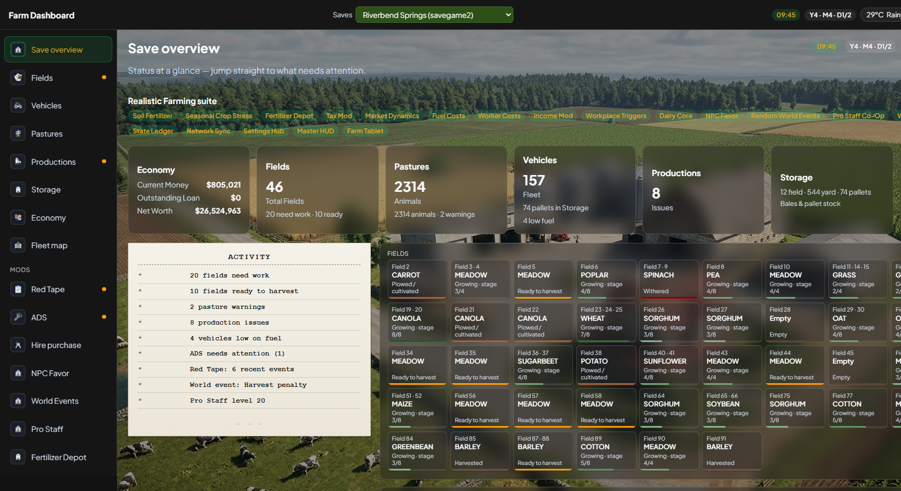

*Figure: **Save overview** — Saves control, time/weather, sidebar (core + MODS), economy/fields/pasture/vehicle chips, activity list, field tiles. This capture also stands in for navbar chrome.*

---

## 5. Settings modal — every tab and control

Open **Settings** in the top bar. The panel is **opaque** (solid farm panel colour) so text stays readable over the map photo. Backdrop is dark.

Tabs: **Dashboard** · **Servers & saves** · **FS25 mod** · **Appearance** · **Health** · **About**.

Footer: **Save** on most tabs; Appearance also has **Save Theme**. After **Save** on Servers, the **Saves** list in the top bar updates **without restarting**.

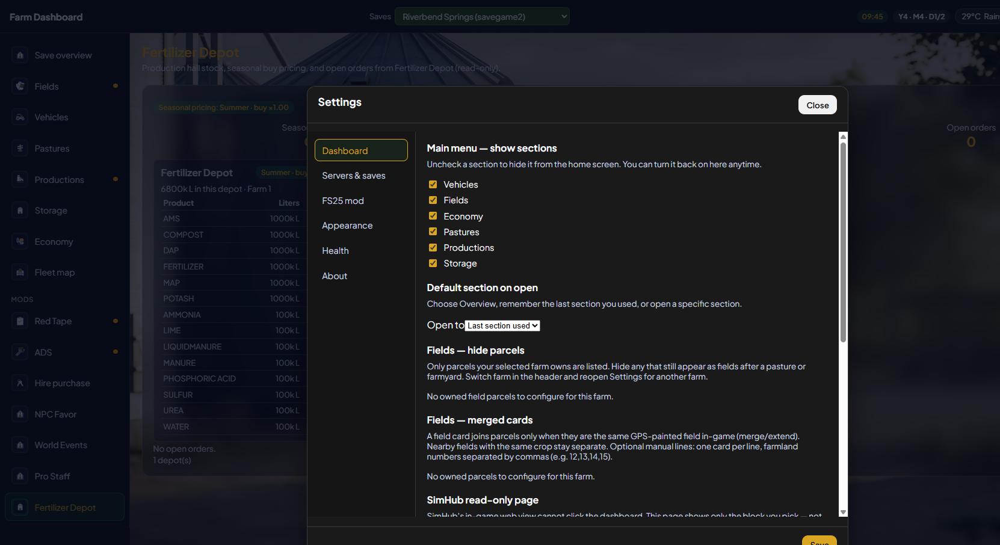

*Figure: Settings open on Dashboard (opaque modal).*

### 5.1 Tab — Dashboard

| Control | What it does |
| ------- | ------------ |
| **Main menu — show sections** | Hide core items from the sidebar (Vehicles, Fields, Economy, Pastures, Productions, Storage). Turn them back on here. |
| **Default section on open** | Last section used, Save overview, or a named section |
| **Fields — hide parcels** | Un-tick owned farmland so it does not appear as a field card |
| **Fields — merged cards** | A card joins parcels **only** when they are the **same GPS-painted field** in-game (merge/extend). Nearby fields with the **same crop stay separate**. Optional **manual** lines: one card per line, farmland numbers |
| **SimHub read-only page** | `/simhub.html` for SimHub’s in-game web view (no clicks). Optional cluster / pasture / production ids |

Do **not** expect classic “auto-merge adjacent same crop” behaviour. That was removed on purpose.

### 5.2 Tab — Servers & saves

| Control | What it does |
| ------- | ------------ |
| **Enable LAN access** | Bind `0.0.0.0` so other devices can connect. Default is **local-only** (`127.0.0.1`) |
| **LAN username / password** | HTTP Basic for remote browsers. Weak / historic defaults rejected when LAN is on |
| **Allowed IPs** | Optional allowlist; empty = any LAN IP that can auth |
| **Allow LAN read-only pages without password** | Dangerous on public Wi‑Fi; trusted home LAN only |
| **Restore local-only default** | Turn LAN off again |
| **Join as client** | Same five steps as Setup §3.4a |
| **FTP polling** | Delay, interval, sync/stagger |
| **Open full setup window** | `setup.html` |
| **Auto-Detect / Scan mods** | Same as Setup |
| **Server list + Add Server** | Local or FTP |


*Figure: LAN (local-only badge), join-as-client copy, FTP polling start.*

Help text may still mention **:8766**. Use the port **this V5 instance** actually listens on (**8768** installed, **8767** repo dev).

### 5.3 Tab — FS25 mod

Writes `config.xml` on this PC. **Reload the save** (or restart FS25) for collectors to pick up changes.

| Control | What it does |
| ------- | ------------ |
| **Update interval (ms)** | Legacy; used if collection cycle missing |
| **Collection cycle (ms)** | Master cycle (mod clamps ~5 s – 30 min) |
| **Data modules** | Animals, Vehicles, Weather, Fields, Finance, Economy, Production |

Stock / bales / Red Tape collectors may still need `config.xml` hand-edit (§9).

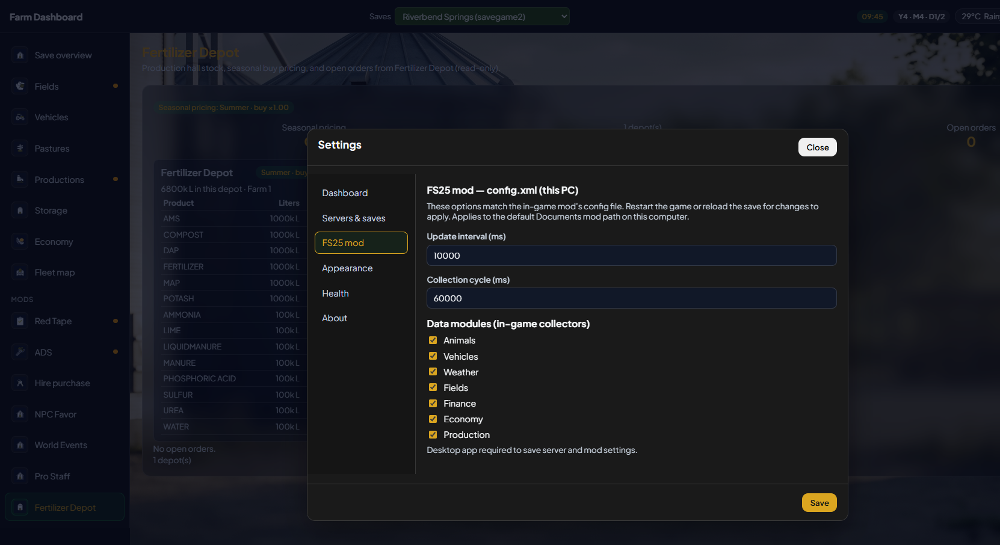

*Figure: Collection cycle and module checkboxes.*

### 5.4 Tab — Appearance

| Control | What it does |
| ------- | ------------ |
| **Language** | UI language (page reload) |
| **Use new dashboard UI** | On **V5** you are already on the new screens. Copy on this tab may still talk about classic opt-in — ignore it on V5; do not use it to “go back” to V4 (keep the V4 app for that) |
| **Tab to customize** | Global / section colour sets |
| **Background / panel / header / accent** | Theme colours |
| **Copy to all / Reset / Save Theme** | Theme actions |

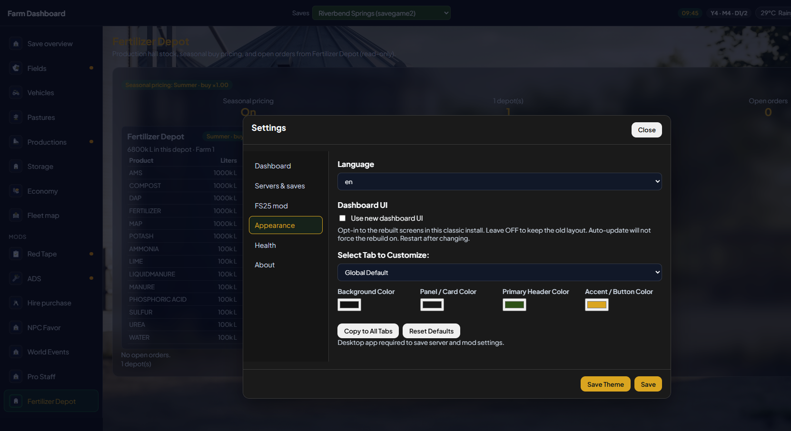

*Figure: Language, theme colours, Save Theme.*

### 5.5 Tab — Health

Connection diagnostics: mod version, last export, XML age, parse issues, recent status events, **Restore local-only default**. Use this when a save looks stale instead of guessing.

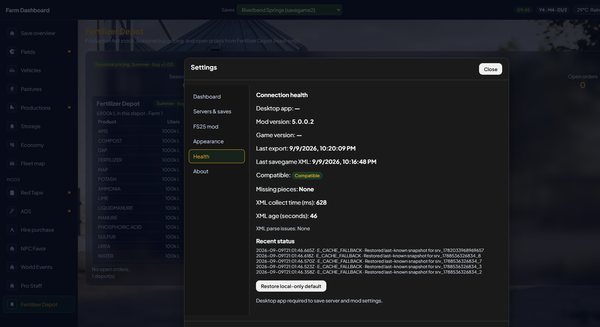

*Figure: Connection health — mod 5.0.0.2, last export, Compatible badge.*

### 5.6 Tab — About

Desktop app version (5.x on a packaged V5; may show “—” in a browser-only session), **in-game mod** version, minimum mod, **About Farm Dashboard V5** wording (not Farm Tablet), detected suite mods, compatibility table, **Check for updates** (must **not** overwrite V4), authors, licence, links.

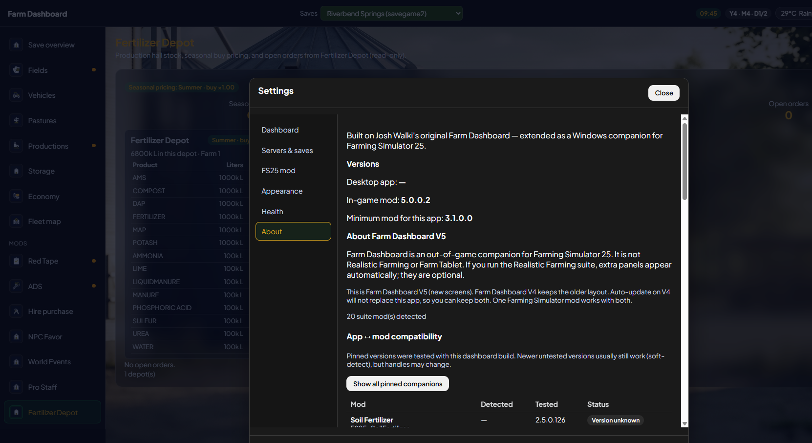

*Figure: About — V5 identity, 20 suite mods detected on this capture save.*

---

## 6. Dashboard sections

### 6.1 Save overview

Home. Status at a glance — jump to what needs attention.

| Block | What it shows |
| ----- | ------------- |
| Suite chips | Soil Fertilizer, Tax, Market Dynamics, etc. **Hidden** when those mods are absent |
| Economy / Fields / Pastures / Vehicles / Productions / Storage cards | Counts and warnings; click through to the section |
| Activity list | Fields needing work, harvest-ready, pasture warnings, production issues, ADS, Red Tape, world events, Pro Staff |
| Field tiles | Compact crop / status grid |


*Figure: Save overview on Riverbend Springs (savegame2).*

### 6.2 Pastures (animals)

Classic **Livestock** is this page. `#/livestock` redirects here.

| Control | What it does |
| ------- | ------------ |
| Summary cards | Total pastures, active livestock, birth warnings, average health |
| **Dairy Core** | Herd health / milk quality / spoilage — **only** with DairyCore |
| Search + pasture list | Pick a barn / pen |
| Detail column | Head count, sex split, feed/water/straw, days of food |
| **View All Livestock** | Combined animal table |
| **Details** | Pen information modal (§7.7) |
| **Animals List / Farm Statistics / Genetics** | Table vs extra panes |
| Filters, search, page size, **Export Data** | Same idea as classic livestock |
| Row **Details** / **Pen detail** | Individual vs cluster/LOD pen |

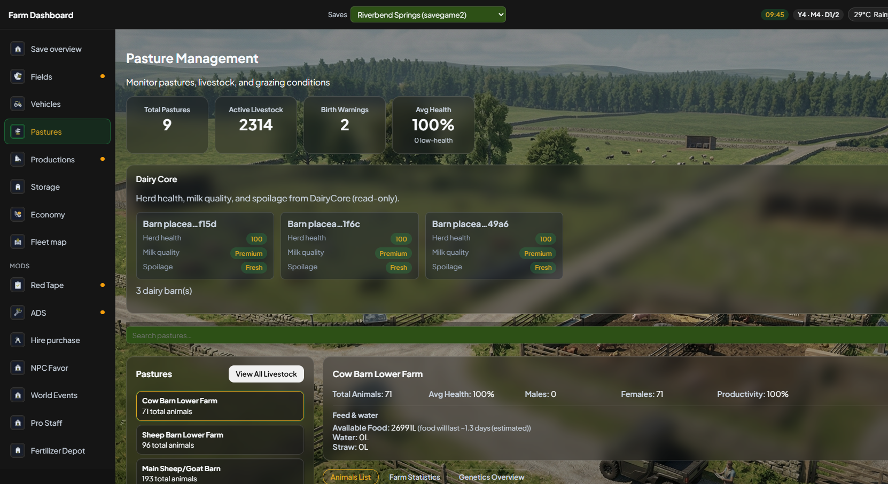

*Figure: Nine pastures, 2314 animals, Dairy Core, Cow Barn selected.*

### 6.3 Vehicles

| Control | What it does |
| ------- | ------------ |
| Total / low fuel / high damage / ADS cards | Click to filter |
| Table vs **Cards** | Layout toggle |
| Type / fuel / status filters | Narrow the fleet |
| Card | Name, brand, hours, condition, coordinates, **Show on map**, role badge |
| Image click | Vehicle image modal when a shop pic exists |
| ADS | Workshop / breakdown chips when ADS exports — full workshop is the **ADS** sidebar |

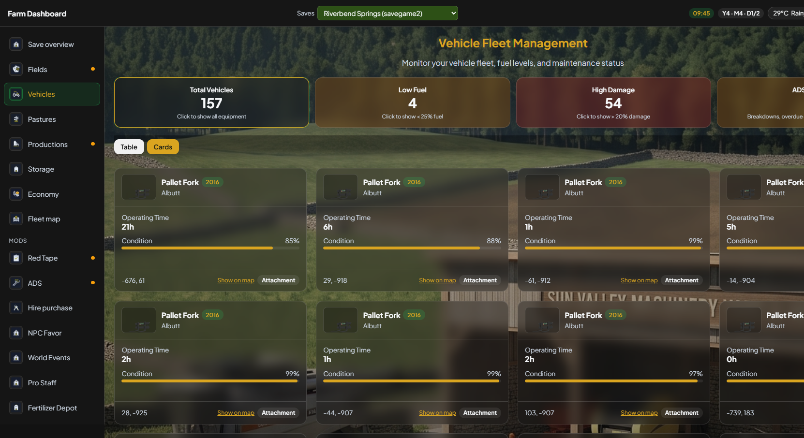

*Figure: 157 vehicles, cards view, ADS counts.*

### 6.4 Fields

Richest section.

| Control | What it does |
| ------- | ------------ |
| Total fields / area / needs work / harvest ready | Summary |
| **All / Harvest ready / Needs work / Growing / Empty** | Filters |
| **Include unowned fields** | Off by default so the map does not dump into “my farm” |
| **Order** | **Field number** (default), **Crop**, **Size** (hectares, large first), **Work needed**, **Soil urgency** (only useful when Soil Fertilizer reports). Preference stored as `farmdash_fields_sort_v1`. Soil Fertilizer does **not** force urgency order |
| Search | Field number or crop name |
| Field card | Growth, fruit, GPS-merged parcels, soil bars (N/P/K/pH/OM/weed/pest/disease), moisture, windrows, rules **Suggested next step**, fleet / shop tools |
| Merged view | Same painted field only; soil bars use the **lead** parcel |

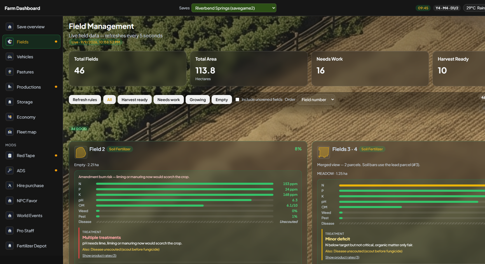

*Figure: Filters, Order = Field number, Field 2 soil + burn warning, Fields 3·4 GPS merge.*

Crop **names** must be words (Wheat, linseed, …), not `147` or `$l10n_…`. **Witcombe extras stay on Witcombe**; **Montana extras stay on Montana**.

### 6.5 Economy

| Control | What it does |
| ------- | ------------ |
| Current money / purchases / loan / net worth | Farm finance |
| **Open Red Tape / Hire purchase** | Jumps to those sidebar pages when present |
| **Market Prices** tab | Named fill types (may wait on economy collector / XML) |
| **Equipment Purchases** tab | All / Vehicles / Implements; sort Price / Age / Name |
| **Realistic Farming** block | Tax, fuel, income, worker costs, workplaces, market dynamics — **only** if those mods export. Some RF money mods are **global** (same totals on every farm) — that is the companion, not a dashboard bug |

Storage is **not** an Economy tab on V5. Use the **Storage** sidebar.

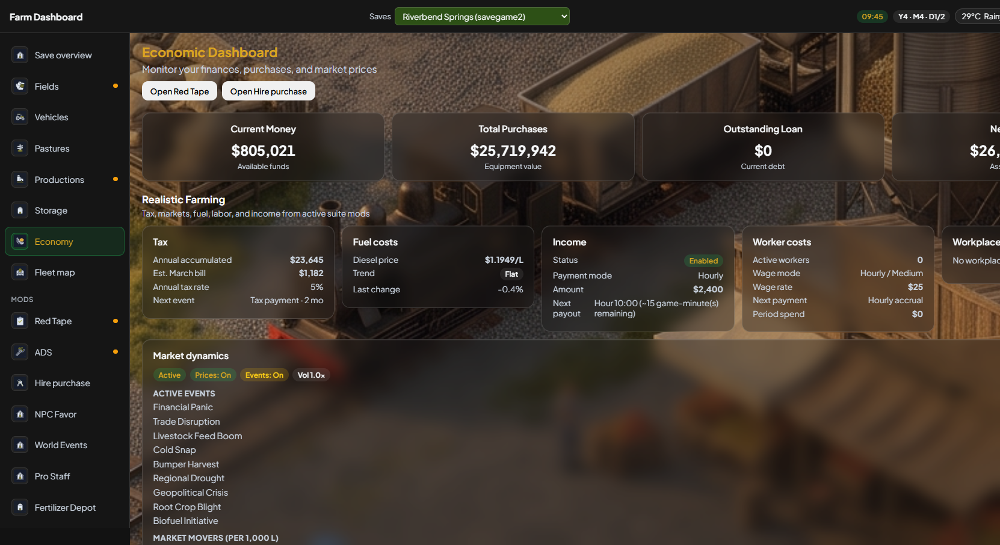

*Figure: Cash, RF tax/fuel/income, market events.*

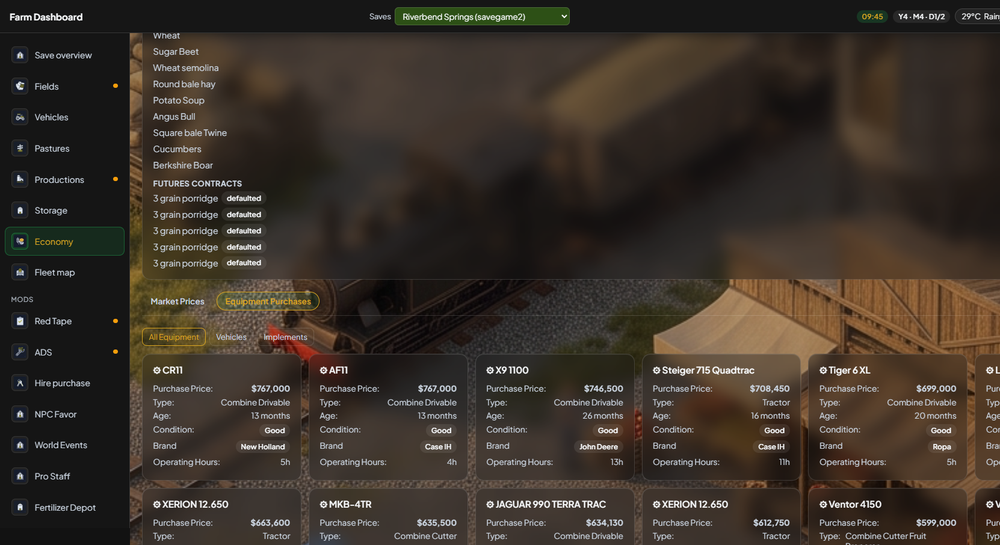

*Figure: Purchase cards (price, age, condition, brand).*

### 6.6 Storage

| Block | What it shows |
| ----- | ------------- |
| **Fertilizer Depot** (if present) | Hall bin litres + seasonal buy multiplier. **Not** the 50k shop book. Button opens the Depot section |
| **Silo & bunker stock** | Fill types, litres, estimated value, expand for locations |
| **Bale stock** | Loose on cropland vs yards/sheds |
| **Pallets & big bags** | Grouped by product |

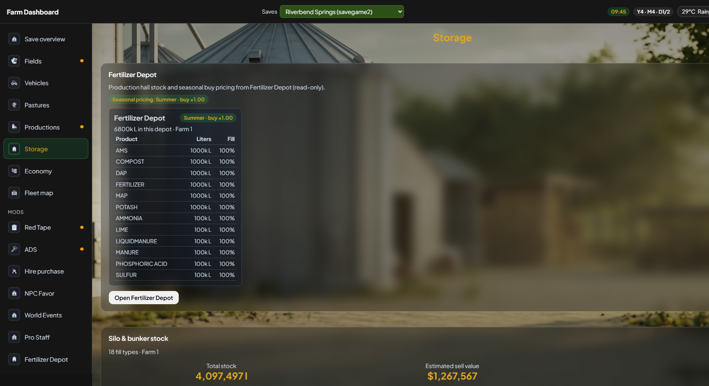

*Figure: Hall depot at 100% bins + silo total / sell value.*

### 6.7 Productions

Search, optional map/public filter, chain cards: running/stopped, input/output litres, recipes, rates. Empty state if the Production collector is off or you own none.

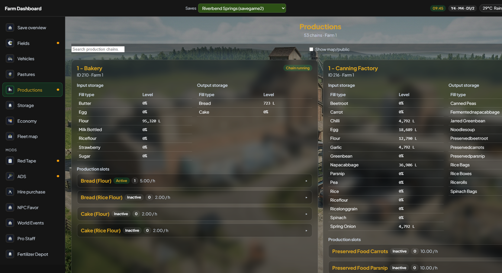

*Figure: Bakery (chain running) and Canning Factory.*

### 6.8 Fleet map

Live pins on the save’s PDA **overview**.

| Control | What it does |
| ------- | ------------ |
| Overlay | Off / crops / growth / ownership / weeds / tillage / soil / moisture / work needed |
| Search | Vehicles and places |
| Show all farms | Server-wide pins vs your farm |
| Productions, pastures, sell points | Extra place pins |
| Hide map border | Crops PDA chrome |
| Show names | Labels |
| Type filters | All / tractors / harvesters / … |
| − / + / Reset / Fit items | Zoom |
| Pin hover / click | Name, heading icon when exported |

On first open after a map change, overview cache may rebuild (`map_overviews` under the app userData). **4 km** maps can still shift pins beyond ±1024 m PDA range.

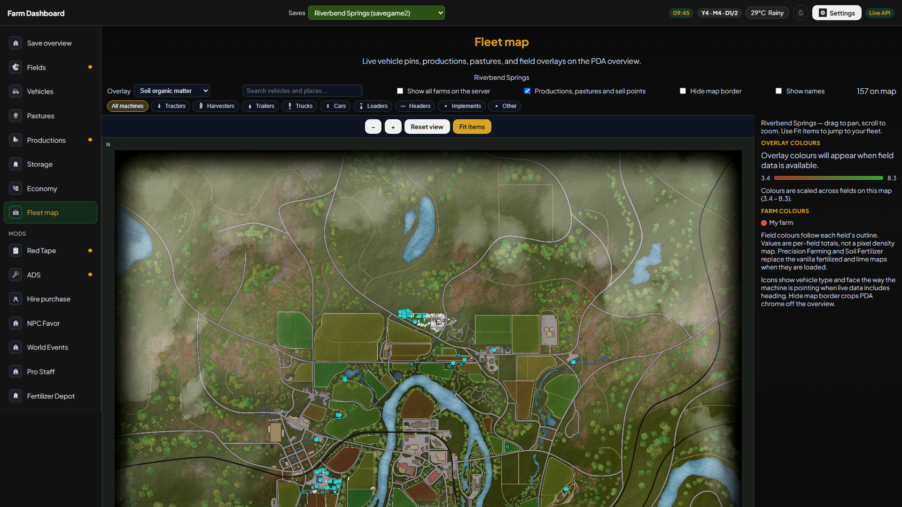

*Figure: Riverbend Springs, Growth overlay, vehicle pins.*

In-game PDA (reference only):


*Figure: In-game PDA — not the dashboard UI.*

### 6.9 Red Tape (mod-gated)

Tier, points, policies, crop-rotation harvest history, schemes, tax/grants, recent events.

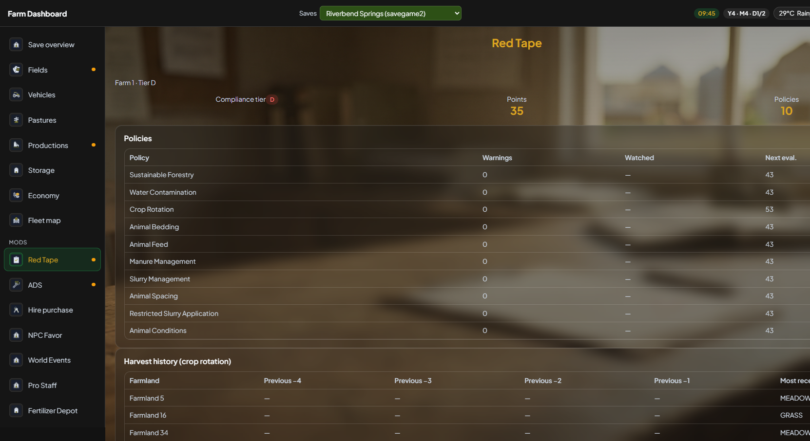

*Figure: Farm 1 · Tier D, policy table, rotation history.*

### 6.10 ADS (mod-gated)

Workshop / breakdowns / in need of repair. Select a machine for operating hours, fuel, condition, workshop stats, pre-shift inspection, **Show on map**.

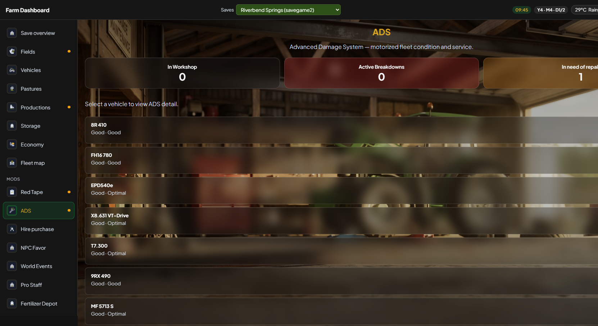

*Figure: ADS summary + fleet list.*

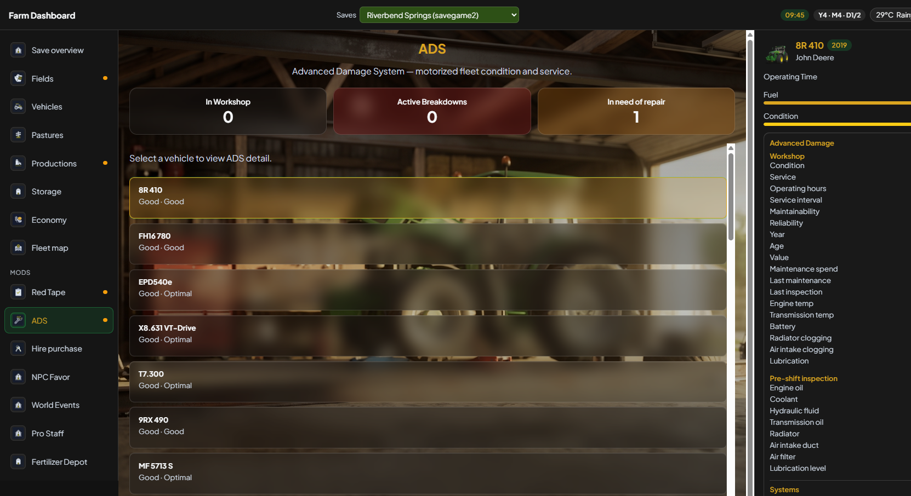

*Figure: 8R 410 workshop and inspection pane.*

### 6.11 Hire purchase (mod-gated)

Active deals: vehicle, monthly, remaining. **Invoices** is a separate sidebar item when that companion is present (not on the Riverbend capture).

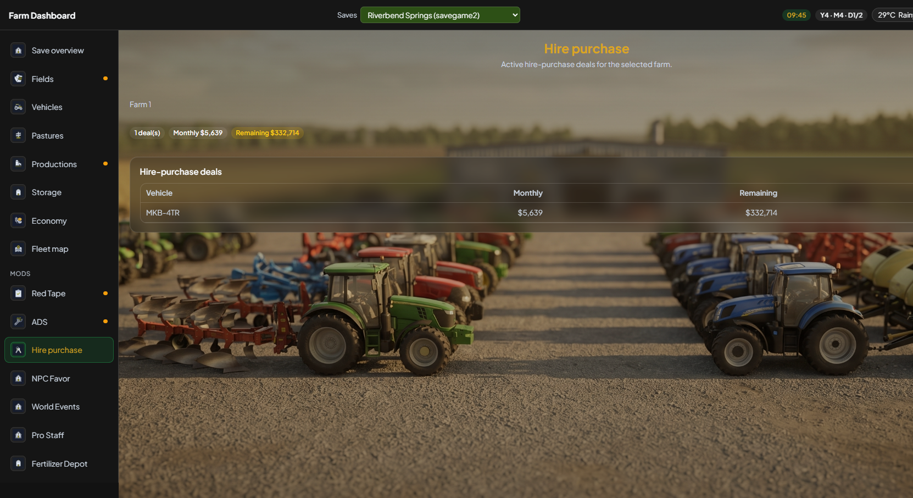

*Figure: One deal, monthly and remaining totals.*

### 6.12 NPC Favor (mod-gated)

Active favors + relationship table (name, favor, standing). Relationships may be **shared** across farms — same honesty as the companion mod.

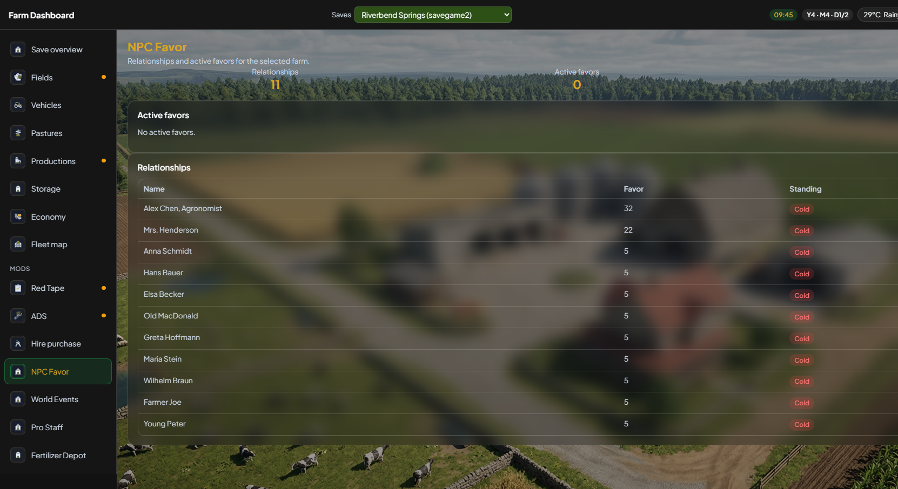

*Figure: 11 relationships, no active favors.*

### 6.13 World Events (mod-gated)

Frequency / intensity / type count, current event name, category, remaining duration. No history API — only what the collector exports.

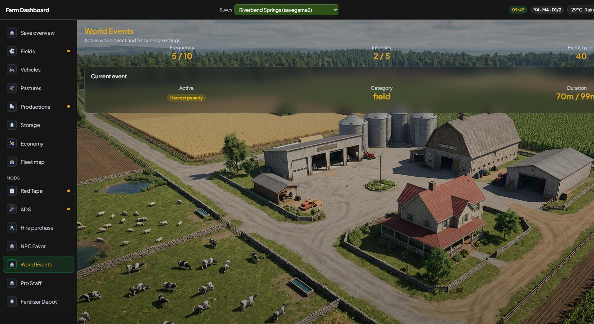

*Figure: Harvest penalty, field category, timer.*

### 6.14 Pro Staff (mod-gated)

Co-op level, membership, investment, discount modifiers, unlock flags.

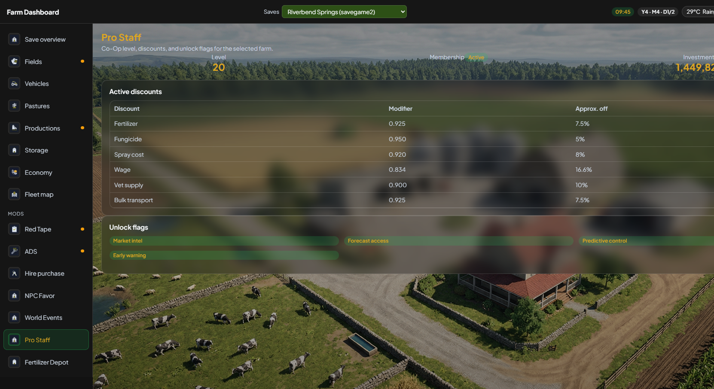

*Figure: Level 20, fertilizer/wage discounts, unlock pills.*

### 6.15 Fertilizer Depot (mod-gated)

Hall stock table, seasonal buy factor, open orders. Same hall-bin rule as Storage.

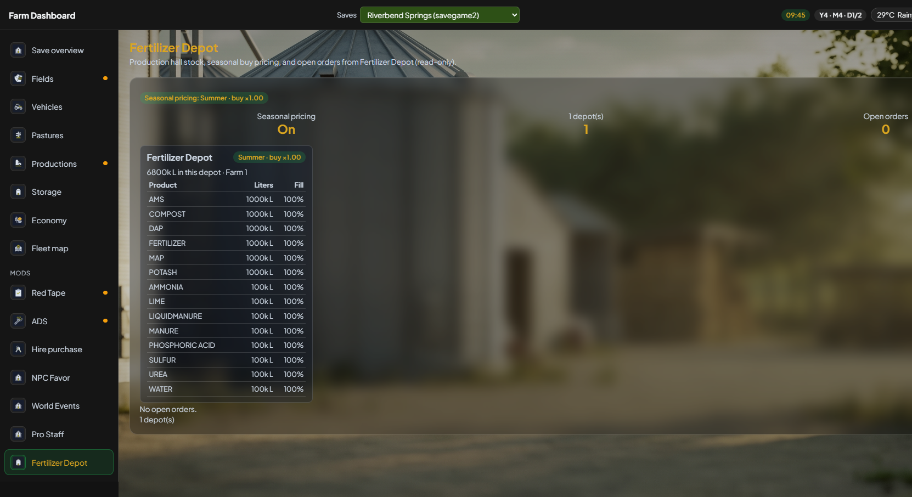

*Figure: Summer ×1.00, 6800k L hall stock, no open orders.*

---

## 7. Modals

### 7.1 Notification history

Bell → list (capped). **Clear All**. Empty state is honest — the UI will not retry forever.

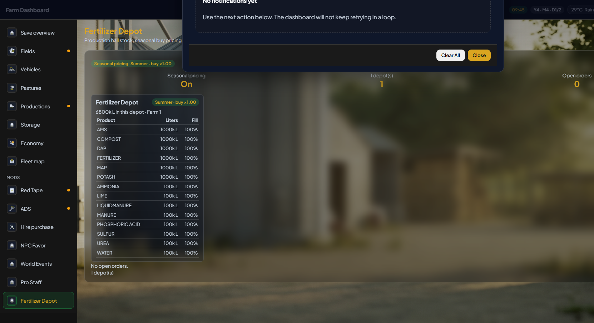

*Figure: Empty notification history (this capture session).*

### 7.2 Export livestock

Pastures → **Export Data**. Format + download.

### 7.6–7.7 Animal / pen / pasture details

Table row **Details** = animal sheet when the row has a real id. **Pen detail** = cluster/LOD pen. Pasture **Details** = pen information (capacity, feed, livestock summary).

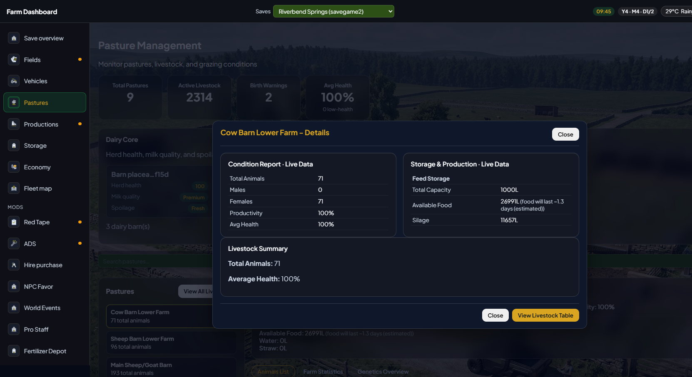

*Figure: Cow Barn Lower Farm — condition + storage + View Livestock Table.*

### 7.8 Vehicle image

Click a vehicle thumbnail. **[manual]** zoom shot still wanted.

### 7.9 Weather forecast

Click the weather control. Current temp/condition, wind/cloud/rain/humidity. **Weather Guard** block is companion telemetry (labelled as such), plus a multi-day outlook — not a second sky.

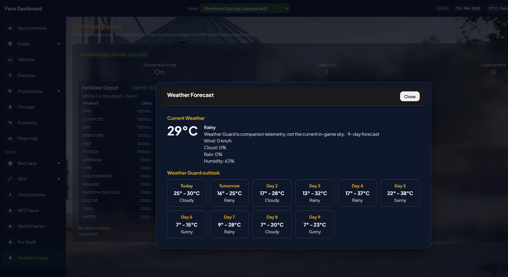

*Figure: Rainy 29°C + Weather Guard 9-day outlook.*

### 7.10 Mod export progress

Shown while the mod-image scan runs (Setup or Settings).

### 7.11 Farm selection

When the save has more than one farm, pick from the header farm control. Other farms’ land, fleet, and silos must not show as yours.

---

## 8. LAN access and tablets

1. Settings → **Servers & saves**.
2. Enable **LAN access**; set a **strong** username and password (10+ characters; historic `admin` / `farmhub` rejected).
3. Optional IP allowlist.
4. **Save**. The HTTP server binds all interfaces on **this V5 port** (installed **8768**).
5. On the tablet, open `http://<PC-LAN-IP>:8768` (or **8767** if you are on repo `dev:new-ui`).
6. Optional `?viewer=1` for a tighter viewer session.

**Tablets cannot run Setup.** `/setup.html` from a phone bounces to the dashboard. See [`SECURITY.md`](./SECURITY.md).

LAN toggle lives on the Servers tab:


*Figure: Remote / LAN access (local-only until you enable it).*

Tablet auth + portrait dashboard shots: **[manual]** (`v5-lan-020-*`, `v5-lan-030-*`).

---

## 9. In-game mod settings (`config.xml`)

```
%USERPROFILE%\Documents\My Games\FarmingSimulator2025\modSettings\FS25_FarmDashboard\config.xml
```

Settings → **FS25 mod** edits this file. Example shape:

```xml
<farmDashboard>
  <settings updateInterval="60000" collectionCycleMs="60000" debugBaleScan="false" />
  <modules animals="true" vehicles="true" fields="true" weather="true"
           finance="true" economy="true" production="true"
           stock="true" baleInventory="true" redTape="true" />
</farmDashboard>
```

| Attribute | Effect |
| --------- | ------ |
| `collectionCycleMs` | Master cycle; one collector module per slice |
| `modules.animals` … `production` | Core collectors (also Settings checkboxes) |
| `modules.stock` | Silo / bunker / placeable storage |
| `modules.baleInventory` | World bales + bale buildings |
| `modules.redTape` | Compliance export when Red Tape is present |
| `debugBaleScan` | Hand-edit only |


*Figure: `config.xml` on disk.*


*Figure: `config.xml` open in a text editor.*

There is **no** Giants console command for collectors. Reload the save after edits.

---

## 10. Troubleshooting

| Symptom | What to check |
| ------- | ------------- |
| Waiting / stale / empty farm | Stage B–C; Saves path; save loaded **into the world** |
| Port in use | V5 **8768** vs V4 **8766** vs repo **8767** — do not run two copies on the same port |
| Saves list wrong after Settings Save | Should refresh immediately; if not, report it — restart is **not** the intended fix |
| Fields merged that are only “same crop neighbours” | Bug — GPS painted blob + manual groups only |
| Depot shows 50k shop book | Bug — hall bins are the dashboard stock |
| Another farm’s stuff | Farm dropdown; farm-scope filters |
| Join-as-client stale | Client connected? Same mod? Empty dedi = no mirror |
| FTP quiet | Interval 1–25 min; credentials; slot folder |
| Raw keys like `pastures.card…` | Translations catalog not built / app not restarted |
| Language half-English | Wait for reload; missing key |
| Tablet 401 / 403 | LAN password / allowlist; Setup from tablet is blocked on purpose |
| About says this *is* Farm Tablet | Fail — report copy |
| V4 Check for updates installed V5 | Fail — feeds must stay separate |
| Soil / ADS / Red Tape with **no** those mods | Fail — ghost tabs |
| Productions empty | `modules.production`; you own chains |
| Storage empty | `modules.stock`; you own silos |
| Fill type `#190` on the wrong map | Map-scoped names; see TESTERS Witcombe vs Montana |

---

## 11. Screenshot index

Full recipe table: [`SCREENSHOTS.md`](./SCREENSHOTS.md). All images: [`doc-screenshots/`](./doc-screenshots/).

**Document version:** app **5.0.4** · mod **5.0.0.3** · V5 screens captured 2026-09-09. **Authors:** [`../AUTHORS.md`](../AUTHORS.md).
